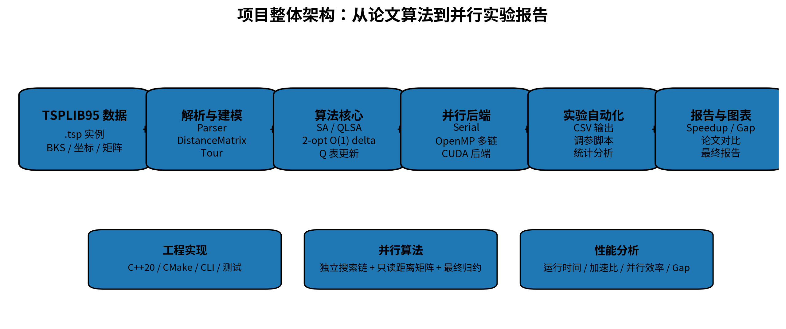
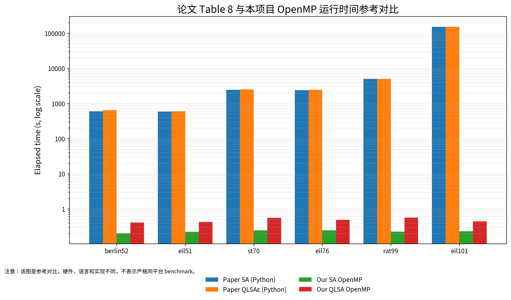
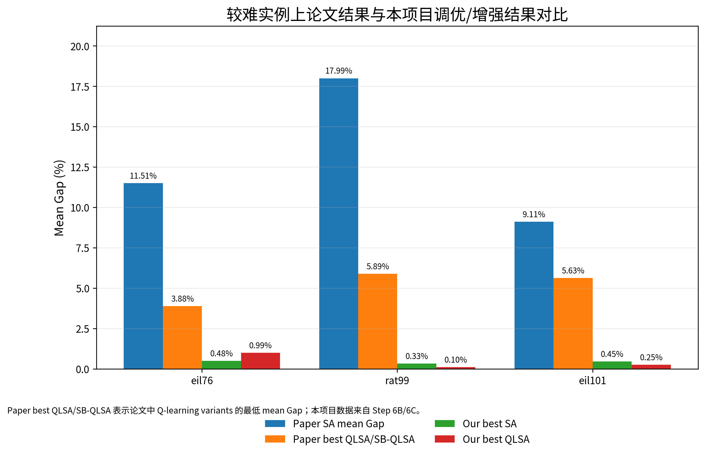
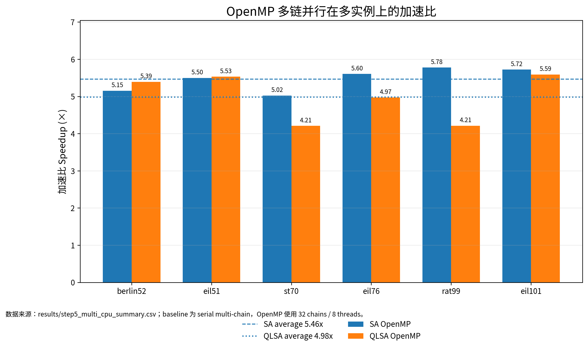
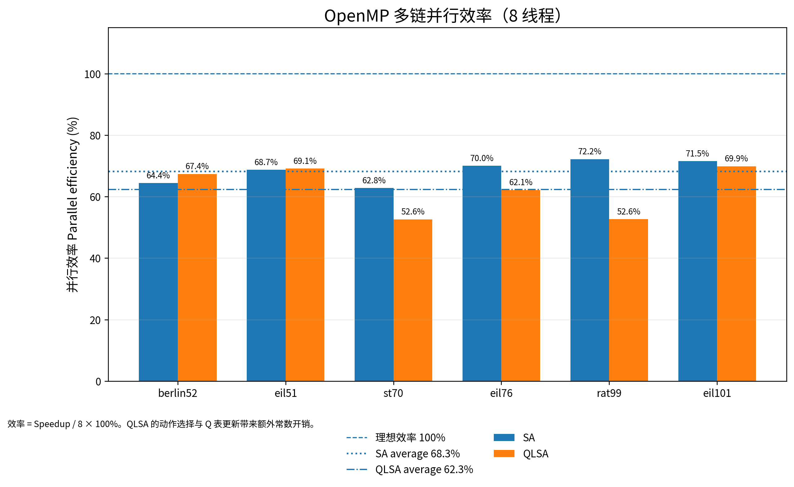
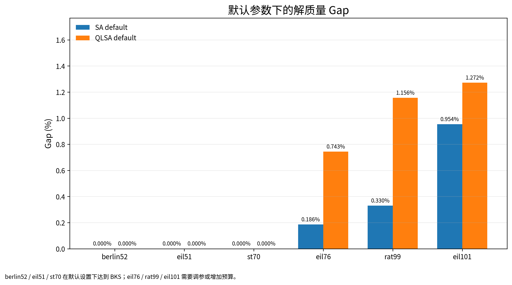
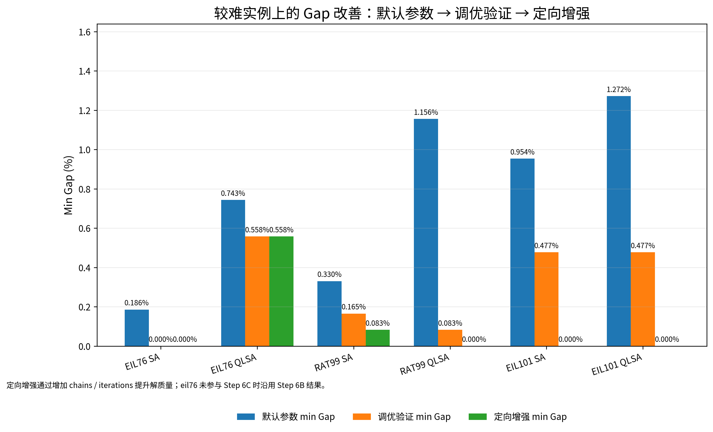
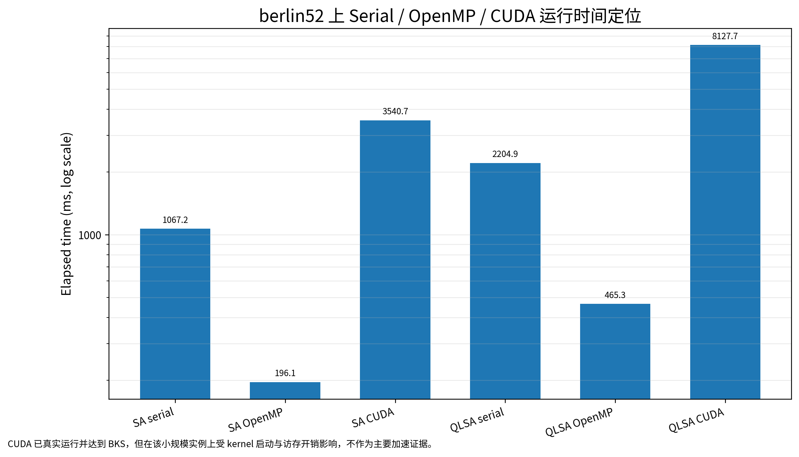

# 面向旅行推销员问题的 Q-Learning 辅助模拟退火算法并行化实现与性能优化

## 摘要

本项目以旅行推销员问题（Traveling Salesman Problem, TSP）为研究对象，参考 2026 年发表的论文 *Q-Learning-Assisted Simulated Annealing for Traveling Salesman Problem Optimization*，实现了模拟退火算法（Simulated Annealing, SA）与 Q-Learning 辅助模拟退火算法（Q-Learning-Assisted Simulated Annealing, QLSA）。在算法实现之外，本项目进一步完成了 C++20 工程化、TSPLIB95 解析器、一维连续距离矩阵、2-opt 常数时间增量计算、命令行接口、自动实验脚本和图表生成流程。

并行化方面，本项目采用多链并行（multi-chain parallelism）作为主要并行粒度，将多条独立搜索链映射到 OpenMP 线程，并实现了 CUDA 后端（CUDA backend）的工程扩展。默认参数多实例实验表明，OpenMP 多链并行在六个 TSPLIB95 实例上稳定有效：SA 平均加速比（speedup）约为 5.46x，QLSA 平均加速比约为 4.98x。

解质量方面，本项目在默认参数实验之外进行了参数调优和定向增强实验。结果显示，`rat99` 上 QLSA high-budget 配置达到 BKS=1211，而 SA high-budget 最好结果为 1212；`eil101` 上 SA 与 QLSA 在定向增强实验中均达到 BKS=629。这说明 QLSA 在部分较难实例上可以带来质量收益，但不能概括为在所有实例上均优于 SA。

CUDA 后端已经在 Ninja + CUDA 构建下真实编译并运行，`berlin52` 上能够达到 BKS=7542。但在当前小规模 TSPLIB95 实例上，CUDA 运行时间不优于 OpenMP，因此本报告将 OpenMP 作为主要性能结论，将 CUDA 定位为已完成的工程扩展与后续优化基础。

## 1. 基本信息

表 1：项目基本信息。

| 项目 | 内容 |
|---|---|
| 课程名称 | 并行算法 |
| 项目题目 | 面向旅行推销员问题的 Q-Learning 辅助模拟退火算法并行化实现与性能优化 |
| 团队人数 | 1 人 |
| 团队成员 | 陈乐浚 |
| 学号 | 22361054 |
| 学院/专业 | 中山大学计算机学院 / 信息与计算科学 |

## 2. 课程要求与完成情况

本节从课程评分点和选题报告预期目标两个角度说明项目完成情况。总体而言，本项目完成了论文算法思想复现、C++ 工程化、多后端并行化和实验分析，但对于论文中的 State-Based QLSA，只实现了状态/动作离散化思想，并不完全等同于论文中的 SB-QLSA 机制。

表 2：课程评分点对应关系。

| 课程评分点 | 本项目对应完成内容 |
|---|---|
| 完成情况 | 完成 SA、QLSA、OpenMP 多链并行、CUDA 后端、测试与多实例实验 |
| 技术难度 | C++20 底层实现、TSPLIB95 parser、O(1) 2-opt delta、OpenMP、CUDA、参数调优 |
| 近期论文复现/并行化 | 基于 2026 年 QLSA for TSP 论文进行算法复现与并行化扩展 |
| 论文对比 | 引入论文 Table 8 运行时间和 hard-instance 质量数据进行参考对比 |
| 并行性能分析 | 统计运行时间、加速比、并行效率（parallel efficiency）和 Gap |
| 报告质量 | 提供正式报告、个人附录、图表、结果 CSV 和提交检查清单 |

表 3：选题报告预期目标与实际完成情况对照。

| 预期目标 | 实际完成情况 | 说明 |
|---|---|---|
| TSPLIB95 parser | 已完成 | 支持坐标型和显式矩阵型 `.tsp` 文件 |
| SA | 已完成 | 实现 2-opt、Metropolis 接受准则和指数退火 |
| QLSA | 已完成 | 实现 Q 表更新、epsilon-greedy 与 softmax 策略 |
| State-Based QLSA | 部分完成 | 采用状态/动作离散化，不完全等同论文 SB-QLSA |
| Softmax/epsilon-greedy | 已支持 | CLI 支持两种策略，默认实验主要使用 epsilon-greedy |
| OpenMP | 已完成 | 实现多链并行和最终结果归约 |
| CUDA | 已完成工程实现 | 已真实编译运行，但当前小实例上不是主要加速结论 |
| 与论文对比 | 已完成 | 引入论文运行时间和 hard-instance 质量结果 |
| 图表与自动实验 | 已完成 | 脚本生成 CSV、Markdown 分析和报告图表 |

## 3. 参考论文与本项目定位

### 3.1 论文基本信息

参考论文为：

Adil, N., Eddaoudi, F., Lakhbab, H., & Naimi, M. (2026). *Q-Learning-Assisted Simulated Annealing for Traveling Salesman Problem Optimization*. *Statistics, Optimization & Information Computing*, 15(5), 3706–3730. https://doi.org/10.19139/soic-2310-5070-3028

论文使用 TSPLIB95 实例评估 SA、QLSA 和 State-Based QLSA（SB-QLSA）。其运行环境为 64-bit Linux、Intel Xeon Gold 6130 CPU、Python 3.11.5，并使用 NumPy、Pandas 和 TSPLIB95 Python library。论文对每个实例进行 10 次独立运行，报告 Best、Worst、Mean、Std、Gap 和 computational time。

### 3.2 论文算法机制

论文中的 SA 使用 2-opt 邻域和 Metropolis 接受准则。QLSA 在 SA 的搜索过程中引入 Q-learning，用于从候选集合中选择引导搜索的解。候选集合包括当前解、全局最优解、随机解和 double-bridge 扰动解。论文同时讨论 epsilon-greedy 与 Softmax/Boltzmann 策略，并进一步提出 SB-QLSA，用 diversity state 描述当前解与最优解之间的差异程度。

论文的核心思想是让学习机制辅助启发式搜索策略选择，而不是替代 SA 本身。实验结果显示，Q-learning variants 在多个 TSPLIB95 实例上能改善平均 Gap，但也引入额外运行时间。

### 3.3 本项目与论文机制的对应关系

表 4：论文机制与本项目实现的对应关系。

| 论文内容 | 本项目实现 | 说明 |
|---|---|---|
| TSPLIB95 实例 | 已实现 parser | 支持 EUC_2D、GEO、ATT、EXPLICIT 等格式 |
| SA + 2-opt | 已实现 | 使用 O(1) delta 优化内层迭代 |
| QLSA | 已实现 | 采用状态/动作离散化，与论文 candidate-leader 机制不完全相同 |
| epsilon-greedy / softmax | 已支持 | 默认实验主要使用 epsilon-greedy |
| SB-QLSA | 部分对应 | 未逐项实现论文 SB-QLSA 的全部机制 |
| 并行化 | 已扩展 | 实现 OpenMP 和 CUDA 多链后端 |

### 3.4 对比口径声明

本项目与论文的运行时间对比需要谨慎解释。论文使用 Python/NumPy/Pandas + Xeon 环境，本项目使用 C++20 + OpenMP/CUDA + i5-12600KF/RTX 4070 SUPER。两者硬件、语言、实现细节和并行后端均不同，因此运行时间表格不是同硬件、同语言、同实现的严格性能基准。

本报告使用该对比的目的，是说明在相同 TSPLIB95 实例和相同 BKS 口径下，本项目经过 C++ 工程化与 OpenMP 并行化后取得的实际运行效率，以及调优后在部分较难实例上的解质量表现。该对比不能被解释为算法本身在严格同平台条件下全面超过论文。

## 4. 算法设计

### 4.1 TSP 问题定义与 Gap 指标

给定 \(n\) 个城市和距离矩阵 \(D\)，TSP 要求寻找一条访问每个城市恰好一次并回到起点的最短回路。若路径排列为 \(\pi\)，路径长度为：

$$
L(\pi)=\sum_{i=0}^{n-1}D_{\pi_i,\pi_{(i+1)\bmod n}}
$$

实验中使用 TSPLIB95 的 Best Known Solution（BKS）计算 Gap：

$$
\operatorname{Gap}
=
\frac{L_{\mathrm{best}}-L_{\mathrm{BKS}}}{L_{\mathrm{BKS}}}
\times 100\%
$$

其中，$L_{\mathrm{best}}$ 表示实验得到的最优路径长度（best length），$L_{\mathrm{BKS}}$ 表示 TSPLIB95 给出的 Best Known Solution（BKS）。

### 4.2 模拟退火算法

SA 维护一个当前解，通过邻域扰动产生候选解。若候选解使路径长度减少，则直接接受；若路径长度增加，则以随温度降低而下降的概率接受，从而具备跳出局部最优的能力。对于长度变化 \(\Delta\) 和温度 \(T\)，接受概率为：

$$
P(\Delta,T)=
\begin{cases}
1, & \Delta \le 0, \\
\exp(-\Delta/T), & \Delta > 0.
\end{cases}
$$

本项目使用指数退火：

$$
T_k
=
T_0
\left(\frac{T_f}{T_0}\right)^{k/N}
$$

实现时预先计算每轮温度乘法因子，避免在百万级迭代中反复调用 `pow`。

### 4.3 QLSA 算法

QLSA 在 SA 主循环中加入 Q-learning。状态 \(s\) 由近期路径长度变化或 delta 离散化得到，动作 \(a\) 表示可选邻域策略。每次 move 接受或拒绝后，根据奖励更新 Q 表：

$$
Q(s,a)
\leftarrow
Q(s,a)
+
\alpha
\left[
r+\gamma\max_{a'}Q(s',a')-Q(s,a)
\right]
$$

其中 \(\alpha\) 为学习率，\(\gamma\) 为折扣因子。本项目支持 epsilon-greedy 和 softmax 两种动作选择策略。QLSA 的额外开销主要来自状态计算、动作选择和 Q 表更新，因此同等迭代预算下通常比 SA 更慢；其价值主要体现在部分实例上可能提升搜索质量。

### 4.4 2-opt 常数时间增量

对路径反转区间 \([i,k]\) 时，旧边为 \(a-b\)、\(c-d\)，新边为 \(a-c\)、\(b-d\)。其中：

$$
\begin{aligned}
a &= \pi_{(i-1+n)\bmod n}, &
b &= \pi_i, \\
c &= \pi_k, &
d &= \pi_{(k+1)\bmod n}.
\end{aligned}
$$

因此 2-opt move 的增量为：

$$
\Delta
=
D_{a,c}
+
D_{b,d}
-
D_{a,b}
-
D_{c,d}
$$

该公式避免了每次 move 后完整重算路径长度，是高性能实现的关键。

## 5. 工程实现与并行化设计

### 5.1 工程模块



图 1：项目整体架构。系统从 TSPLIB95 输入开始，经解析器、距离矩阵和 SA/QLSA 核心算法，最终由 Serial/OpenMP/CUDA 后端执行并生成 CSV 与报告图表。

表 5：主要工程模块。

| 模块 | 文件 | 功能 |
|---|---|---|
| TSPLIB95 解析 | `tsplib_parser.*` | 读取 `.tsp` 文件并构造实例 |
| 距离矩阵 | `distance_matrix.*` | 一维连续数组存储距离 |
| 路径操作 | `tour.*` | tour 检查、初始化、2-opt delta |
| SA/QLSA | `sa.*`, `qlsa.*` | 串行搜索核心 |
| OpenMP | `parallel.*` | 多链并行与结果归约 |
| CUDA | `cuda.*`, `cuda_kernels.cu` | GPU 后端工程实现 |
| 实验脚本 | `scripts/*.py` | 运行、分析、调参和绘图 |

### 5.2 多链并行思想

单条 SA/QLSA 搜索链具有前后依赖，不适合简单地把内层迭代直接拆给多个线程。但多条搜索链相互独立：每条链有独立随机种子、当前路径、最优路径和 Q 表，只共享只读距离矩阵。因此，本项目选择多链并行作为主要并行粒度。

该设计的优点是同步开销低、实现清晰、可复现性强，并且适合同时映射到 OpenMP 线程和 CUDA 后端。

### 5.3 OpenMP 多链并行

OpenMP 后端使用 chain-level `parallel for`。每个线程执行若干条完整搜索链，链内不频繁加锁，结果写入 `chain_results[chain_id]`。所有链结束后，主线程串行归约全局最优路径。

该方案相比 move-level 并行更适合本项目，因为距离矩阵只读共享，搜索链之间几乎没有通信。实验结果也表明，8 线程下 SA 和 QLSA 均能取得稳定加速。

### 5.4 CUDA 后端设计

CUDA 后端将距离矩阵拷贝到 GPU 全局内存，并让 GPU 端执行多条搜索链。每条链维护独立 tour、随机状态和 Q 表，kernel 结束后由 host 端收集每条链结果并归约全局最优。

当前 CUDA 版本已经完成真实编译和运行验证，但仍属于工程扩展版本。由于测试实例规模较小，每条链的计算量不足以充分抵消 kernel 启动和访存成本，因此 CUDA 不作为当前主要性能结论。后续优化重点应放在 block 内候选 move 批量评估和共享内存利用。

## 6. 实验设置与复现方式

### 6.1 实验环境

表 6：实验环境。

| 项目 | 配置 |
|---|---|
| 操作系统 | Windows |
| CPU | 12th Gen Intel(R) Core(TM) i5-12600KF |
| GPU | NVIDIA GeForce RTX 4070 SUPER |
| 编译器 | MSVC 19.44 / nvcc 12.9.41 |
| 构建工具 | CMake + Ninja |
| 构建模式 | Release |
| 并行支持 | OpenMP 启用，CUDA 启用 |

### 6.2 数据集与指标

默认参数实验使用 `berlin52`、`eil51`、`st70`、`eil76`、`rat99`、`eil101`。主要指标包括最优路径长度、Gap、运行时间、加速比和并行效率。

加速比和并行效率定义如下：

$$
S
=
\frac{T_{\mathrm{serial}}}{T_{\mathrm{parallel}}},
\qquad
E
=
\frac{S}{p}
\times 100\%
$$

其中，$S$ 表示加速比（speedup），$E$ 表示并行效率（parallel efficiency），$p$ 表示 OpenMP 线程数。

### 6.3 实验分组

表 7：实验分组。

| 实验组 | 目的 | 输出文件 |
|---|---|---|
| Step 5B 默认参数实验 | 分析 OpenMP 加速效果 | `step5_multi_cpu_summary.csv` |
| Step 6B 调优独立验证 | 验证调优参数质量 | `tuned_validation_summary.csv` |
| Step 6C 定向增强实验 | 增加搜索预算提升解质量 | `targeted_quality_summary.csv` |
| 论文参考对比 | 对比论文时间和质量结果 | `paper_table8_runtime.csv` |

### 6.4 构建与运行命令

推荐使用 Ninja 构建启用 CUDA 的版本：

```powershell
cmake -S . -B build-cuda-ninja -G Ninja `
  -DCMAKE_BUILD_TYPE=Release -DTSP_ENABLE_CUDA=ON
cmake --build build-cuda-ninja -j
ctest --test-dir build-cuda-ninja --output-on-failure
```

默认参数多实例实验可用以下命令复现：

```powershell
py scripts\run_step5_experiments.py `
  --instances berlin52 eil51 st70 eil76 rat99 eil101 `
  --iterations 1000000 --repeat 3 --chains 32 --threads 8 `
  --no-cuda --output results\step5_multi_cpu_raw.csv
```

调优验证和定向增强实验分别运行：

```powershell
scripts\run_tuned_validation.bat
scripts\run_targeted_quality.bat
```

## 7. 与参考论文的对比

### 7.1 实验设置差异

表 8：论文与本项目实验设置差异。

| 项目 | 论文 | 本项目 |
|---|---|---|
| 实现语言 | Python 3.11.5 | C++20 |
| 主要依赖 | NumPy/Pandas | 标准库 + OpenMP/CUDA |
| 硬件 | Intel Xeon Gold 6130 | i5-12600KF + RTX 4070 SUPER |
| 并行后端 | 未实现并行后端 | OpenMP 与 CUDA |
| 运行次数 | 每实例 10 次 | default 3 次，tuned 10 次，targeted 5 次 |

### 7.2 运行时间参考对比



图 2：论文 Table 8 与本项目 OpenMP 运行时间参考对比。纵轴使用对数尺度，用于展示不同实现环境下的运行时间数量级差异；该图不表示同硬件、同语言条件下的严格 benchmark。

由于硬件、语言和实现方式不同，表 9 不用于声称本项目算法在严格同平台条件下绝对优于论文算法，而用于展示：在相同 TSPLIB95 实例和相同 BKS 评价口径下，本项目经过 C++ 工程化与 OpenMP 多链并行后具有明显的实际运行效率优势。

表 9：论文 Table 8 与本项目 OpenMP 运行时间对比。

| Instance | Paper SA (s) | Paper QLSAε (s) | Our SA (s) | Our QLSA (s) |
|---|---:|---:|---:|---:|
| berlin52 | 600.56 | 644.12 | 0.202 | 0.411 |
| eil51 | 589.41 | 602.53 | 0.224 | 0.429 |
| st70 | 2460.60 | 2498.47 | 0.247 | 0.560 |
| eil76 | 2379.99 | 2450.12 | 0.246 | 0.491 |
| rat99 | 5027.88 | 5003.58 | 0.227 | 0.570 |
| eil101 | 151064.69 | 152305.01 | 0.232 | 0.446 |

### 7.3 解质量参考对比



图 3：论文 hard-instance mean Gap 与本项目调优/增强结果对比。论文中的 QLSA variants 明显优于 Paper-SA，本项目在调优和增强后进一步接近 BKS。

表 10：hard-instance 质量参考对比。

| Instance | Paper best QLSA mean Gap | Our best mean Gap | Our best min Gap |
|---|---:|---:|---:|
| eil76 | 3.8848% | 0.483% | 0.000% |
| rat99 | 5.8880% | 0.099% | 0.000% |
| eil101 | 5.6279% | 0.254% | 0.000% |

`eil76` 未参与 Step 6C 定向增强，因此表 10 中 `eil76` 的本项目结果来自 Step 6B 调优独立验证；`rat99` 与 `eil101` 的结果来自 Step 6C 定向增强。该表同样属于参考对比，不能解释为同平台严格性能比较。

### 7.4 小结

与论文相比，本项目的主要扩展在于 C++20 工程化和 OpenMP/CUDA 多后端并行化。论文提供了 Q-learning-assisted SA 的算法思想和基准结果，本项目则补充了并行性能指标和自动实验体系。两者在实现语言和硬件环境上不同，因此对比应重点服务于“工程化与并行化收益”的说明，而非宣称完全公平的绝对优劣。

## 8. 本项目内部并行性能分析

### 8.1 OpenMP 加速比



图 4：默认参数下 SA 与 QLSA 的 OpenMP 加速比。SA 平均加速比约 5.46x，QLSA 平均加速比约 4.98x。

表 11A：SA 默认参数结果。

| Instance | Serial ms | OpenMP ms | Speedup | Efficiency | Best | Gap |
|---|---:|---:|---:|---:|---:|---:|
| berlin52 | 1043.053 | 202.402 | 5.153 | 64.417% | 7542 | 0.000% |
| eil51 | 1233.527 | 224.443 | 5.496 | 68.699% | 426 | 0.000% |
| st70 | 1243.066 | 247.472 | 5.023 | 62.788% | 675 | 0.000% |
| eil76 | 1377.377 | 245.818 | 5.603 | 70.040% | 539 | 0.186% |
| rat99 | 1310.632 | 226.910 | 5.776 | 72.200% | 1215 | 0.330% |
| eil101 | 1325.891 | 231.733 | 5.722 | 71.520% | 635 | 0.954% |

表 11B：QLSA 默认参数结果。

| Instance | Serial ms | OpenMP ms | Speedup | Efficiency | Best | Gap |
|---|---:|---:|---:|---:|---:|---:|
| berlin52 | 2217.895 | 411.445 | 5.391 | 67.381% | 7542 | 0.000% |
| eil51 | 2371.958 | 428.979 | 5.529 | 69.116% | 426 | 0.000% |
| st70 | 2356.846 | 560.222 | 4.207 | 52.587% | 675 | 0.000% |
| eil76 | 2439.045 | 490.690 | 4.971 | 62.133% | 542 | 0.743% |
| rat99 | 2400.499 | 570.091 | 4.211 | 52.634% | 1225 | 1.156% |
| eil101 | 2490.072 | 445.503 | 5.589 | 69.867% | 637 | 1.272% |

### 8.2 OpenMP 并行效率



图 5：默认参数下 8 线程 OpenMP 并行效率。SA 平均并行效率约 68.28%，QLSA 平均并行效率约 62.29%。

QLSA 的并行效率略低，主要原因是 Q 表更新、状态计算和动作选择带来额外常数开销。此外，随机搜索本身会造成不同实例之间的运行时间波动。

### 8.3 默认参数解质量



图 6：默认参数下 SA 与 QLSA 的 Gap。`berlin52`、`eil51`、`st70` 达到 BKS，而 `eil76`、`rat99`、`eil101` 仍存在 Gap。

默认参数实验主要支撑并行加速结论。对于较难实例，需要通过参数调优或增加搜索预算提升解质量。

## 9. 参数调优与定向增强



图 7：默认参数、调优独立验证和定向增强三个阶段的 Gap 改善。

### 9.1 调优独立验证

Step 6B 使用 Step 6A 搜索得到的参数，但换用从 101 开始的独立 seed，并执行 repeat=10。这样可以避免只报告调参搜索中的最好样本。

表 12：调优独立验证关键结果。

| Instance | Family | Variant | Best | Min Gap | Mean Gap |
|---|---|---|---:|---:|---:|
| eil76 | SA | tuned | 538 | 0.000% | 0.483% |
| eil76 | QLSA | tuned | 541 | 0.558% | 0.985% |
| rat99 | SA | tuned | 1213 | 0.165% | 0.875% |
| rat99 | QLSA | quality-first | 1212 | 0.083% | 0.372% |
| eil101 | SA | tuned | 632 | 0.477% | 1.717% |
| eil101 | QLSA | tuned | 632 | 0.477% | 1.526% |

可以看到，`eil76` 上 SA tuned 达到 BKS；`rat99` 上 QLSA quality-first 在最小 Gap 和平均 Gap 上均优于 SA tuned；`eil101` 上调优改善了解质量，但 repeat=10 下未稳定达到 BKS。

### 9.2 定向增强实验

Step 6C 不重新做全量网格搜索，而是在较优参数附近增加 chains 或 iterations。该阶段增加搜索预算，因此其主要目的在于提升解质量，不作为默认参数加速结论。

表 13：定向增强关键结果。

| Instance | Family | Config | Best | Min Gap | Mean Gap |
|---|---|---|---:|---:|---:|
| eil101 | QLSA | it=2e6, chains=128 | 629 | 0.000% | 0.254% |
| eil101 | QLSA | it=1e6, chains=64 | 629 | 0.000% | 0.763% |
| eil101 | SA | it=2e6, chains=128 | 629 | 0.000% | 0.445% |
| rat99 | QLSA | it=2e6, chains=128 | 1211 | 0.000% | 0.099% |
| rat99 | SA | it=2e6, chains=128 | 1212 | 0.083% | 0.330% |

`eil101` 上 SA 和 QLSA 在定向增强后均达到 BKS=629，其中 QLSA `1e6 iterations + 64 chains` 已经达到 BKS，具有较好的时间-质量折中。`rat99` 上 QLSA high-budget 达到 BKS=1211，而 SA high-budget 最好为 1212，未达到 BKS。

### 9.3 小结

参数调优和定向增强说明，解质量不仅取决于算法类型，也与温度参数、搜索预算和搜索链数量密切相关。QLSA 在 `rat99` 上体现出明确质量优势，但不能因此推出 QLSA 总是在所有实例上优于 SA。

## 10. CUDA 后端实验与局限性



图 8：`berlin52` 上 Serial、OpenMP 与 CUDA 的运行时间对比。CUDA 后端已完成并能达到 BKS，但当前小实例上不优于 OpenMP。

CUDA 实现过程中，Visual Studio CMake 生成器未能正常启用 CUDA toolset，后续改用 Ninja 后成功编译 `cuda_kernels.cu`。实验中，CUDA SA/QLSA 在 `berlin52` 上均找到 BKS=7542。

从运行时间看，当前 CUDA backend 在小规模实例上慢于 OpenMP。主要原因是每条链的计算量较小，kernel 启动和全局内存访问开销占比较高。该结果并不意味着 CUDA 方向无效，而是说明当前版本已完成工程扩展，性能优化仍需要进一步提升 kernel 内计算密度。

## 11. 问题与解决方案

表 14：项目主要问题与解决方案。

| 问题 | 解决方案 | 影响 |
|---|---|---|
| TSPLIB 下载不稳定 | 支持手动下载 `.tsp` 并放入 `data/` | 保证项目不因下载失败中断 |
| Visual Studio CUDA toolset 问题 | 改用 Ninja + CUDA 构建 | 成功真实编译 CUDA kernel |
| Windows Python alias 问题 | 使用 `py` 启动器 | 实验脚本运行更稳定 |
| CUDA 小实例性能不佳 | 将 OpenMP 作为主性能结论 | 保持报告结论谨慎 |
| QLSA 默认参数不稳定 | 进行调优和定向增强实验 | 改善 harder instances 解质量 |
| 论文机制不完全一致 | 明确说明本项目不是完整 SB-QLSA 复刻 | 保证论文对比严谨 |

## 12. 总结与贡献

本项目的贡献可以概括为五个方面：

- 算法实现：完成 SA 与 QLSA，并实现 2-opt 常数时间增量计算。
- 并行实现：完成 OpenMP 多链并行，在多个实例上稳定取得约 5x 加速。
- 工程实现：完成 TSPLIB95 parser、距离矩阵、CLI、测试、CUDA backend 和自动实验脚本。
- 实验分析：完成默认参数实验、调优独立验证、定向增强实验和论文参考对比。
- 对论文的扩展：将论文中的 Q-learning-assisted SA 思想迁移到 C++20/OpenMP/CUDA 工程体系，并补充并行性能指标。

本项目最主要的性能结论是 OpenMP 多链并行稳定取得约 5x 加速；最主要的质量结论是调优/增强后在 `rat99` 和 `eil101` 上达到或接近 BKS；CUDA 作为完成的工程扩展，为后续 GPU 深度优化提供基础。

## 13. 后续工作

后续可从以下方向继续推进：

- 更完整地实现论文 SB-QLSA 的 candidate-leader 与 diversity-state 机制；
- 系统比较 softmax 与 epsilon-greedy；
- 在 CUDA block 内批量评估候选 2-opt move；
- 扩展到更大规模 TSPLIB95 实例；
- 记录收敛曲线并增加统计显著性检验。

## 参考文献

1. Adil, N., Eddaoudi, F., Lakhbab, H., & Naimi, M. (2026). *Q-Learning-Assisted Simulated Annealing for Traveling Salesman Problem Optimization*. *Statistics, Optimization & Information Computing*, 15(5), 3706–3730. https://doi.org/10.19139/soic-2310-5070-3028
2. Reinelt, G. (1991). TSPLIB—A Traveling Salesman Problem Library. *ORSA Journal on Computing*, 3(4), 376–384.
3. OpenMP Architecture Review Board. *OpenMP Application Programming Interface Specification*.
4. NVIDIA. *CUDA C++ Programming Guide*.
5. Kirkpatrick, S., Gelatt, C. D., & Vecchi, M. P. (1983). Optimization by Simulated Annealing. *Science*, 220(4598), 671–680.
6. Sutton, R. S., & Barto, A. G. *Reinforcement Learning: An Introduction*. MIT Press.
