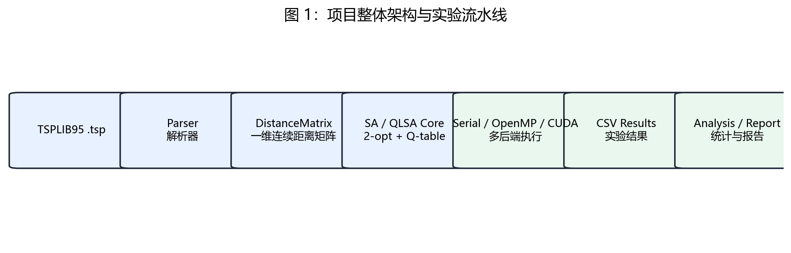
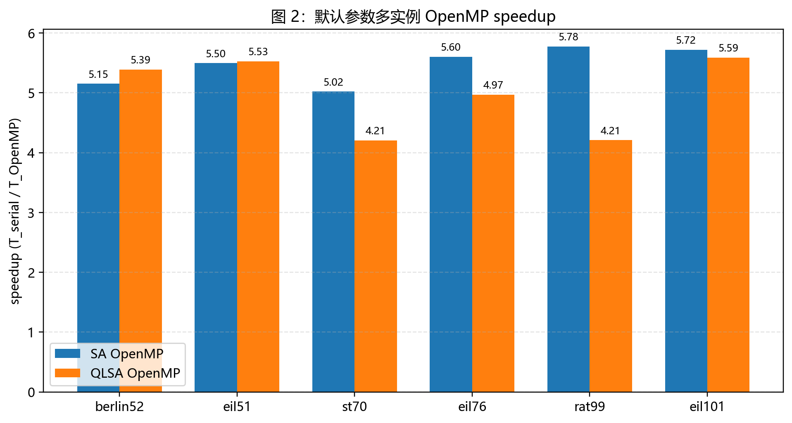
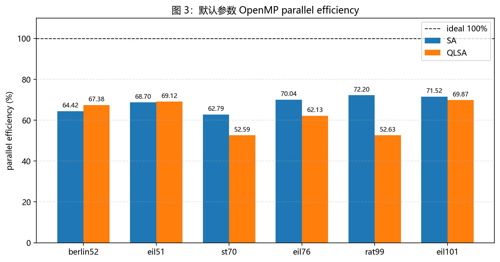
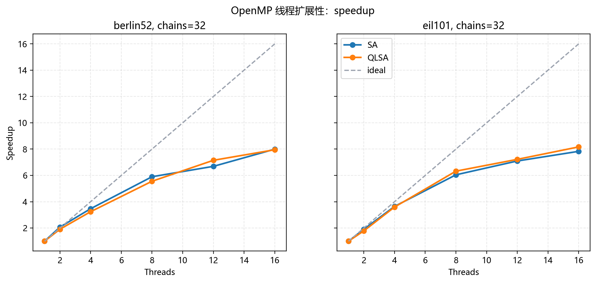
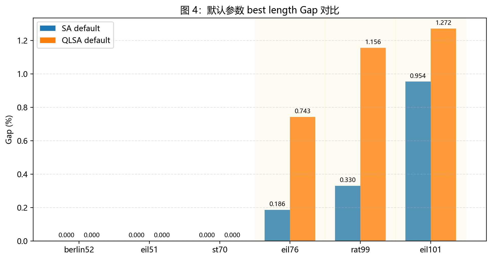
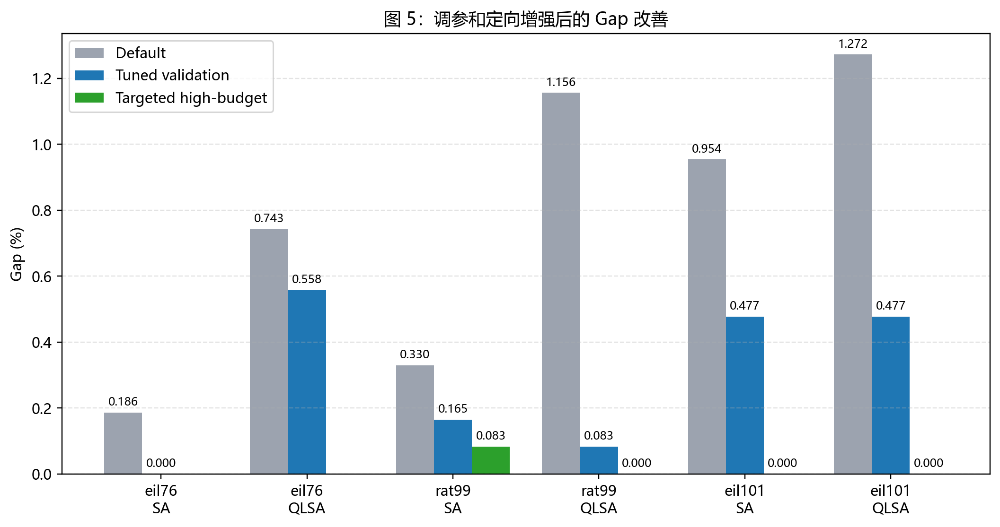
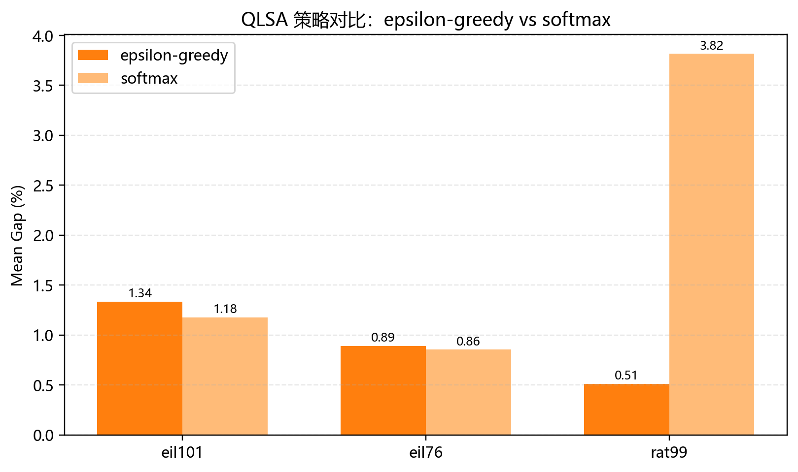
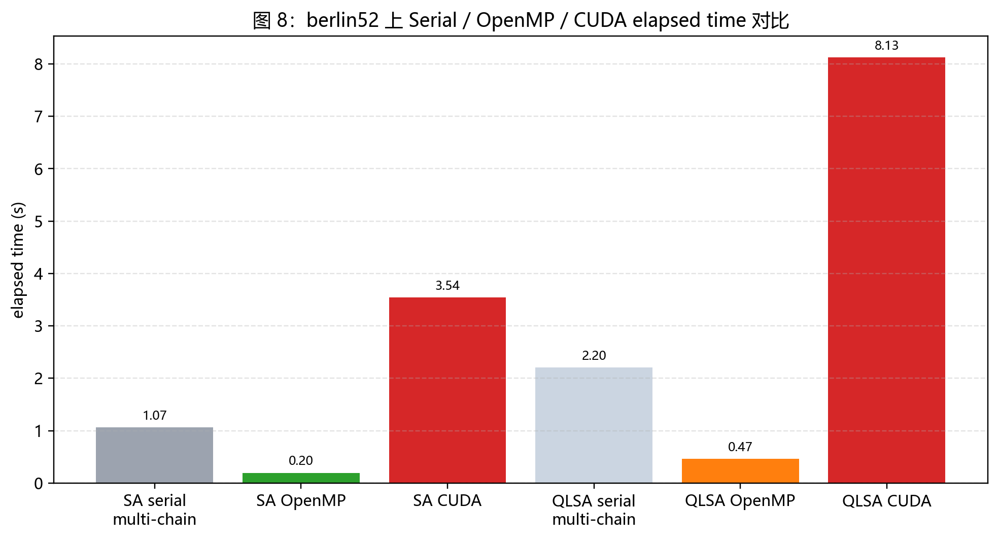
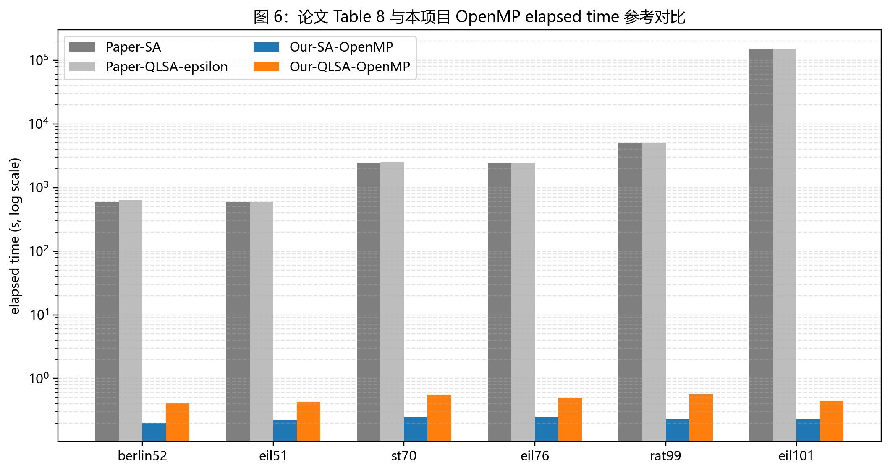
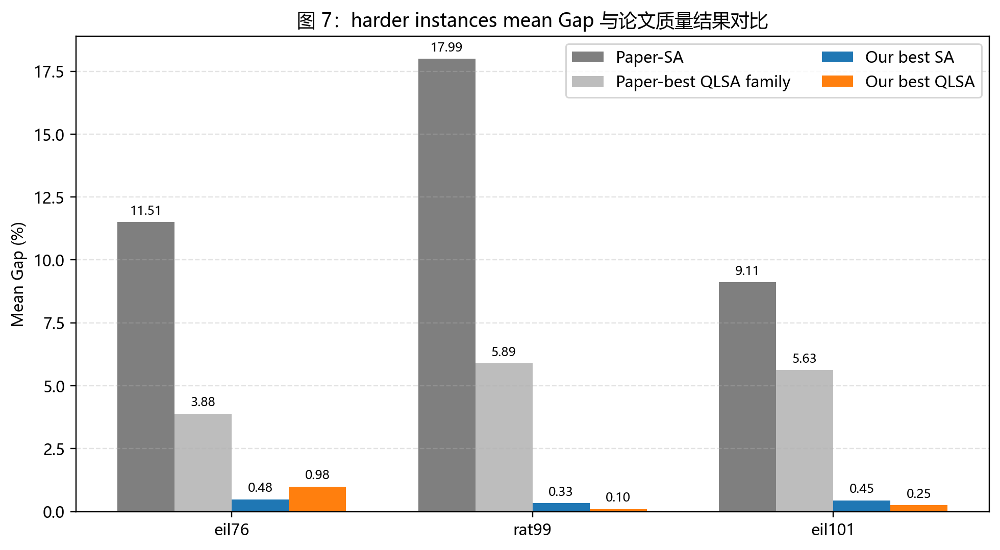

# 面向 TSP 的 Q-Learning 模拟退火并行优化研究与实现

## 1. 项目背景与问题定义

旅行推销员问题（Traveling Salesman Problem, TSP）是经典 NP-hard 组合优化问题。给定 \(n\) 个城市及城市间距离矩阵 \(D\)，目标是在访问每个城市恰好一次并回到起点的约束下，寻找总路径长度最短的 Hamilton 回路。若路径排列为 \(\pi\)，路径长度定义为

\[
L(\pi)=\sum_{i=0}^{n-1}D_{\pi_i,\pi_{(i+1)\bmod n}} .
\]

精确算法在城市规模增大后成本迅速上升，因此启发式和元启发式方法常用于求取高质量近似解。模拟退火（Simulated Annealing, SA）利用温度控制接受较差解的概率，适合处理 TSP 这类多局部最优的离散搜索问题。Q-Learning 辅助模拟退火（Q-Learning-Assisted Simulated Annealing, QLSA）进一步引入学习机制，使搜索策略不完全依赖固定扰动规则。

课程目标不仅要求算法实现，还要求并行化、实验评价和近期论文对比。因此，该课题选择近期 QLSA for TSP 论文作为算法依据，在 C++20 中建立可复现实验系统，并围绕 OpenMP 多链并行和 CUDA 后端进行工程扩展。

## 2. 论文方法分析

### 2.1 SA

参考论文使用 2-opt Metropolis 算子构造 SA。给定当前解 \(x\) 和候选解 \(x'\)，令 \(\Delta=f(x')-f(x)\)。若 \(\Delta \le 0\)，候选解直接接受；若 \(\Delta>0\)，以如下概率接受：

\[
P(\Delta,T)=\exp(-\Delta/T).
\]

SA 的核心价值在于：高温阶段允许更多探索，低温阶段逐渐转向收敛。该机制适合 TSP，因为 2-opt 操作可以快速生成邻域解，而 Metropolis 准则能缓解局部最优问题。

### 2.2 QLSA

论文中的 stateless QLSA 不总是从当前解出发，而是维护一个候选 leader 集合：

- current solution；
- global best solution；
- random solution；
- double-bridge solution。

Q-Learning 在每次迭代中选择一个候选 leader，再对该 leader 应用 2-opt Metropolis 搜索。论文同时比较了 epsilon-greedy 和 Softmax/Boltzmann 两种策略。Softmax 在论文实验中平均表现较稳定，但也会引入额外计算开销。

本实现吸收了“用 Q-Learning 选择搜索策略”的思想，但动作集合定义为不同跨度的 2-opt 邻域策略，而不是完整的 candidate leader 集合。因此，报告中的 QLSA 结果应解释为论文思想的工程化变体。

### 2.3 SB-QLSA 与本实现差异

论文进一步提出 State-Based QLSA（SB-QLSA），使用当前解与最优解之间的 Hamming distance 定义 diversity state，使 Q 表由全局 action value 扩展为 state-action value。该机制的目标是区分搜索处于探索状态还是强化状态。

表 1  论文机制与本实现差异。

| 机制 | 论文做法 | 本实现 |
|---|---|---|
| SA | 2-opt Metropolis | 已实现，使用 O(1) delta |
| QLSA action | candidate leader | 2-opt 邻域动作 |
| epsilon-greedy | 已实验 | 已支持 |
| Softmax | 已实验 | 已支持，机制不完全相同 |
| SB-QLSA state | Hamming diversity | delta 变化离散状态 |
| double-bridge | candidate 之一 | 未作为完整 candidate leader 实现 |

因此，本文不宣称完整复刻 SB-QLSA，而将实现定位为“基于论文思想的 C++ 工程复现与并行化扩展”。

## 3. 系统设计

### 3.1 系统架构图

图 1  系统架构与数据流。输入为 TSPLIB95 `.tsp` 文件，经过解析器、距离矩阵和 SA/QLSA 核心算法后，由 Serial、OpenMP 或 CUDA 后端执行，最后生成 CSV、统计结果和报告图表。

### 3.2 数据流设计

系统数据流分为四层。第一层是输入层，负责读取 TSPLIB95 实例；第二层是基础数据结构层，将实例转化为连续距离矩阵和 tour 表示；第三层是算法层，执行 SA 或 QLSA；第四层是实验层，统一输出 CSV 并由 Python 脚本生成 summary、Markdown 分析和图表。

这种设计避免算法逻辑与实验脚本耦合。所有后端共享相同的 DistanceMatrix 和 Tour 抽象，OpenMP 与 CUDA 只负责并行调度和结果归约。

### 3.3 TSPLIB parser

TSPLIB95 parser 支持坐标型和显式矩阵型实例，包括 `EUC_2D`、`CEIL_2D`、`GEO`、`ATT` 和 `EXPLICIT`。显式矩阵支持 `FULL_MATRIX`、`UPPER_ROW`、`LOWER_ROW`、`UPPER_DIAG_ROW` 和 `LOWER_DIAG_ROW`。该解析能力保证了论文常用 TSPLIB95 实例能够被统一输入到 C++ 算法中。

### 3.4 DistanceMatrix 设计

DistanceMatrix 使用一维连续数组存储 \(n\times n\) 距离矩阵。相比 `vector<vector<int>>`，连续存储具有更好的缓存局部性，并且可以直接将 `raw()` 拷贝到 GPU 全局内存。对于本项目的 OpenMP 多链并行，DistanceMatrix 只读共享，不需要加锁。

### 3.5 Tour 与 2-opt 优化

Tour 使用城市排列表示。2-opt move 反转区间 \([i,k]\)，旧边为 \(a-b\)、\(c-d\)，新边为 \(a-c\)、\(b-d\)。增量计算为

\[
\Delta=D_{a,c}+D_{b,d}-D_{a,b}-D_{c,d}.
\]

该公式使每次 move 的路径长度更新为 \(O(1)\)，避免在百万级迭代中反复完整重算路径，是底层性能的关键。

## 4. 并行设计

### 4.1 OpenMP 多链并行

SA/QLSA 的单条搜索链存在强前后依赖，因为下一次状态依赖当前 tour、当前长度和温度。直接对单条链内部 move 进行细粒度并行会引入大量同步，并且不容易保证随机过程可复现。

多链并行选择另一种粒度：启动多条独立搜索链，每条链拥有独立 seed、tour、best tour 和 Q 表。线程之间只共享只读 DistanceMatrix，结束后串行归约全局最优解。该设计减少锁竞争，也适合 repeated runs 和统计实验。

### 4.2 CUDA 后端

CUDA 后端将多条搜索链映射到 GPU 执行，并在 host 端完成结果归约。CUDA 已经完成工程实现和 smoke test，但当前小规模 TSPLIB95 实例上不优于 OpenMP。主要原因是每条链计算粒度不足，kernel 启动、访存和调度开销占比较高。

### 4.3 并行粒度分析

表 2  并行粒度比较。

| 粒度 | 优点 | 局限 |
|---|---|---|
| chain-level | 同步少，易复现，适合 OpenMP | 单链内部未加速 |
| move-level | 理论上可并行评估邻域 | 同步多，随机过程复杂 |
| GPU block-level | 可映射多链 | 小实例计算密度不足 |

因此，OpenMP chain-level 是本项目主贡献；CUDA 是工程扩展和后续优化基础。

## 5. 实验设计

### 5.1 实验目标

实验目标分为三类：验证实现正确性、评估并行加速效果、分析解质量变化。默认参数实验用于评估 OpenMP 加速；调优和定向增强用于评估较难实例上的解质量；policy comparison 用于观察当前 QLSA 策略敏感性；CUDA positioning 用于说明 GPU 后端完成度和局限。

### 5.2 数据集

实验使用 TSPLIB95 实例，包括 `berlin52`、`eil51`、`st70`、`eil76`、`rat99`、`eil101`。其中 `eil76`、`rat99`、`eil101` 在默认参数下更容易出现 Gap，因此作为调优和定向增强重点。

### 5.3 评价指标

主要指标包括：

- 最优路径长度（best length）；
- Gap；
- 运行时间（elapsed time）；
- 加速比（speedup）；
- 并行效率（parallel efficiency）。

\[
\text{Gap}=\frac{\text{best length}-\text{BKS}}{\text{BKS}}\times 100\%,
\quad
\text{Speedup}=\frac{T_{\text{serial}}}{T_{\text{parallel}}}.
\]

### 5.4 实验分组

表 3  实验分组。

| 分组 | 目的 | 主要文件 |
|---|---|---|
| baseline | 建立串行与默认参数基线 | `step5_multi_cpu_summary.csv` |
| OpenMP scaling | 分析线程扩展性 | `openmp_scaling_final_summary.csv` |
| tuning | 搜索参数 | `tuning_summary.csv` |
| targeted enhancement | 增加预算改善质量 | `targeted_quality_summary.csv` |
| policy comparison | 比较 QLSA 策略 | `policy_comparison_summary.csv` |
| CUDA positioning | 定位 CUDA 工程表现 | `step5_berlin52_summary.csv` |

## 6. 实验结果

### 6.1 OpenMP 性能结果

图 2  OpenMP 多实例加速比。SA 与 QLSA 在六个实例上均获得稳定加速。

表 4  默认参数 OpenMP 平均结果。

| Family | 平均 speedup | 平均 efficiency | 说明 |
|---|---:|---:|---|
| SA | 5.46x | 68.28% | 主性能基线 |
| QLSA | 4.98x | 62.29% | 有学习开销 |

OpenMP 采用独立搜索链并行，线程间共享数据少，因此在 8 线程下能保持约 5x 加速。QLSA 的效率略低，原因是 Q 表更新、状态计算和动作选择增加了常数开销。

图 3  OpenMP 并行效率。并行效率低于理想值，但在随机启发式搜索任务中仍具有稳定收益。

图 4  OpenMP 线程扩展性。线程数从 1 增加到 16 时 speedup 继续上升，但逐渐偏离理想线性加速。

### 6.2 解质量结果

图 5  默认参数 Gap 对比。`berlin52`、`eil51`、`st70` 在默认参数下达到 BKS，`eil76`、`rat99`、`eil101` 仍存在 Gap。

表 5  默认参数下较难实例 Gap。

| Instance | SA Gap | QLSA Gap | 说明 |
|---|---:|---:|---|
| eil76 | 0.186% | 0.743% | 需要调参 |
| rat99 | 0.330% | 1.156% | QLSA 默认不稳定 |
| eil101 | 0.954% | 1.272% | 需要增加预算 |

默认参数实验说明并行化解决的是运行时间问题，不自动保证所有实例达到 BKS。解质量仍依赖温度、迭代次数、搜索链数量和 QLSA 参数。

### 6.3 参数调优结果

图 6  调优与定向增强 Gap。调参和增加预算后，较难实例的最小 Gap 明显下降。

表 6  定向增强关键结果。

| Instance | Family | Best | Min Gap | Mean Gap |
|---|---|---:|---:|---:|
| eil101 | SA | 629 | 0.000% | 0.445% |
| eil101 | QLSA | 629 | 0.000% | 0.254% |
| rat99 | SA | 1212 | 0.083% | 0.330% |
| rat99 | QLSA | 1211 | 0.000% | 0.099% |

`rat99` 是最清晰的 QLSA 质量优势案例。相同高预算方向下，QLSA 达到 BKS=1211，而 SA 最好停留在 1212。该结果支持“QLSA 在部分实例上有质量收益”，但不能外推为所有实例均由 QLSA 占优。

### 6.4 policy comparison

图 7  QLSA 策略对比。当前实现中，Softmax 在 `eil76` 和 `eil101` 上略优，但在 `rat99` 上明显变差。

表 7  QLSA 策略对比。

| Instance | Better policy | Mean Gap | 说明 |
|---|---|---:|---|
| eil76 | softmax | 0.855% | 略优 |
| rat99 | epsilon-greedy | 0.512% | 明显优于 softmax |
| eil101 | softmax | 1.176% | 略优 |

该实验表明策略选择具有实例敏感性。论文中 Softmax 平均更稳定，但本实现的动作定义不同，因此不能直接复用论文结论。

### 6.5 CUDA 定位分析

图 8  `berlin52` 上 Serial、OpenMP 与 CUDA 时间对比。CUDA 已能运行并达到 BKS，但小规模实例上不是主要加速结果。

表 8  CUDA 定位结论。

| 项目 | 结论 | 解释 |
|---|---|---|
| 正确性 | 可运行并达到 BKS | smoke test 与 berlin52 结果支持 |
| 性能 | 当前不优于 OpenMP | kernel 启动和访存开销占比高 |
| 定位 | 工程扩展 | 后续需优化 block 内并行 |

CUDA 后端体现了工程难度，但不作为当前报告的主性能证据。

## 7. 与论文对比

### 7.1 方法对比

表 9  方法层面对比。

| 维度 | 论文 | 本实现 |
|---|---|---|
| 语言 | Python | C++20 |
| QLSA | candidate leader | 邻域动作选择 |
| SB-QLSA | diversity state | 部分状态离散化 |
| 并行化 | 未来工作方向 | OpenMP + CUDA |

### 7.2 时间对比

图 9  论文 Table 8 与本实现 OpenMP 时间参考对比。纵轴为对数尺度。

表 10  时间对比口径。

| 项目 | 论文 | 本实现 |
|---|---|---|
| 硬件 | Xeon Gold 6130 | i5-12600KF |
| 语言 | Python 3.11.5 | C++20 |
| 并行 | 未作为主实现 | OpenMP |

该对比涉及不同硬件、不同语言和不同实现，因此绝对时间不可直接比较。它只能说明 C++ 工程化与 OpenMP 并行化在本实验环境中的实际运行效率。

### 7.3 解质量对比

图 10  论文 hard-instance mean Gap 与本实现调优/增强结果对比。

表 11  hard-instance mean Gap。

| Instance | Paper best QLSA | Our best |
|---|---:|---:|
| eil76 | 3.8848% | 0.483% |
| rat99 | 5.8880% | 0.099% |
| eil101 | 5.6279% | 0.254% |

解质量对比使用共同 BKS 作为参照，但实现机制、运行次数和硬件环境不同。因此，结论应表述为“具有竞争力并更接近 BKS”，而不是“严格全面超过论文”。

### 7.4 结论风险说明

表 12  对比风险。

| 风险 | 规避方式 |
|---|---|
| 绝对时间不可直接比较 | 明确为不同硬件、不同语言下的参考对比 |
| QLSA 并非全实例占优 | 只报告具体实例结论 |
| SB-QLSA 未完整复刻 | 单独说明实现差异 |
| CUDA 小实例不占优 | 定位为工程扩展 |

## 8. 工程实现亮点

表 13  课程要求与完成情况映射。

| 课程要求 | 完成情况 |
|---|---|
| 算法实现 | 完成 SA、QLSA、2-opt delta、TSPLIB95 数据输入 |
| 并行设计 | 完成 OpenMP 多链并行，并实现 CUDA 后端作为工程扩展 |
| 实验评价 | 形成 raw CSV、summary CSV、Markdown 分析和报告图表流水线 |
| 论文对比 | 纳入参考论文运行时间表和 hard-instance 质量表进行口径说明 |
| 可复现性 | 提供 CLI、seed、repeat、批量脚本和提交级复现命令 |

表 14  工程实现亮点。

| 亮点 | 技术价值 |
|---|---|
| C++20 工程化 | 降低解释器开销，便于性能优化 |
| TSPLIB parser | 支持标准数据集复现实验 |
| O(1) 2-opt delta | 内层循环避免完整重算 |
| CLI 系统 | 支持参数、seed、repeat、并行后端 |
| 自动实验框架 | raw CSV、summary CSV、日志可追溯 |
| 图表 pipeline | 结果可直接进入报告 |
| seed 设计 | 支持可复现实验 |

这些设计使项目不仅是算法 demo，而是可构建、可测试、可复现实验的工程系统。

## 9. 局限性分析

CUDA 后端仍未充分优化。当前 kernel 主要验证工程路径，小规模实例上计算密度不足，无法抵消启动和访存开销。

QLSA 表现存在不稳定性。默认参数下，QLSA 在部分实例上不如 SA；只有经过调参和增加预算后，`rat99` 等实例显示出质量优势。

实验实例规模偏小。`berlin52`、`eil51`、`st70` 等实例容易达到 BKS，难以充分区分高级搜索策略的优势。

OpenMP 扩展性存在 ceiling。线程数增加后效率下降，说明调度、缓存和负载粒度开销逐渐显现。

论文机制尚未完整覆盖。candidate leader、double-bridge 和 Hamming diversity state 仍是后续工作。

## 10. 总结

该工程完成了论文复现、并行扩展和实验系统三个层面的闭环。SA 与 QLSA 提供算法基础，OpenMP 多链并行构成主要性能贡献，CUDA 后端体现工程扩展能力，自动实验与图表 pipeline 保证结果可追溯。

最稳健的性能结论是：OpenMP 多链并行在多个 TSPLIB95 实例上取得约 5x 平均加速。最有价值的质量结论是：经过调参和定向增强后，`rat99` 上 QLSA 达到 BKS，而 SA high-budget 未达到 BKS。最需要克制的结论是：CUDA 已完成但仍需优化，QLSA 并不在所有实例上稳定优于 SA。

## 参考文献

1. Adil, N., Eddaoudi, F., Lakhbab, H., & Naimi, M. (2026). *Q-Learning-Assisted Simulated Annealing for Traveling Salesman Problem Optimization*. *Statistics, Optimization & Information Computing*, 15(5), 3706-3730. https://doi.org/10.19139/soic-2310-5070-3028
2. Reinelt, G. (1991). TSPLIB--A Traveling Salesman Problem Library. *ORSA Journal on Computing*, 3(4), 376-384.
3. OpenMP Architecture Review Board. *OpenMP Application Programming Interface Specification*.
4. NVIDIA. *CUDA C++ Programming Guide*.
5. Kirkpatrick, S., Gelatt, C. D., & Vecchi, M. P. (1983). Optimization by Simulated Annealing. *Science*, 220(4598), 671-680.
