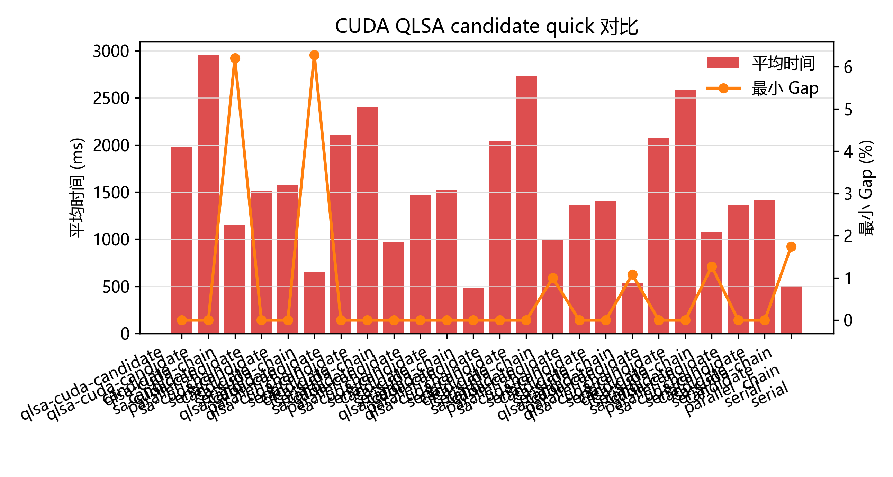

# 面向旅行推销员问题的 Q-Learning 辅助模拟退火算法并行化实现与性能优化

## 摘要

旅行推销员问题是典型 NP-hard 组合优化问题，适合用模拟退火这类随机局部搜索方法求近似解，也适合通过多搜索链并行提高搜索覆盖率。本课题以 2026 年 Q-Learning-Assisted Simulated Annealing for Traveling Salesman Problem Optimization 论文为算法来源，将 SA/QLSA 思想迁移到 C++20 工程实现中，并扩展到 OpenMP、CUDA 和 MPI + OpenMP hybrid 后端。

性能结论首先来自 OpenMP multi-chain。默认参数多实例实验表明，SA 在 6 个 TSPLIB95 实例上的平均 speedup 约为 5.46x，QLSA 平均 speedup 约为 4.98x；并行化不改变 SA/QLSA 的接受准则，因此性能提升与解质量评估口径保持一致。解质量方面，调优和定向增强实验显示 harder instances 可以明显改善：rat99 中 QLSA high-budget 达到 BKS=1211，而 SA high-budget 最好为 1212；eil101 中 SA/QLSA targeted 配置均达到 BKS。

工程扩展方面，CUDA 后端已完成真实编译、运行和结果归约，并进一步实现了 candidate-level 2-opt batch evaluation；该模式在 selected instances 上改善了解质量，但在当前小中规模实例上仍慢于 CUDA chain mode，且不作为 OpenMP 的性能替代结论，因此不作为主性能结论。MPI + OpenMP 后端已在两台 Ubuntu VM 上完成真实 `mpirun` smoke 和 formal scaling，说明 chain-level 搜索可以扩展到 distributed-memory 环境；该结论限定为 VMware NAT 环境下的工程证据，而不是生产 HPC 集群 benchmark。

大实例压力测试补充了工程可扩展性证据。L1 的 8 个 130-280 城市实例已经完成 OpenMP formal，参数为 iterations=1,000,000、chains=64、threads=8、repeat=3；这说明项目已经跑通“百万迭代级”中等规模 TSPLIB95 实验。该表述不能扩大为“百万城市级实例已跑通”，因为本项目没有运行百万城市规模 TSP。

## 1. 基本信息

| 项目 | 内容 |
|---|---|
| 课程名称 | 并行算法 |
| 项目题目 | 面向旅行推销员问题的 Q-Learning 辅助模拟退火算法并行化实现与性能优化 |
| 团队人数 | 1 人 |
| 团队成员 | 陈乐浚 |
| 学号 | 22361054 |
| 学院/专业 | 中山大学计算机学院 / 信息与计算科学 |

## 2. 预期目标与实际完成情况

表 1 对照选题阶段目标和最终完成内容。评价重点不是把某个循环简单并行化，而是把论文算法、C++ 工程、并行后端、自动实验和报告证据串成完整系统。

| 模块 | 预期目标 | 实际完成 | 说明 |
|---|---|---|---|
| TSPLIB95 parser | 读取标准实例 | 完成 | 支持坐标型和显式矩阵型实例，覆盖 EUC_2D、CEIL_2D、GEO、ATT、EXPLICIT。 |
| SA baseline | 串行模拟退火 | 完成 | 2-opt 邻域、Metropolis 准则、指数退火、O(1) delta。 |
| QLSA | Q-learning 辅助 SA | 完成 | 支持状态/动作离散化、Q 表、epsilon-greedy、softmax。 |
| SB-QLSA | 对齐论文状态思想 | 部分完成 | C++ 主线不声称完整复刻论文 candidate-leader 与 diversity-state；Python reference 提供机制对照。 |
| OpenMP | 多链并行 | 完成 | 主性能结论来源。 |
| CUDA | GPU 工程扩展 | 完成 | chain mode 与 SA candidate-level mode 均可运行；不作为主加速结论。 |
| MPI + OpenMP | 分布式内存扩展 | 完成 | 两台 Ubuntu VM 上真实 `mpirun` smoke 和 formal scaling。 |
| 实验自动化 | 可复现实验 | 完成 | raw CSV、summary CSV、figures、analysis docs、submission 包。 |

表 2 给出课程评分点和支撑材料。

| 课程评分点 | 支撑材料 | 证据位置 |
|---|---|---|
| 完成情况 | SA、QLSA、OpenMP、CUDA、MPI、parser、实验脚本均交付 | 源码、tests、results |
| 技术难度 | C++20、O(1) 2-opt、CUDA candidate、MPI hybrid、自动分析流水线 | 第 4-6 节 |
| 并行性能 | OpenMP 约 5x 加速，MPI formal scaling，效率分析 | 第 8 节 |
| 近期论文对比 | 论文 Table 8/质量表、Python faithful baseline、机制差异说明 | 第 3、9 节 |
| 报告质量 | 课程提交版报告、图表、证据等级、限制说明、复现命令 | docs/final、submission |

## 3. 参考论文方法与实现差异

参考论文验证了 Q-learning 辅助模拟退火在 TSP 上的解质量提升潜力。论文方法可以拆成三层：classical SA 使用 2-opt 和 Metropolis 准则；QLSA 通过 Q-learning 在候选解或策略之间选择；SB-QLSA 进一步引入 diversity state，提高较难实例上的稳定性。该工程保留 SA/QLSA 的核心搜索思想，但不声称完整复刻论文全部 SB-QLSA 细节。

| 论文机制 | 工程实现 | 是否完全对应 | 说明 |
|---|---|---|---|
| SA + 2-opt | C++20 SA + O(1) delta | 是 | 接受准则与温度下降一致。 |
| QLSA policy | C++ QLSA 支持 epsilon-greedy/softmax | 部分 | 状态/动作设计为工程化离散版本。 |
| candidate-leader | Python reference 实现，C++ 主线仅设计 paper-lite | 部分 | 不把 C++ 结果表述为完整论文复刻。 |
| SB-QLSA diversity state | Python reference 对齐 Hamming diversity | 部分 | 用于同机制对照，不替代 C++ 主实验。 |
| Python 串行实验 | C++/OpenMP/CUDA/MPI 多后端 | 不同 | 该工程重点是并行化和系统实现。 |

与论文的时间对比必须谨慎。论文运行在 Python + Xeon 平台，该工程运行在 Windows + C++20 + OpenMP/CUDA/MPI 环境；不同硬件、不同语言、不同实现导致绝对时间不能作为同硬件同语言下的严格基准。可成立的结论是：同一类搜索思想在 C++ multi-chain 实现中形成了可稳定并行加速的负载。

## 4. 方案设计

方案设计围绕一个核心约束展开：TSP 局部搜索需要频繁查询距离和计算 2-opt delta，因此数据结构必须服务于内层循环。C++20 用于控制内存布局和降低运行时开销；TSPLIB95 用作标准输入；CLI 和 CSV pipeline 用于保证实验可复现。

图 1：系统总体架构与数据流。

DistanceMatrix 采用一维连续数组存储 `n*n` 距离，避免 `vector<vector<int>>` 带来的额外间接寻址，也便于 CUDA 后端直接复制到 GPU。Tour 使用城市排列表示，并提供 identity、random、nearest-neighbor 初始化和合法性检查。2-opt move 不重新计算整条路径，而只替换两条旧边和两条新边：

$$
\Delta = d(a,c) + d(b,d) - d(a,b) - d(c,d)
$$

这一设计把 move 评价从 O(n) 降到 O(1)，是后续 OpenMP、CUDA 和 MPI 多链扩展的基础。

## 5. 并行方案设计

SA/QLSA 的天然并行机会来自多搜索链：每条 chain 有独立随机种子、当前解、best tour 和 Q table，DistanceMatrix 只读共享，最终只需归约全局最优解。相比 move-level 并行，chain-level 并行通信少、同步少、实现风险低，更适合课程工程和可复现实验。

图 2：MPI + OpenMP + CUDA 三层 HPC 架构。

OpenMP 后端使用 chain-level `parallel for`，每个线程处理一组搜索链，结果写入独立 `chain_results`，并行区结束后串行归约。CUDA 后端保留 multi-chain 路径，同时新增 candidate-level mode：一个 block 对应一条 chain，block 内多个线程并行评价候选 2-opt move，并通过 shared memory reduction 选择候选。MPI 后端进一步把 chain range 切分到不同 rank，rank 内继续使用 OpenMP，rank 间通过 MPI reduction/gather 汇总全局最优和统计量。

## 6. 实施过程与解决的问题

| 问题 | 现象 | 解决方案 | 对结果影响 |
|---|---|---|---|
| TSPLIB 下载不稳定 | WSL/代理下官方源不可用 | 支持多镜像下载、手动放置和 SHA256 记录 | 数据准备可追溯。 |
| CUDA toolset | Visual Studio 生成器启用 CUDA 失败 | 改用 Ninja + nvcc | CUDA kernel 能真实编译。 |
| Python alias | Windows Store alias 干扰 `python` | 使用 `py` 启动器 | 自动脚本稳定。 |
| QLSA 参数不稳定 | 默认参数 hard instances Gap 较大 | 调优、独立验证、定向增强 | 解质量提升但保留默认结果。 |
| MPI remote launch | VM 间 Open MPI 路径/PMIx 不一致 | 统一 Open MPI 4.1.2 prefix | 双 VM `mpirun` 跑通。 |
| 报告隐私与编码 | 课程提交材料包含个人信息 | 固定课程提交版入口，加入 mojibake 检查 | 提交材料更安全。 |
| GPT 外部评审 | Chrome 页面停留在登录页 | 保留可粘贴资料包和阻塞记录 | 不伪造 GPT 反馈。 |

## 7. 实验设计

实验体系不是单次跑分，而是围绕不同问题设置的证据链：baseline 用于得到串行多链和默认 OpenMP 对比；scaling 用于分析线程/链数量变化；tuning 用于降低 harder instances 的 Gap；targeted enhancement 用于验证高预算质量；policy comparison 用于比较 epsilon-greedy 与 softmax；paper compare 用于与参考论文和 Python faithful baseline 建立对照；large-instance stress 用于验证工程可扩展性。

核心指标如下：

$$
Gap = \frac{best\_length - BKS}{BKS} \times 100\%
$$

$$
Speedup = \frac{T_{serial}}{T_{parallel}}, \quad
Efficiency = \frac{Speedup}{p} \times 100\%
$$

默认 OpenMP 实验使用 berlin52、eil51、st70、eil76、rat99、eil101，iterations=1,000,000，chains=32，repeat=3，threads=8，init=nearest-neighbor。QLSA 默认参数为 alpha=0.1、gamma=0.9、epsilon=0.1、policy=epsilon-greedy。

## 8. 实验结果与分析

### 8.1 OpenMP 性能

图 3：默认参数下 OpenMP 多实例 speedup。

图 4：默认参数下 OpenMP 并行效率。

| family | average speedup | average efficiency | 主结论 |
|---|---:|---:|---|
| SA | 5.46x | 68.28% | 稳定加速，是主性能证据。 |
| QLSA | 4.98x | 62.29% | 仍稳定加速，但 Q table 和动作选择增加常数开销。 |

结果表明，chain-level OpenMP 是当前最可靠的性能提升路径。效率低于 100% 的主要原因是线程调度、随机搜索链运行差异、内存层次开销和 QLSA 额外学习逻辑。

### 8.2 默认参数解质量

图 5：默认参数下 SA/QLSA 的 Gap 对比。

默认参数中 berlin52、eil51、st70 可达到 BKS，但 eil76、rat99、eil101 仍有 Gap。这说明并行加速不等价于自动提升解质量；对 harder instances，需要独立调参和更高搜索预算。

### 8.3 调优与定向增强

图 6：调优与定向增强前后的 Gap 改善。

| instance | family | configuration | best | min Gap | mean Gap |
|---|---|---|---:|---:|---:|
| eil101 | QLSA | 1e6 iterations, 64 chains | 629 | 0.000% | 0.763% |
| eil101 | SA | 2e6 iterations, 64 chains | 629 | 0.000% | 0.572% |
| rat99 | QLSA | 2e6 iterations, 128 chains | 1211 | 0.000% | 0.099% |
| rat99 | SA | 2e6 iterations, 128 chains | 1212 | 0.083% | 0.330% |

rat99 是 QLSA 相对 SA 的明确质量案例：在 high-budget targeted 配置下，QLSA 达到 BKS=1211，而 SA 最好仍为 1212。该结果不能推广为 QLSA 在全部实例上占优，因为 QLSA 也带来额外时间成本。

### 8.4 Policy comparison

图 7：epsilon-greedy 与 softmax 策略对比。

policy comparison 表明 softmax 并非在所有实例上稳定优于 epsilon-greedy，rat99 中 epsilon-greedy 的质量明显更好。该实验比较的是工程 QLSA 策略实现，不等同于论文 softmax 机制的完整复现。

### 8.5 CUDA positioning

图 8：berlin52 中 serial、OpenMP 与 CUDA 时间对比。

CUDA 后端可以编译运行并找到 BKS，但在小实例上尚未形成相对 OpenMP 的性能替代结论。主要原因是 kernel 启动、每条 chain 工作量不足、GPU 并行粒度仍偏 coarse-grained。报告中只把 CUDA 作为工程复杂度和后续优化方向。

### 8.6 CUDA candidate-level evaluation

图 9：CUDA chain mode 与 candidate mode 的 formal small experiment 用时对比。

CUDA 后端已经从原始 chain-level multi-chain 扩展到显式 `--cuda_mode candidate`。该模式仍保持 one block per chain，但在每个 iteration 中使用 block 内多个线程并行评估候选 2-opt move，把候选 `(delta, i, k)` 写入 shared memory，并通过 block-level reduction 选择代表 move。由于每轮 proposal 从单候选变为 batch proposal，该模式在报告中单独标记为 CUDA candidate-level evaluation，不与原始 SA move 采样过程混写。

本轮进一步补齐了两个工程缺口：第一，`--qlsa --parallel cuda --cuda_mode candidate` 已经接入，algorithm 字段区分为 `qlsa-cuda-candidate`；第二，新增 `--cuda_reversal_mode serial|parallel`，其中 parallel reversal 由 block 内线程协作交换 2-opt 区间，默认仍保持 serial 以兼容历史结果。

图 10：CUDA SA/QLSA chain 与 candidate mode 在 berlin52、eil101、ch130、a280 上的对比。

| instance | algorithm | mode | reversal | best | Gap | mean ms |
|---|---|---|---|---:|---:|---:|
| a280 | SA | candidate | parallel | 2579 | 0.0000% | 1512.642 |
| a280 | QLSA | candidate | parallel | 2579 | 0.0000% | 1985.010 |
| a280 | QLSA | chain | serial | 2739 | 6.2040% | 1153.319 |
| ch130 | QLSA | candidate | parallel | 6110 | 0.0000% | 2046.892 |
| berlin52 | SA/QLSA | candidate | serial/parallel | 7542 | 0.0000% | 1471-2400 |

candidate mode 在 a280、ch130 等实例上显著改善了 best length，说明 GPU block 内批量候选评价能提升搜索覆盖率；但 elapsed time 通常仍高于 chain mode 或 OpenMP，主要开销来自区间反转、同步和 shared-memory reduction。因此可写的结论是“CUDA candidate-level 路径已经具备工程可运行性和质量潜力”，不能写成“CUDA 已成为主性能后端”。

图 11：CUDA candidate mode 中 serial reversal 与 parallel reversal 的时间对比。

parallel reversal 对 QLSA candidate 的改善更明显：例如 a280 上 QLSA candidate 从 2951.838 ms 降到 1985.010 ms，局部 speedup 为 1.49x；ch130 上从 2728.945 ms 降到 2046.892 ms，局部 speedup 为 1.33x。SA candidate 的收益较小，说明 reversal 不是唯一瓶颈，候选生成、同步和 Metropolis 判定仍然限制整体性能。

### 8.7 MPI + OpenMP formal scaling

图 10：双 VM MPI formal scaling 中 np=2 相对 np=1 的 speedup。

| family | threads/rank | np=1 mean ms | np=2 mean ms | speedup | efficiency |
|---|---:|---:|---:|---:|---:|
| SA | 2 | 2604.738 | 1312.730 | 1.9842 | 99.21% |
| SA | 4 | 2619.846 | 1309.360 | 2.0009 | 100.04% |
| QLSA | 2 | 3863.947 | 2276.523 | 1.6973 | 84.87% |
| QLSA | 4 | 3825.010 | 2106.975 | 1.8154 | 90.77% |

formal scaling 使用 berlin52、iterations=300000、chains=64、repeat=3。SA 接近理想 2x，QLSA 也达到 1.70x-1.82x。通信开销均值约 5-6 ms，说明该粒度下通信不是主瓶颈。该结论仍限定在 VMware NAT 双 VM 环境，不能外推为生产集群性能。

### 8.8 大规模实例工程压力测试

图 11：大规模 OpenMP 压力测试的 Gap 与运行时间。

图 12：大规模 CUDA chain 与 candidate mode 对比。

图 13：大规模 MPI + OpenMP VM quick scaling。

为验证完整工程在 130-1000 城市级 TSPLIB95 实例上的可扩展性，项目增加 L1/L2/L3 实例分层、download status、inventory、DistanceMatrix 内存估算和 OpenMP/CUDA/MPI 运行脚本。数据准备阶段已经下载 L1 全部 8 个实例、L2 全部 10 个实例，以及 L3 中的 dsj1000、u1060、vm1084；pr1002 和 si1032 当前镜像返回 404，保留为 missing。下载来源、EDGE_WEIGHT_TYPE 和 SHA256 记录在 `results/final/large_instance_download_status.csv`。

OpenMP 大实例实验已经形成可引用的工程压力测试结果。L1 formal 使用 8 个 130-280 城市实例、iterations=1,000,000、chains=64、threads=8、repeat=3；L2 formal subset 进一步在 lin318、pcb442、rat575 上使用 iterations=1,000,000、repeat=3；L3 quick 在 dsj1000、u1060、vm1084 上使用 iterations=100,000、repeat=1。该证据说明工程链路可以稳定处理 1000-city 级输入和百万迭代级预算，但不能写成“百万城市级实例已跑通”。

CUDA 大实例实验只运行 SA，并比较 chain mode 与 candidate mode。formal subset 覆盖 ch130、a280、lin318、rat575，参数为 iterations=500,000、repeat=3、chains=64、block=128、candidates=128。candidate mode 在部分实例上改善解质量，但仍慢于 chain mode，且不作为 OpenMP 的性能替代结论；因此该结果应解释为 GPU block-level candidate evaluation 路径可行，而不是 CUDA 主性能优势。

MPI + OpenMP large quick 已在两台 Ubuntu VM 上通过真实 `mpirun` 完成。实例为 ch130、a280、lin318，np=1/2、threads/rank=2/4、chains=64、iterations=300,000、repeat=1。np=2 相对 np=1 的 speedup 多数接近 2x，communication_ms 处于毫秒级，说明 rank-level chain decomposition 的通信开销较低。该结论限定为 VMware NAT 双 VM 环境下的工程证据，不等同生产 HPC 集群 benchmark。

### 8.9 OpenMP 大实例 scaling

图 14：a280 与 rat575 上的 OpenMP 线程扩展性。

OpenMP large scaling 选择 a280 与 rat575，threads=1/2/4/8/12，chains=64，iterations=500,000，repeat=3。结果显示，随着线程数增加，SA 和 QLSA 均获得稳定 speedup，但 8-12 线程后 efficiency 下降，说明线程调度、链间随机耗时差异和内存层次开销开始显现。rat575 相比 a280 具有更大单实例工作量，能更好摊销部分固定开销，但仍受限于每条 chain 内部串行 2-opt 更新。

### 8.10 CUDA candidate 参数扫描与 profiling

图 15：CUDA candidate 参数扫描中的时间与 Gap 折中。

CUDA candidate sweep 覆盖 a280 与 lin318，并同时包含 SA 与 QLSA candidate。扫描参数包括 block_size=64/128、candidates_per_iter=32/64/128、iterations=200,000、repeat=2、chains=64，并比较 serial 与 parallel reversal。结果表明，增加 candidates_per_iter 往往能改善解质量，但不会单调改善时间；例如 a280 上 QLSA candidate 在 candidates=64 时可把 Gap 降到 0.1551%，而 candidates=128 的时间更高且质量未必进一步改善。该现象符合 batch proposal 的预期：候选数增加提高每轮选择质量，但同步、reduction 和 reversal 成本也随之上升。

图 16：CUDA profiling 工具链状态。

Nsight Systems 当前 Windows PATH 中未找到；Nsight Compute 已成功捕获 `sa_candidate_kernel` 并生成 `results/logs/nsight/cuda_candidate_a280_ncu.ncu-rep`。由于本次 speedOfLight section 未采集到完整 metrics，报告只把 profiling 写作“CUDA kernel 可被 profiling 工具捕获，后续可继续分析 occupancy / memory throughput”，不写 occupancy、带宽或 CUDA 性能优势结论。

### 8.11 MPI large quick / formal subset

图 17：大实例 MPI + OpenMP 在双 VM 上的 np=2 相对 np=1 speedup。

MPI large quick 已在两台 Ubuntu VM 上通过真实 `mpirun` 完成，覆盖 ch130、a280、lin318、rat575，参数为 iterations=300,000、chains=64、repeat=1、np=1/2、threads/rank=2/4，并同时运行 SA 与 QLSA。随后又执行了 formal subset：ch130 与 a280，repeat=3。报告只使用 VM1/VM2 代称，不记录 IP、用户名或密钥路径。

| instance | family | threads/rank | np=1 mean ms | np=2 mean ms | speedup | efficiency | comm ms |
|---|---|---:|---:|---:|---:|---:|---:|
| ch130 | SA | 2 | 2781.477 | 1406.447 | 1.9777 | 98.88% | 6.675 |
| ch130 | SA | 4 | 2798.604 | 1507.186 | 1.8568 | 92.84% | 10.062 |
| ch130 | QLSA | 2 | 4542.144 | 2114.380 | 2.1482 | 107.41% | 5.399 |
| ch130 | QLSA | 4 | 4305.763 | 2109.813 | 2.0408 | 102.04% | 11.102 |
| a280 | SA | 2 | 2890.839 | 1494.956 | 1.9337 | 96.69% | 7.028 |
| a280 | SA | 4 | 2985.585 | 1456.008 | 2.0505 | 102.53% | 6.381 |
| a280 | QLSA | 2 | 4265.610 | 2101.179 | 2.0301 | 101.51% | 5.009 |
| a280 | QLSA | 4 | 4383.042 | 2092.496 | 2.0946 | 104.73% | 5.283 |

这些结果证明 rank-level chain decomposition 可以扩展到分布式内存环境：每个 rank 独立运行一组 chains，rank 内继续使用 OpenMP，最终通过 MPI 归约得到全局最优。由于实例规模和 VM 环境较小，部分 speedup 超过 2x 属于运行波动、虚拟化调度和 cache/CPU 分配差异的综合结果，不能解释为超线性 HPC 性能结论。可写入报告的边界是：MPI + OpenMP 大实例 quick/formal subset 已真实跑通，通信开销量级为数毫秒到十余毫秒，工程链路完整；不能写成生产集群 benchmark。

MPI island migration 本轮没有实现。原因是现有 SA/QLSA chain runner 以完整链为单位执行，不暴露可安全暂停和恢复的 mid-run state；在没有 chunked search API 的情况下强行添加 CLI 会造成伪实现。该方向保留为后续工作，不作为本次已实现结果。

## 9. 与近期论文结果对比

本节将对比分为两类：第一类是与论文原文表格的参考对比，第二类是本工程在同一机器上构造的 Python faithful baseline 与 C++/OpenMP 实现的直接对比。这样划分是必要的，因为论文原文运行环境与该工程环境不同，绝对运行时间不能直接解释为同平台性能优劣；而同机 Python baseline 能更直接说明工程化重写和并行化带来的实际收益。

图 13：论文 Table 8 时间与本工程 OpenMP 时间参考对比。

图 14：hard instances 中论文质量数据与本工程调优/增强结果对比。

参考论文主要验证算法质量，该工程补充了并行工程维度：C++20 内核提供高性能串行基线，OpenMP 多链并行提供稳定约 5x 加速，CUDA 后端完成 GPU 路径验证，MPI + OpenMP 在双虚拟机上完成真实跨节点运行。该部分是相对论文的主要扩展：它将论文中的随机搜索思想转化为一个可构建、可测试、可复现实验、可跨后端运行的并行优化系统。

## 10. 工程难度与证据等级

工程难度体现在四个层面：C++20 内核控制了数据结构和内层循环；OpenMP/CUDA/MPI 覆盖共享内存、GPU 和分布式内存三类并行后端；实验流水线把 CLI、CSV、summary、figures 和 report 连接起来；课程提交入口固定和隐私检查保证提交材料可控。

| 结论 | 支撑数据 | 证据等级 | 是否主结论 |
|---|---|---|---|
| OpenMP SA/QLSA 约 5x 加速 | 6 实例、repeat=3 | 强 | 是 |
| QLSA 在 rat99 high-budget 达 BKS | targeted repeat=5 | 中强 | 是，质量结论 |
| MPI + OpenMP 双 VM 可扩展 | formal scaling repeat=3 | 中强 | 工程/HPC 结论 |
| CUDA candidate mode 已接入 | CUDA formal/large quick | 中 | 工程扩展 |
| CUDA 小实例加速主张 | 无 | 无 | 否 |
| SB-QLSA 全机制实现 | 无 | 无 | 否 |

## 11. 局限性

CUDA 后端已完成 chain mode 和 SA candidate-level evaluation，但 candidate mode 在当前 small/formal、large/formal 和参数扫描实验中仍慢于 chain mode，且不作为 OpenMP 的性能替代结论，因此不适合作为性能主结论；同时 QLSA candidate mode 尚未接入主实验。C++ QLSA 是论文思想的工程化变体，不等于完整 SB-QLSA。MPI 实验运行在 VMware NAT 双 VM 中，只能说明跨节点执行链路、rank-level decomposition 和 quick/formal scaling，不等同生产 HPC 集群 benchmark。大实例实验已经覆盖 L1 formal、L2 formal subset、L3 quick、CUDA large formal 和 MPI large quick，但这些结果用于工程可扩展性与趋势分析，不应写成所有大实例达到 BKS 的结论。L3 仍只做短预算 quick，pr1002/si1032 仍缺失。

## 12. 总结

性能贡献：OpenMP multi-chain 在 6 个 TSPLIB95 实例上获得稳定约 5x 加速，MPI + OpenMP 进一步证明该并行粒度可扩展到双 VM distributed-memory 环境。

算法贡献：SA/QLSA 均完成 C++20 工程化实现，调优与定向增强使 rat99、eil101 等 harder instances 的解质量接近或达到 BKS，其中 rat99 high-budget 显示 QLSA 具有明确质量优势。

工程贡献：项目形成了 parser、算法内核、多后端并行、自动实验、图表、报告、隐私检查和提交包的完整流水线，满足课程对完成情况、技术难度、论文对比和报告质量的综合要求。

## 参考文献

1. Adil, N., Eddaoudi, F., Lakhbab, H., & Naimi, M. (2026). Q-Learning-Assisted Simulated Annealing for Traveling Salesman Problem Optimization. *Statistics, Optimization & Information Computing*, 15(5), 3706-3730. https://doi.org/10.19139/soic-2310-5070-3028
2. Reinelt, G. TSPLIB: A Traveling Salesman Problem Library. *ORSA Journal on Computing*, 3(4), 376-384, 1991.
3. OpenMP Architecture Review Board. OpenMP Application Programming Interface Specification.
4. NVIDIA. CUDA C++ Programming Guide.
5. MPI Forum. MPI: A Message-Passing Interface Standard.
6. Kirkpatrick, S., Gelatt, C. D., & Vecchi, M. P. Optimization by Simulated Annealing. *Science*, 220(4598), 671-680, 1983.

## 附录 A：个人工作说明

本课程作业为单人团队完成，团队成员为陈乐浚，学号 22361054。

单人团队完成了选题、论文阅读、C++ 工程框架、TSPLIB95 parser、SA/QLSA 实现、OpenMP 多链并行、CUDA 后端、MPI + OpenMP hybrid 后端、实验脚本、参数调优、结果分析、图表生成和最终报告整理。实现过程中重点解决了 TSPLIB 数据准备、CUDA/Ninja 构建、Windows Python 启动器、双 VM Open MPI 路径一致性、课程提交入口边界和报告编码检查等问题。最终材料同时保留工程源码、实验 CSV、图表和复现命令，保证报告中的主要结论可追溯。
