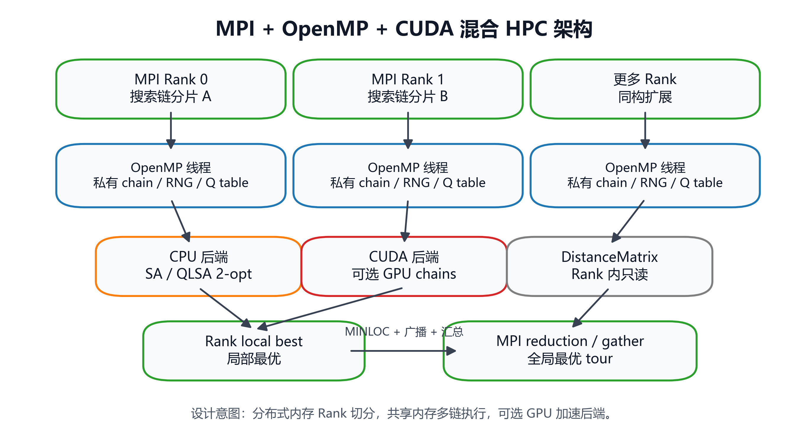
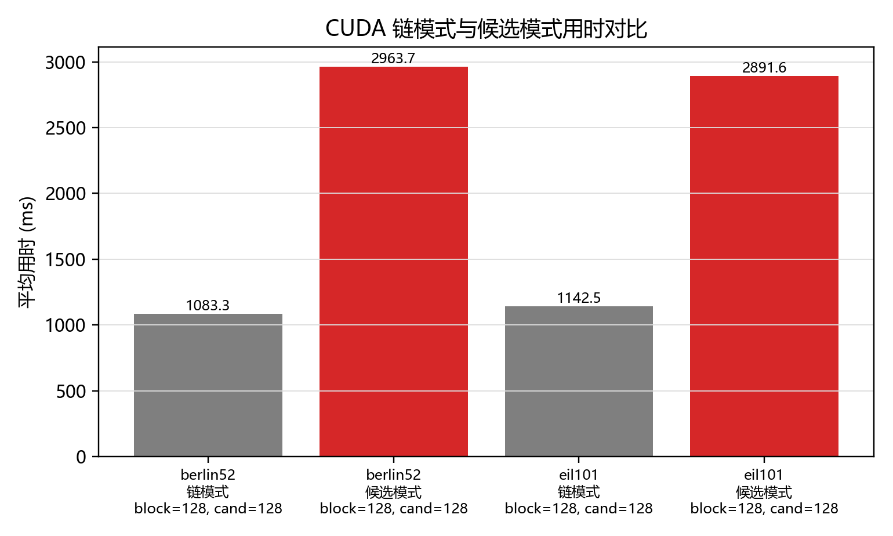
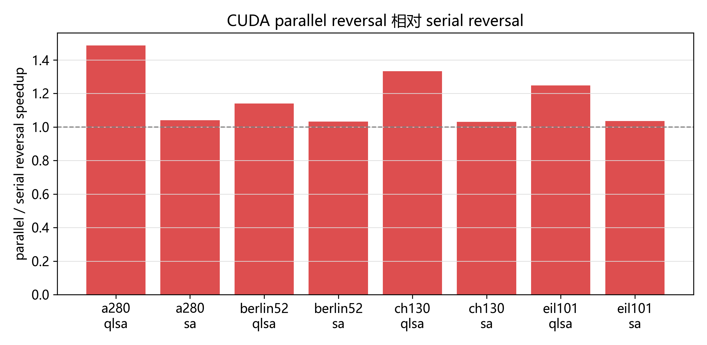
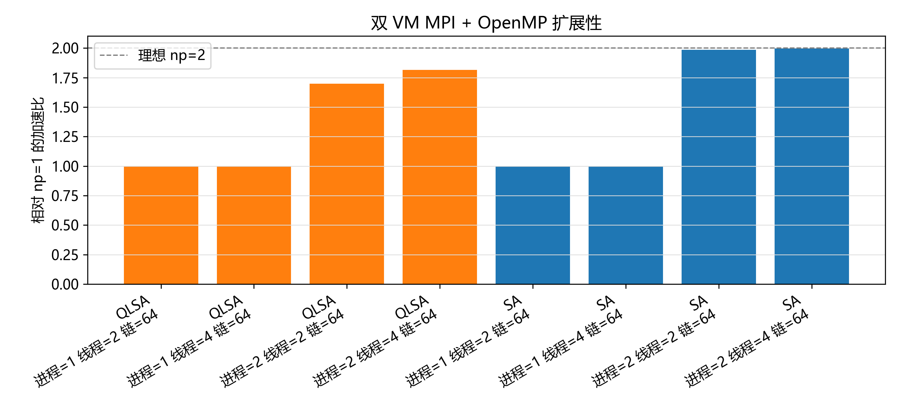
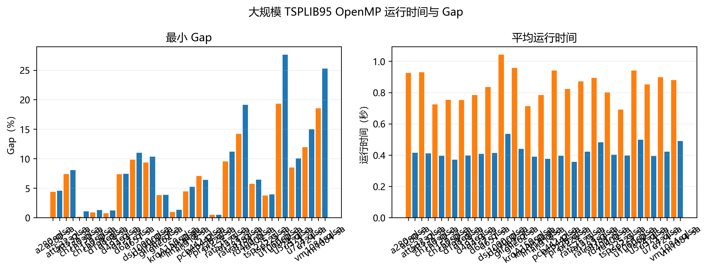
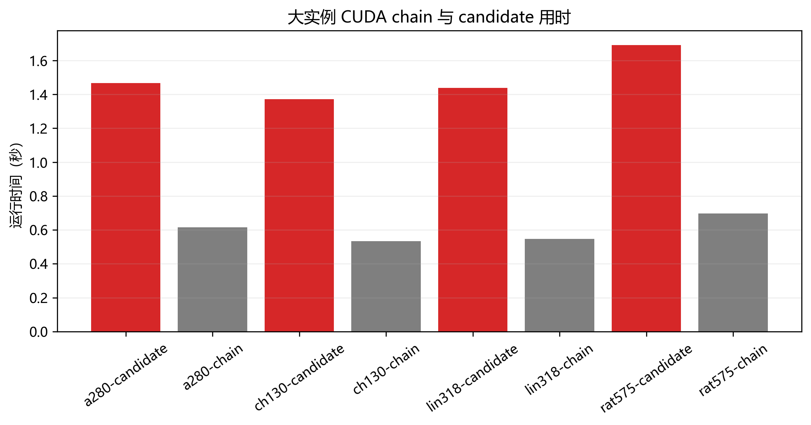
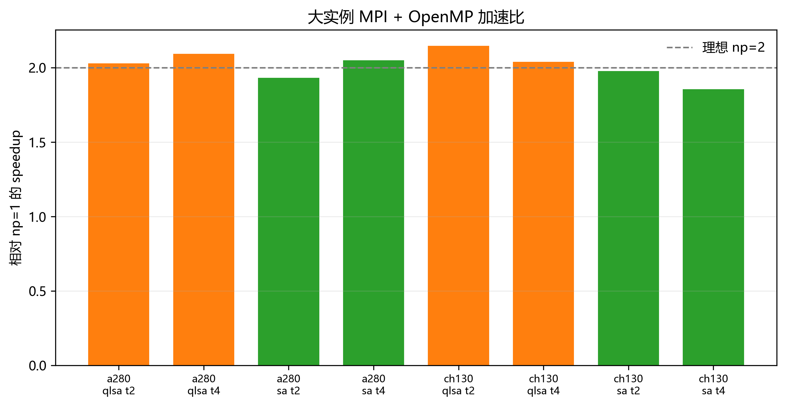
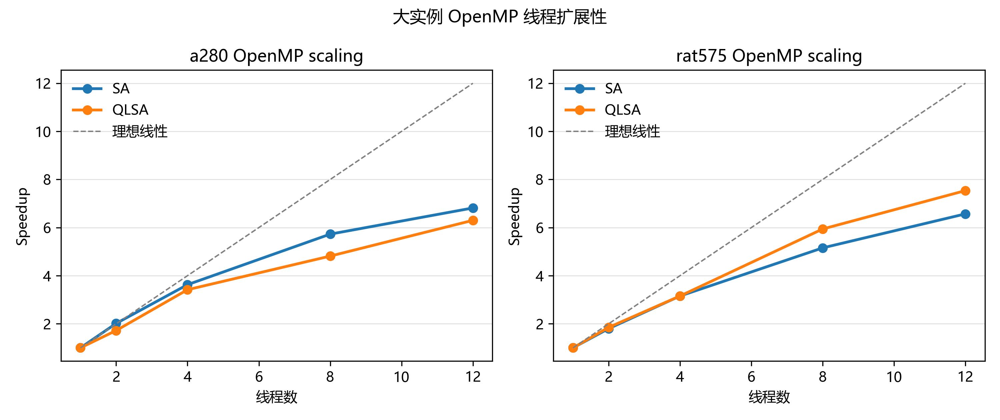
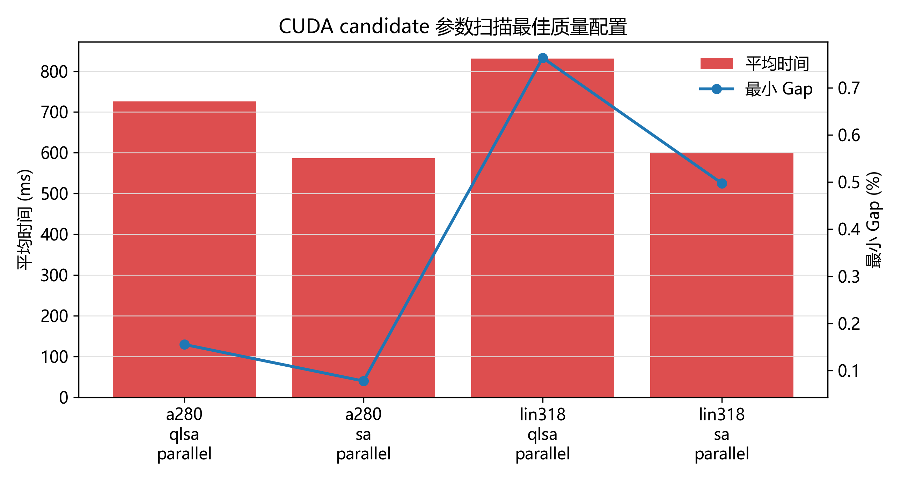
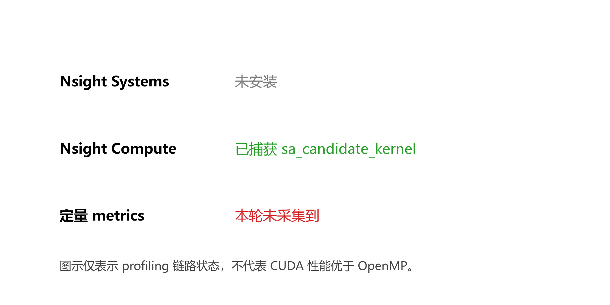

# 面向旅行推销员问题的 Q-Learning 辅助模拟退火算法并行化实现与性能优化

## 摘要

旅行推销员问题（Traveling Salesman Problem, TSP）是组合优化中的典型 NP-hard 问题。精确算法在规模增大后代价很高，模拟退火（Simulated Annealing, SA）这类随机局部搜索方法常用于获得近似解。参考论文 *Q-Learning-Assisted Simulated Annealing for Traveling Salesman Problem Optimization* 将 Q-learning 引入 SA，用于辅助搜索策略选择。本课程作业围绕这一思路，完成了 SA/QLSA 的 C++20 工程实现，并把多搜索链扩展到 OpenMP、CUDA 以及 MPI + OpenMP 后端。

报告的主线是“基于多搜索链的 SA/QLSA 并行化实现”。默认参数实验显示，OpenMP 多链并行是当前最可靠的性能来源：SA 在 6 个 TSPLIB95 实例上的平均 speedup 为 5.46x，平均 parallel efficiency 为 68.28%；QLSA 的平均 speedup 为 4.98x，平均 parallel efficiency 为 62.29%。由于 OpenMP 后端只并行不同搜索链，不改变单链内 2-opt、Metropolis 接受准则和 Q-learning 更新逻辑，因此性能对比和解质量对比的口径较清晰。

解质量方面，默认参数不能保证较难实例都达到 BKS。后续调优和定向增强实验用于分析更高搜索预算的效果。rat99 上，QLSA high-budget 配置达到 BKS=1211，而 SA high-budget 最好为 1212；eil101 targeted 实验中 SA 和 QLSA 均达到 BKS=629。这说明 QLSA 在部分实例上有质量收益，但不能表述为总是优于 SA。

CUDA 和 MPI 在本报告中定位为工程扩展。CUDA 已实现 chain mode、candidate-level 2-opt batch evaluation、QLSA candidate mode 和 parallel reversal；这些结果展示了 GPU 内部候选评价路径，但当前实验不支持把 CUDA 描述为性能上超过 OpenMP。MPI + OpenMP 已在两台 Ubuntu VM 上通过真实 `mpirun` 完成 smoke、formal scaling 和大实例 quick/formal subset，说明 rank-level chain decomposition 可以扩展到 distributed-memory 环境；该结果不等同于生产集群性能评测。

## 1 选题背景与目标

TSP 要求在给定城市集合和两两距离的情况下，寻找访问每个城市一次并回到起点的最短回路。问题规模增大后，搜索空间随城市数呈阶乘增长。课程大作业要求鼓励使用并行算法完成实际应用或近期论文复现，并评价完成情况、技术难度和报告质量。TSP 与随机局部搜索结合后，天然适合多搜索链并行：不同链可以从不同初始路径或随机种子出发，彼此独立搜索，最后归约全局最优。

本项目的目标不是只把单个循环改成 parallel for，而是搭建一个可复现实验系统：底层用 C++20 实现 SA/QLSA 与 TSPLIB95 支持；性能上使用 OpenMP 做主后端；工程上补充 CUDA 与 MPI + OpenMP；实验上使用 CSV、summary、figures 和报告形成可追溯证据。

下表给出课程目标与完成内容的对应关系。

表 1：课程要求与本项目完成内容。

| 课程关注点 | 本项目对应内容 | 证据材料 |
|---|---|---|
| 完成情况 | SA、QLSA、OpenMP、CUDA、MPI、TSPLIB parser、实验脚本 | `src/`、`include/`、`tests/`、`scripts/` |
| 技术难度 | O(1) 2-opt delta、连续距离矩阵、CUDA candidate、MPI hybrid | 源码、测试、最终报告图表 |
| 并行性能 | OpenMP speedup/efficiency，MPI formal scaling | `results/summary/step5_multi_cpu_summary.csv`、`mpi_vm_scaling_formal_summary.csv` |
| 论文对比 | 引入论文 Table 8 和 hard-instance quality 数据 | `results/reference/` |
| 报告质量 | 课程报告、复现命令、限制说明、结果索引 | `docs/final/`、`results/final/` |

## 2 参考论文方法与本项目定位

参考论文提出 Q-Learning-Assisted Simulated Annealing，用 Q-learning 辅助 SA 搜索。论文中的 classical SA 使用 2-opt 扰动和 Metropolis 接受准则；QLSA 在搜索过程中使用 Q 值选择候选策略；SB-QLSA 进一步引入状态信息，例如 diversity state。论文的实验在 TSPLIB95 上统计 Best、Mean、Std、Gap 和运行时间。

本项目基于论文思想进行工程化扩展，而不是逐行复刻全部 SB-QLSA 细节。C++ 主线实现了 SA、QLSA、epsilon-greedy、softmax、状态/动作离散化和 Q table；Python reference 侧保留 candidate-leader 与 diversity-state 对照。报告中涉及 C++ 结果时，不把它写成完整 SB-QLSA 复现。

下表总结论文机制与本项目实现的关系。

表 2：参考论文机制与本项目实现关系。

| 论文内容 | 本项目实现 | 对应程度 | 说明 |
|---|---|---|---|
| SA + 2-opt + Metropolis | C++ SA + O(1) 2-opt delta | 较高 | 接受准则和退火框架一致。 |
| QLSA policy | C++ QLSA，支持 epsilon-greedy/softmax | 部分对应 | 状态和动作是工程化离散设计。 |
| candidate-leader | Python reference 对照，C++ 主线未作为等价实验报告 | 部分对应 | 不声称等价实现论文全部机制。 |
| SB-QLSA diversity state | Python reference 对照 | 部分对应 | C++ 结果不写成 SB-QLSA 主实验。 |
| 论文 Python 串行实现 | C++20 / OpenMP / CUDA / MPI 多后端 | 扩展方向不同 | 本项目重点在工程化和并行化。 |

论文时间结果来自 Python + Xeon 平台，本项目来自 Windows + C++20 + OpenMP/CUDA/MPI。不同语言、不同硬件和不同实现使绝对时间不能作为同口径基准。本报告只把论文时间作为参考基准，用来说明同一问题和相近算法思想下，工程实现和并行化带来的实际变化。

## 3 串行算法与关键优化

串行部分首先保证路径表示、距离计算和 2-opt delta 正确。TSPLIB95 parser 支持坐标型和显式矩阵型实例，覆盖 EUC_2D、CEIL_2D、GEO、ATT、EXPLICIT 等格式。DistanceMatrix 使用一维连续数组存储 `n*n` 距离，这样既减少间接寻址，也便于 CUDA 后端直接拷贝到设备内存。

Tour 使用城市排列表示。一次 2-opt move 反转区间 `[i,k]`，只改变四条边。设旧边为 `a-b`、`c-d`，新边为 `a-c`、`b-d`，delta 为：

$$
\Delta = d(a,c) + d(b,d) - d(a,b) - d(c,d)
$$

因此每次 move 评价可以从 O(n) 降到 O(1)。这对 SA、QLSA、OpenMP 多链和 CUDA candidate evaluation 都是基础优化。

SA 的接受准则为：

$$
P(\Delta,T)=
\begin{cases}
1, & \Delta < 0 \\
\exp(-\Delta/T), & \Delta \ge 0
\end{cases}
$$

QLSA 在此基础上引入 Q table。每轮根据当前离散状态选择动作，动作影响邻域策略或 move 类型，接受或拒绝 move 后更新 Q 值：

$$
Q(s,a) \leftarrow Q(s,a) + \alpha [r + \gamma \max_{a'} Q(s',a') - Q(s,a)]
$$

奖励以路径长度改善为核心，改进越大，奖励越高。该设计保持了 SA 的随机搜索能力，同时让 QLSA 能根据搜索历史调整策略。

## 4 并行化设计

多搜索链是本项目最重要的并行粒度。每条链维护独立的随机种子、当前 tour、best tour、当前路径长度以及 QLSA 的 Q table；DistanceMatrix 是只读共享数据；最终只需在链结果之间取全局 best。这个粒度通信少、同步少，也更容易保持可复现。

图 1：系统架构与数据流。

### 4.1 OpenMP 多链并行

OpenMP 后端使用 chain-level `parallel for`。每个线程处理若干搜索链，所有写入都在各自的 chain result 中完成。并行区结束后，主线程串行归约 best tour、best length、accepted moves 和 improved moves。这种方式避免在内层 move 循环中加锁，也避免频繁同步。

选择 chain-level 而不是 move-level 的原因有三点：第一，move-level 并行会改变单链内 proposal/acceptance 过程，比较口径更复杂；第二，2-opt 接受后需要修改 tour，过细并行会带来冲突；第三，多链本身就是随机搜索中常用的提高覆盖率方式，适合课程项目的可解释性。

### 4.2 CUDA 后端

CUDA 后端保留原 chain mode，同时新增 candidate mode。candidate mode 采用 one block per chain，block 内线程并行生成和评价多个 2-opt 候选 move，通过 shared memory reduction 选择候选，再由 serial 或 parallel reversal 应用接受的 2-opt 反转。

图 2：OpenMP、CUDA 和 MPI + OpenMP 的后端关系。

该模式提高了 GPU 计算密度，但会改变单步 proposal：一轮不再只评估一个候选，而是从一批候选中选择。因此报告把它单独称为 CUDA candidate-level evaluation，而不把它与原始 SA 单候选采样混为一谈。

### 4.3 MPI + OpenMP hybrid

MPI 后端按 rank 切分 chains，每个 rank 内继续使用 OpenMP。每个 rank 产生 local best，最后使用 MPI gather/reduction 得到 global best。通信主要发生在最终归约阶段，因此与多链搜索的计算模式较匹配。双 VM 实验使用该设计验证 distributed-memory 工程链路，但 VM/NAT 环境不等同生产集群。

## 5 工程实现与实验流程

工程实现遵循“算法内核、并行后端、实验脚本、结果分析”分层。核心算法在 C++ 中实现，脚本只负责批量运行、收集 CSV 和生成图表，不在 Python 中替代核心计算。

表 3：工程模块划分。

| 模块 | 主要内容 | 设计考虑 |
|---|---|---|
| Parser | TSPLIB95 `.tsp` 读取 | 支持坐标型和显式矩阵型数据。 |
| DistanceMatrix | 一维连续距离矩阵 | 便于 CPU cache 和 GPU 拷贝。 |
| Tour / 2-opt | 路径、合法性检查、O(1) delta | 降低内层循环开销。 |
| SA / QLSA | 串行搜索内核 | 作为 OpenMP/CUDA/MPI 的基础。 |
| OpenMP | 多链并行 | 主性能后端。 |
| CUDA | chain/candidate/parallel reversal | 工程扩展，不作为主性能结论。 |
| MPI + OpenMP | rank-level chain decomposition | 双 VM 分布式内存验证。 |
| Scripts | run/analyze/figure/check | 保证实验可复现。 |

实验流程为：TSPLIB95 数据进入 C++ 程序，程序输出统一 CSV 行；Python 脚本聚合 raw CSV，计算 mean/std/Gap/speedup/efficiency；图表从 summary CSV 生成；报告只引用 CSV 和图表中已有结果。

## 6 实验设计

实验数据来自 TSPLIB95。默认实验实例为 berlin52、eil51、st70、eil76、rat99、eil101；大实例压力测试进一步覆盖 ch130、ch150、kroA150、d198、tsp225、pr226、gil262、a280，以及 L2/L3 中的若干实例。

评价指标如下：

$$
Gap = \\frac{best\_length - BKS}{BKS} \\times 100\%
$$

$$
Speedup = \\frac{T_{baseline}}{T_{parallel}},\quad
Efficiency = \\frac{Speedup}{p} \\times 100\%
$$

主要实验分为六类：

表 4：实验分组与目的。

| 实验组 | 目的 | 主要输出 |
|---|---|---|
| baseline / OpenMP | 比较 serial multi-chain 与 OpenMP multi-chain | speedup、efficiency、Gap |
| tuning / targeted | 降低 hard instances 的 Gap | best length、mean Gap、runtime |
| policy comparison | 比较 epsilon-greedy 与 softmax | 策略质量差异 |
| CUDA positioning | 验证 CUDA chain/candidate/reversal | CUDA 工程边界 |
| MPI VM scaling | 验证 rank-level 分布式链路 | np=1/2 speedup、communication ms |
| large-instance stress | 检查 130-1000 城市级工程可运行性 | time、Gap、moves/s |

## 7 实验结果与分析

### 7.1 OpenMP 是主性能结果

图 3：默认参数下 OpenMP 多实例 speedup。

图 4：默认参数下 OpenMP parallel efficiency。

表 5：OpenMP 默认参数实验汇总。

| family | average speedup | average efficiency | 说明 |
|---|---:|---:|---|
| SA | 5.46x | 68.28% | 主性能结论，搜索逻辑与串行多链一致。 |
| QLSA | 4.98x | 62.29% | 仍有稳定加速，但 Q table 和动作选择带来额外开销。 |

这组结果是最适合作为课程性能结论的部分。OpenMP 并行只拆分 chains，不修改每条链的接受准则，因此 speedup 和 parallel efficiency 的解释直接。QLSA 的效率低于 SA，主要来自 Q table 更新和动作选择带来的常数开销，也与随机链之间运行差异有关。

### 7.2 默认参数下的解质量

图 5：默认参数下 SA/QLSA 的 Gap 对比。

默认参数下，berlin52、eil51、st70 能达到 BKS；eil76、rat99、eil101 仍有 Gap。这个结果说明并行化首先解决的是时间问题，不能自动保证所有实例的解质量。对 hard instances，需要额外的参数调优和搜索预算。

### 7.3 调优与定向增强

图 6：调优、独立验证和定向增强后的 Gap 变化。

表 6：定向增强实验中的关键配置。

| instance | family | iterations | chains | best | min Gap | mean Gap | mean ms |
|---|---|---:|---:|---:|---:|---:|---:|
| eil101 | SA | 2000000 | 128 | 629 | 0.000% | 0.445% | 1868.0 |
| eil101 | QLSA | 2000000 | 128 | 629 | 0.000% | 0.254% | 3348.5 |
| rat99 | SA | 2000000 | 128 | 1212 | 0.083% | 0.330% | 1804.4 |
| rat99 | QLSA | 2000000 | 128 | 1211 | 0.000% | 0.099% | 3424.6 |

rat99 的结果可以作为 QLSA 的质量案例：QLSA high-budget 达到 BKS=1211，而 SA high-budget 最好为 1212。eil101 中 SA 和 QLSA targeted 配置都能达到 BKS。与此同时，定向增强增加了 chains 或 iterations，运行时间也随之增加，因此报告应同时呈现解质量和成本。

### 7.4 策略对比

图 7：epsilon-greedy 与 softmax 策略对比。

policy comparison 的作用是说明 QLSA 策略并非固定最优。当前工程实现中，epsilon-greedy 在 rat99 上表现更好；softmax 在某些实例上并没有稳定优势。该结果不能直接等同论文中的 softmax 结论，因为本项目的状态/动作设计与论文 candidate-leader 机制并不完全一致。

### 7.5 CUDA 工程扩展

图 8：berlin52 上 serial、OpenMP 与 CUDA 时间对比。

CUDA 后端完成了真实编译和运行，但小实例上没有形成替代 OpenMP 的性能结论。后续 candidate mode 提高了 GPU 内部计算密度，适合作为工程扩展和搜索质量探索。

图 9：CUDA chain mode 与 candidate mode 对比。

表 7：CUDA candidate / QLSA candidate 关键结果。

| instance | algorithm | mode | reversal | best | Gap | mean ms |
|---|---|---|---|---:|---:|---:|
| berlin52 | sa-cuda-candidate | candidate | parallel | 7542 | 0.000% | 1471.4 |
| berlin52 | qlsa-cuda-candidate | candidate | parallel | 7542 | 0.000% | 2105.5 |
| eil101 | sa-cuda-candidate | candidate | parallel | 629 | 0.000% | 1368.0 |
| eil101 | qlsa-cuda-candidate | candidate | parallel | 629 | 0.000% | 2072.6 |
| ch130 | sa-cuda-candidate | candidate | parallel | 6110 | 0.000% | 1364.0 |
| ch130 | qlsa-cuda-candidate | candidate | parallel | 6110 | 0.000% | 2046.9 |
| a280 | sa-cuda-candidate | candidate | parallel | 2579 | 0.000% | 1512.6 |
| a280 | qlsa-cuda-candidate | candidate | parallel | 2579 | 0.000% | 1985.0 |

图 10：CUDA candidate mode 中 serial reversal 与 parallel reversal 对比。

CUDA candidate mode 在 a280、ch130、eil101 等实例上可以达到 BKS，说明 batch candidate evaluation 对搜索质量有帮助。parallel reversal 对 QLSA candidate 的局部改善较明显，例如 a280 上从 2951.838 ms 降到 1985.010 ms。另一方面，candidate mode 通常仍慢于 CUDA chain mode 或 OpenMP，因此不能写成主性能后端。

### 7.6 MPI + OpenMP 双 VM 结果

图 11：双 VM MPI formal scaling 中 np=2 相对 np=1 的 speedup。

表 8：berlin52 MPI formal scaling 结果。

| algorithm | threads/rank | np=1 mean ms | np=2 mean ms | speedup | efficiency | comm ms |
|---|---:|---:|---:|---:|---:|---:|
| qlsa-mpi-omp | 2 | 3863.947 | 2276.523 | 1.6973 | 84.87% | 5.727 |
| qlsa-mpi-omp | 4 | 3825.010 | 2106.975 | 1.8154 | 90.77% | 5.212 |
| sa-mpi-omp | 2 | 2604.738 | 1312.730 | 1.9842 | 99.21% | 4.924 |
| sa-mpi-omp | 4 | 2619.846 | 1309.360 | 2.0009 | 100.04% | 6.387 |

MPI formal scaling 说明 rank-level chain decomposition 可以跨两台 VM 运行。SA 的 np=2 speedup 接近 2x，QLSA 也达到 1.70x-1.82x。通信开销为毫秒级，说明在该粒度下最终归约不是主要开销。由于实验环境是 VMware NAT 双 VM，这一结果只作为 distributed-memory 工程证据，不作为生产 HPC benchmark。

### 7.7 大实例压力测试

图 12：L1/L2/L3 大实例 OpenMP 压力测试。

表 9：L1 OpenMP formal 部分结果。

| instance | dimension | family | best | min Gap | mean ms | moves/s |
|---|---:|---|---:|---:|---:|---:|
| a280 | 280 | QLSA | 2692 | 4.381% | 740.7 | 86.4M |
| a280 | 280 | SA | 2697 | 4.575% | 364.4 | 175.6M |
| ch130 | 130 | QLSA | 6118 | 0.131% | 683.7 | 93.6M |
| ch130 | 130 | SA | 6175 | 1.064% | 341.5 | 187.4M |
| ch150 | 150 | QLSA | 6586 | 0.888% | 776.1 | 82.5M |
| ch150 | 150 | SA | 6611 | 1.271% | 354.9 | 180.3M |
| d198 | 198 | QLSA | 15897 | 0.741% | 741.4 | 86.3M |
| d198 | 198 | SA | 15972 | 1.217% | 343.6 | 186.3M |

L1 formal 覆盖 8 个 130-280 城市实例，iterations=1,000,000、chains=64、threads=8、repeat=3；L2 formal subset 覆盖 lin318、pcb442、rat575；L3 quick 覆盖 dsj1000、u1060、vm1084。该实验用于验证工程可扩展性和运行趋势，不要求所有大实例达到 BKS。报告中只能写“百万迭代级中等规模实验跑通”，不能写“百万城市级”。

图 13：大实例 CUDA chain 与 candidate mode 对比。

表 10：大实例 CUDA formal subset。

| instance | mode | best | min Gap | mean ms | speedup candidate vs chain | 说明 |
|---|---|---:|---:|---:|---:|---|
| a280 | candidate | 2579 | 0.000% | 1465.6 | 0.4195 | batch proposal variant; slower than chain |
| a280 | chain | 2741 | 6.282% | 614.8 | 1.0000 |  |
| ch130 | candidate | 6110 | 0.000% | 1370.6 | 0.3888 | batch proposal variant; slower than chain |
| ch130 | chain | 6176 | 1.080% | 532.9 | 1.0000 |  |
| lin318 | candidate | 42217 | 0.447% | 1438.0 | 0.3811 | batch proposal variant; slower than chain |
| lin318 | chain | 44433 | 5.720% | 548.0 | 1.0000 |  |
| rat575 | candidate | 6924 | 2.229% | 1691.5 | 0.4127 | batch proposal variant; slower than chain |
| rat575 | chain | 8066 | 19.090% | 698.0 | 1.0000 |  |

candidate mode 在 ch130、a280、lin318、rat575 上改善了 best length，但用时仍高于 chain mode。原因包括 batch proposal 的 reduction、同步、reversal 和设备端 tour 更新开销。该结果适合作为 CUDA 内部并行评价路径的证据，不适合作为 CUDA 性能主张。

图 14：大实例 MPI + OpenMP 在双 VM 上的 np=2 scaling。

大实例 MPI quick/formal subset 已覆盖 ch130、a280、lin318、rat575，使用真实 `mpirun`。在 ch130 和 a280 formal subset 中，np=2 相对 np=1 的 speedup 多数接近 2x，communication_ms 为数毫秒到十余毫秒。部分 efficiency 超过 100% 应解释为 VM 调度、缓存和运行波动，不应写成超线性 HPC 结论。

### 7.8 OpenMP 大实例 scaling 与 CUDA sweep

图 15：a280 与 rat575 上的 OpenMP 线程扩展性。

OpenMP large scaling 选择 a280 和 rat575，threads=1/2/4/8/12，chains=64，iterations=500000，repeat=3。线程数增加后 SA/QLSA 均获得加速，但 8-12 线程后效率下降，说明调度和内存层次开销开始影响收益。

图 16：CUDA candidate 参数扫描中的时间与 Gap 折中。

CUDA sweep 显示 candidate 数量增加通常能扩大单轮搜索覆盖，但不会单调改善运行时间。该结果说明 CUDA candidate 是质量/时间折中工具，而不是简单的加速开关。

图 17：CUDA profiling 工具链状态。

Nsight Compute 已能捕获 `sa_candidate_kernel`；Nsight Systems 当前 PATH 中未找到。报告只据此说明 CUDA kernel 可被 profiling 工具捕获，后续可继续分析 occupancy 和 memory throughput；不写具体带宽或占用率结论。

## 8 与参考论文对比

图 18：论文 Table 8 时间与本项目 OpenMP 时间参考对比。

表 11：论文 Table 8 时间数据节选。

| instance | Paper SA (s) | Paper QLSA epsilon (s) | 说明 |
|---|---:|---:|---|
| eil51 | 589.41 | 602.53 | 论文 Python 平台时间 |
| berlin52 | 600.56 | 644.12 | 论文 Python 平台时间 |
| st70 | 2460.60 | 2498.47 | 论文 Python 平台时间 |
| eil76 | 2379.99 | 2450.12 | 论文 Python 平台时间 |
| rat99 | 5027.88 | 5003.58 | 论文 Python 平台时间 |
| eil101 | 151064.69 | 152305.01 | 论文 Python 平台时间 |

该表只能作为参考对比。论文使用 Python 3.11、NumPy/Pandas 和 Xeon 平台；本项目使用 C++20、OpenMP/CUDA/MPI 和不同硬件。时间差异同时来自语言、实现、硬件和并行策略，不能写成同平台同口径性能评测。

图 19：论文 hard-instance quality 与本项目调优/增强结果对比。

表 12：论文 hard-instance mean Gap 节选。

| instance | Paper-SA mean Gap | Paper best QLSA-family mean Gap | 本项目使用方式 |
|---|---:|---:|---|
| eil76 | 11.5056% | 3.8848% (Paper-SB-QLSA-softmax) | 作为质量参考，不作同平台结论 |
| rat99 | 17.9934% | 5.8880% (Paper-QLSA-epsilon) | 作为质量参考，不作同平台结论 |
| eil101 | 9.1097% | 5.6279% (Paper-SB-QLSA-softmax) | 作为质量参考，不作同平台结论 |

参考论文说明 Q-learning variants 在 hard instances 上通常优于 classical SA。本项目的调优和定向增强实验也观察到类似方向：rat99 上 QLSA high-budget 达到 BKS，而 SA 未达到。差异在于，本项目还额外分析了 OpenMP 加速、CUDA candidate 和 MPI 分布式执行。也就是说，论文验证算法思想，本项目侧重把这一思想做成可构建、可测试、可复现实验的并行工程。

## 9 问题与局限性

表 13：实施过程中的主要问题。

| 问题 | 处理方式 | 当前边界 |
|---|---|---|
| CUDA 小实例不快 | 保留 CUDA chain，并新增 candidate/reversal | 不写 CUDA 已经成为主性能后端。 |
| QLSA 参数敏感 | tuning、independent validation、targeted enhancement | 不写 QLSA 在所有实例都占优。 |
| SB-QLSA 未等价实现 | Python reference 对照，C++ 主线保守表述 | 不写 C++ 主线等同论文 SB-QLSA。 |
| MPI VM 环境 | 统一 Open MPI prefix，真实 `mpirun` | 不写生产集群性能评测。 |
| 大实例 Gap | 用 L1/L2/L3 stress 观察趋势 | 不要求所有大实例达到 BKS。 |
| 论文时间对比 | 明确不同语言和硬件 | 不写同平台同口径评测。 |

当前项目仍有改进空间：CUDA candidate 的 reversal 和内存访问仍可优化；MPI island migration 没有实现，因为现有 chain runner 没有安全的 mid-run pause/resume API；大实例只做了有限预算，不能替代更系统的长期搜索；softmax 与论文机制并非完全一致，后续如果要严格复现实验，应进一步对齐 candidate-leader 和 diversity-state。

## 10 总结

第一，性能方面，OpenMP multi-chain 是本项目最可靠的加速结果。默认参数下 SA 平均 speedup 为 {sa_avg_speed:.2f}x，QLSA 平均 speedup 为 {qlsa_avg_speed:.2f}x，说明多搜索链粒度适合该类随机局部搜索。

第二，算法方面，SA/QLSA 均完成 C++20 工程化实现。调优和定向增强使 eil101 的 SA/QLSA 均达到 BKS，rat99 上 QLSA high-budget 达到 BKS=1211，而 SA high-budget 最好为 1212，形成了一个 QLSA 质量收益案例。

第三，工程方面，项目实现了 TSPLIB95 parser、O(1) 2-opt delta、OpenMP、CUDA、MPI + OpenMP、Python reference、实验脚本、图表生成和提交检查。CUDA 与 MPI 的结果不作为主性能结论，但提高了工程难度，也展示了从共享内存、GPU 到分布式内存的扩展路径。

## 参考文献

1. Adil, N., Eddaoudi, F., Lakhbab, H., & Naimi, M. (2026). Q-Learning-Assisted Simulated Annealing for Traveling Salesman Problem Optimization. *Statistics, Optimization & Information Computing*, 15(5), 3706-3730. https://doi.org/10.19139/soic-2310-5070-3028
2. Reinelt, G. TSPLIB: A Traveling Salesman Problem Library. *ORSA Journal on Computing*, 3(4), 376-384, 1991.
3. Kirkpatrick, S., Gelatt, C. D., & Vecchi, M. P. Optimization by Simulated Annealing. *Science*, 220(4598), 671-680, 1983.
4. OpenMP Architecture Review Board. OpenMP Application Programming Interface Specification.
5. NVIDIA. CUDA C++ Programming Guide.
6. MPI Forum. MPI: A Message-Passing Interface Standard.

## 附录 A 个人工作说明

本课程作业为单人团队完成。

| 项目 | 内容 |
|---|---|
| 团队人数 | 1 人 |
| 团队成员 | 陈乐浚 |
| 学号 | 22361054 |
| 学院/专业 | 中山大学计算机学院 / 信息与计算科学 |

本人承担了本项目的全部工作。选题阶段完成了 TSP、模拟退火和 Q-Learning Assisted SA 相关论文阅读，并将课程要求中的“近期论文复现或并行化应用”落实为本项目目标。工程阶段搭建 C++20/CMake 结构，编写 TSPLIB95 parser、DistanceMatrix、Tour、SA、QLSA、OpenMP multi-chain、CUDA backend、MPI + OpenMP backend 和测试代码。实验阶段编写自动化脚本，完成默认参数实验、参数调优、独立验证、定向增强、policy comparison、CUDA candidate、MPI VM scaling、大实例压力测试以及论文参考对比。

实现过程中还处理了多类工程问题：TSPLIB 数据下载源不稳定，因此增加数据状态和 SHA256 记录；Visual Studio CMake 生成器启用 CUDA 不稳定，因此改用 Ninja；Windows Python alias 影响脚本执行，因此统一使用 `py`；双 VM MPI 需要统一 Open MPI prefix 和 remote launch 环境；最终报告需要兼顾课程提交、隐私保护和结果可追溯，因此整理了 `docs/final/`、`results/final/`、`figures/final/` 与 `submission/course/`。本报告中的主要结论均来自已有 CSV、图表或参考论文数据，没有把未完成或不公平的对比写成结论。
