# TSP 多搜索链 SA/QLSA 并行优化

## 摘要

旅行推销员问题（TSP）是组合优化中的经典 NP-hard 问题。随着城市数量增加，可行路径数量快速增长，精确搜索难以在有限时间内完成。模拟退火（SA）通过温度下降和 Metropolis 接受准则，在局部改进与随机跳出之间取得平衡；参考论文进一步引入 Q-learning 辅助模拟退火（QLSA），尝试用学习机制改善邻域搜索策略。

本项目以“多搜索链”为统一并行粒度。每条搜索链独立维护路径、随机数状态和搜索历史，距离矩阵只读共享，最终只需汇集各链的最优结果。这个粒度适合共享内存多线程，也可以映射到 CUDA 线程块和 MPI 进程。项目因此形成了一条清晰主线：先建立可靠的 SA/QLSA 串行搜索内核，再围绕多搜索链实现 OpenMP、CUDA、MPI + OpenMP 三类并行后端。

实验结果表明，OpenMP 是本项目最稳定的性能后端。默认参数下，SA 在 6 个 TSPLIB95 实例上的平均加速比为 5.46，平均并行效率为 68.28%；QLSA 的平均加速比为 4.98，平均并行效率为 62.29%。解质量方面，berlin52、eil51、st70 在默认参数下达到 BKS；eil76、rat99、eil101 通过后续调优验证和定向增强实验进一步改善了解质量。

QLSA 的质量收益主要体现在较难实例和较高搜索预算下。rat99 上 QLSA high-budget 达到 BKS=1211，而 SA high-budget 最好结果为 1212；eil101 的定向增强实验中 SA 和 QLSA 均达到 BKS=629。CUDA 后端实现了多链模式、候选批量评价和并行路径反转，候选批量评价在若干实例上改善了最短路径长度；MPI + OpenMP 已在双 Ubuntu 虚拟机上通过真实 `mpirun` 运行，berlin52 formal scaling 中 SA 的 np=2 接近 2 倍加速，QLSA 的 np=2 加速比约为 1.70 至 1.82，通信开销为毫秒级。

## 1 选题背景与目标

TSP 的输入是一组城市和任意两城市之间的距离，目标是寻找一条访问所有城市一次并回到起点的最短回路。该问题具有明确的数学定义、标准测试集和已知最优值，适合用来评价启发式搜索的解质量。对并行算法课程来说，TSP 还有一个重要特点：一次完整搜索可以从不同初始状态出发重复运行，多条搜索链之间依赖很少，天然适合并行化。

选择 SA 是因为它能以较低实现复杂度体现随机局部搜索的核心思想。2-opt 邻域用于改变路径结构，Metropolis 准则允许在温度较高时接受较差解，从而降低陷入局部最优的风险。选择 QLSA 是因为参考论文将 Q-learning 引入 SA 的邻域选择过程，为“近期论文算法的工程化复现与并行扩展”提供了清晰切入点。

本项目的预期目标可以概括为三点。第一，完成可运行的 SA/QLSA C++20 工程实现；第二，在多核 CPU、GPU 和分布式内存环境中验证多搜索链并行；第三，形成可复现的实验流程，给出加速比、并行效率和解质量分析。最终结果以 OpenMP 作为主性能结论，以 QLSA 的困难实例质量改善作为算法扩展结论，以 CUDA 和 MPI 作为更高工程复杂度的并行后端验证。

从并行算法课程要求看，这一选题同时覆盖了算法实现、并行设计、工程难度和实验报告四个方面：SA/QLSA 负责算法基础，OpenMP 和 MPI 体现多处理单元协同，CUDA 体现 GPU 端实现探索，实验部分则用加速比、并行效率和 Gap 支撑结果分析。

## 2 参考论文与本项目定位

参考论文 *Q-Learning-Assisted Simulated Annealing for Traveling Salesman Problem Optimization* 比较了 SA、QLSA 和带状态的 QLSA 变体。论文使用 TSPLIB95 实例，报告最优值、均值、标准差、相对最优偏差和运行时间。它的核心启发在于：模拟退火不必只依赖固定扰动策略，Q-learning 可以根据搜索反馈选择更合适的候选来源或邻域动作。

论文中的方法可以分为三层。第一层是普通 SA：从当前路径出发，用 2-opt 产生邻域路径，再根据 Metropolis 准则决定是否接受。第二层是 QLSA：在 SA 框架上增加 Q-learning，用动作选择机制决定候选来源或扰动策略，例如当前解、历史最优解、随机解或 double-bridge 扰动解等。第三层是 State-Based QLSA：进一步引入状态信息，使 Q 表更新不仅依赖动作，也依赖搜索过程中的状态划分。论文通过这些变体比较学习机制对解质量和稳定性的影响。

本项目吸收了论文中的三个关键思想。第一，保留 SA + 2-opt + Metropolis 的基本搜索框架；第二，在 QLSA 中维护 Q 表，并支持 epsilon-greedy 与 softmax 两类动作选择策略；第三，用状态和奖励描述搜索过程，使学习机制能够根据路径改善情况更新动作价值。基于这些思想，项目进一步加入 C++20 工程化实现、OpenMP 多链并行、CUDA 候选批量评价和 MPI + OpenMP 分布式运行，并补充了 `paper` 与 `paper-sb` 两个可选 QLSA 机制对齐变体。

论文方法与本项目实现的对应关系如下：

| 论文内容 | 本项目处理方式 | 报告中的定位 |
|---|---|---|
| SA + 2-opt + Metropolis | 作为 C++20 串行内核实现，并用于 OpenMP/CUDA/MPI 后端 | 基础算法 |
| QLSA 动作选择 | 默认变体实现状态/动作/Q 表更新，支持 epsilon-greedy 与 softmax | 算法扩展 |
| Candidate-leader QLSA | 可选 `paper` 变体使用 current、global best、random、double-bridge 四类候选来源 | 机制对齐 |
| State-Based QLSA | 可选 `paper-sb` 变体在 candidate-leader 上加入基于 Hamming 距离的 diversity state | 机制对齐 |
| TSPLIB95 实验 | 使用相同问题族和 BKS 指标进行质量比较 | 参考对比 |
| 并行实现 | 本项目扩展 OpenMP、CUDA、MPI + OpenMP | 课程工程重点 |

需要明确的是，已有默认参数、调优和定向增强实验主要使用 `current` 变体；新增 `paper` / `paper-sb` 提供了 candidate-leader 与 diversity state 的 C++ 对齐入口，但尚未替代历史主实验。这样处理能同时保留已有结果的可比性，并为后续更严格的论文机制复现实验留下同一套工程接口。

论文结果与本项目结果可以在相同 TSPLIB95 实例和 BKS 指标下进行质量参考。运行时间比较则需要注明口径：论文使用 Python 生态和不同硬件环境，本项目使用 Windows、C++20、OpenMP、CUDA、MPI 和本地 CPU/GPU/虚拟机环境。不同语言、不同硬件和不同实现方式都会影响绝对时间，因此本文把论文时间作为参考背景，而不是同平台计时对照。

## 3 串行搜索内核设计

### 3.1 问题建模与数据表示

并行化之前，首先要把单条搜索链的行为定义清楚。TSP 的一个解可以看作城市编号的一个排列，例如 $(v_0,v_1,\ldots,v_{n-1})$，路径长度为相邻城市距离之和再加上回到起点的距离。由于可行解数量为 $(n-1)!/2$ 量级，直接枚举不可行，本项目采用启发式随机搜索：从一个初始路径出发，反复生成邻域解，用接受准则决定是否移动到新路径，并记录搜索过程中遇到的最短路径。

距离矩阵使用一维连续数组保存，访问位置由城市编号映射得到。这样做的好处是结构简单、缓存友好，也便于复制到 GPU 全局内存。路径使用城市编号序列表示。2-opt 操作选取两条边 `a-b` 和 `c-d`，替换为 `a-c` 和 `b-d`，路径长度变化为：

$$
\Delta = d(a,c)+d(b,d)-d(a,b)-d(c,d)
$$

这个公式是串行搜索内核的关键优化。若每次扰动都重新计算完整路径长度，单次评价需要 $O(n)$；使用 2-opt 增量后，只需访问四条边，单次评价降为 $O(1)$。当迭代次数达到百万级、搜索链数量达到几十或上百时，这个优化直接决定实验是否能在合理时间内完成。

### 3.2 SA 算法描述

SA 的单链流程可以描述为以下步骤：

1. 用最近邻或随机方式生成初始路径，计算当前路径长度。
2. 按温度 $T$ 生成一个 2-opt 候选移动，利用增量公式得到 $\Delta$。
3. 若 $\Delta<0$，说明路径变短，直接接受；否则按 Metropolis 准则以一定概率接受。
4. 接受移动后更新当前路径；若当前路径优于历史最优路径，则更新该链的最优结果。
5. 按冷却计划降低温度，重复上述过程直到达到迭代次数。

模拟退火的接受概率为：

$$
P_{\mathrm{accept}}(\Delta,T)=
\begin{cases}
1, & \Delta < 0,\\
\exp(-\Delta/T), & \Delta \ge 0.
\end{cases}
$$

温度较高时，算法更容易接受较差解，搜索范围更广；温度下降后，接受较差解的概率降低，搜索逐渐集中于局部改进。这个过程使 SA 能在“探索”和“利用”之间取得平衡。

### 3.3 QLSA 算法描述

QLSA 在 SA 的基础上增加状态、动作和奖励。可以把它理解为：普通 SA 的邻域扰动策略基本固定，而 QLSA 让算法根据近期搜索反馈选择不同扰动方式。状态由近期路径变化离散化得到，动作表示不同邻域选择方式或扰动范围，奖励主要来自路径长度改善。动作选择支持 epsilon-greedy 和 softmax：前者保留一定概率随机探索，后者按 Q 值分布进行概率选择。Q 值更新为：

$$
Q(s,a) \leftarrow Q(s,a)+\alpha\left[r+\gamma\max_{a'}Q(s',a')-Q(s,a)\right]
$$

其中 $\alpha$ 为学习率，$\gamma$ 为折扣因子。QLSA 的额外代价来自动作选择和 Q 表更新，因此它通常比 SA 单链更慢；它的价值主要体现在合适参数和预算下改善搜索质量。

### 3.4 算法分析

从复杂度角度看，设城市数为 $n$，单链迭代次数为 $I$。距离矩阵预处理需要 $O(n^2)$ 时间和空间；路径本身需要 $O(n)$ 空间；使用 O(1) 增量后，SA 主循环评价移动的核心代价近似为 $O(I)$。QLSA 在此基础上增加状态计算、动作选择和 Q 表更新，渐进量级仍与迭代次数线性相关，但常数开销更高。

这个复杂度特点直接影响并行化选择：一次 2-opt 增量评价只访问四条边，单次计算很轻；一条完整搜索链却包含大量迭代、完整随机数状态和独立最优路径。因此，把“搜索链”作为并行任务，比把单次 2-opt 移动拆给多个 CPU 线程更合适。后续 OpenMP、CUDA 和 MPI 后端都沿用这个任务粒度，只是在不同硬件上采用不同的数据放置和归约方式。

## 4 多搜索链并行化方案

多搜索链并行把“一条完整搜索链”定义为一个任务。设总链数为 $C$，并行执行单元数为 $p$，任务集合就是：

$$
\{0,1,\ldots,C-1\}
$$

每个任务独立运行一条 SA 或 QLSA 搜索链，最后从所有链的局部最优结果中选出全局最优路径。这个划分方式不是简单地把循环套上并行语句，而是根据 SA/QLSA 的计算特征做出的设计选择。

链级并行的核心数据归属如下。

| 数据或状态 | 归属方式 | 原因 |
|---|---|---|
| 距离矩阵 | 只读共享 | 所有链都需要查询距离，但运行过程中不修改 |
| 当前路径、当前长度 | 每条链私有 | 不同链从不同随机种子出发，搜索轨迹不同 |
| 历史最优路径 | 每条链私有，结束后归约 | 避免内层循环频繁锁竞争 |
| 随机数状态 | 每条链私有 | 保证不同链独立且可复现 |
| Q 表与学习状态 | QLSA 每条链私有 | 不同链的学习过程不互相覆盖 |
| 接受次数、改进次数 | 每条链私有，结束后求和 | 统计信息只在输出时汇总 |

这种设计有两个直接后果：

- **同步点少**：OpenMP 和 MPI 后端主要在搜索结束后做一次归约，内层迭代不加锁。
- **搜索覆盖更广**：多条链从不同随机种子出发，既提供并行度，也增加探索不同局部区域的机会。

### 4.1 OpenMP 任务划分

OpenMP 后端直接按搜索链编号划分任务。实现中使用静态调度，每个线程负责若干 `chain_id`，每条链完成后把结果写入 `chain_results[chain_id]`。由于每个链编号对应唯一写入位置，线程之间不需要在主循环内加锁。

OpenMP 后端的执行过程可以概括为：

```text
并行执行 chain_id = 0 ... C-1:
    seed = splitmix64(base_seed, chain_id)
    运行一条 SA 或 QLSA 搜索链
    写入 chain_results[chain_id]

并行区域结束后:
    顺序扫描 chain_results
    选出 best_length 最小的路径
    汇总 accepted_moves 和 improved_moves
```

这个策略的性能优势来自两点。第一，距离矩阵只读共享，避免了数据竞争。第二，最优路径归约发生在链结束后，归约次数与链数有关，而不是与迭代次数有关。对于百万次迭代的实验，减少内层同步比增加少量链间归约更重要。

### 4.2 CUDA 任务划分

CUDA 后端保留链级并行，同时增加块内候选批量评价。

- **多链模式**：一个 CUDA 线程块对应一条搜索链，重点验证 GPU 能同时运行多条独立链。
- **候选批量评价模式**：一个线程块仍对应一条搜索链，但块内多个线程同时生成并评价 2-opt 候选。

候选批量评价模式的块内步骤为：

1. 每个活动线程生成一个候选 2-opt 移动。
2. 每个线程用 O(1) 增量公式计算候选 $\Delta$。
3. 候选的 $\Delta$、下标和策略信息写入共享内存。
4. 块内按 `best` 或 `random` 策略选出一个候选。
5. 选中候选进入 Metropolis 接受判定。
6. 若接受，块内线程协作完成路径反转，并协作复制新的最优路径。

这里的并行度来自“同一条链的一次迭代中批量评价多个候选”。它和 OpenMP/MPI 的链级并行不同，会改变候选提案过程，因此报告中把它称为 CUDA 候选批量评价变体，而不是普通 SA 的完全等价加速版。

### 4.3 MPI + OpenMP 任务划分

MPI 后端先把搜索链按连续区间分给不同 MPI 进程。设总链数为 $C$、进程数为 $r$，每个进程获得约 $C/r$ 条链；若不能整除，前若干进程多分一条。进程内部再使用 OpenMP 静态调度运行本地链。

每个 MPI 进程完成本地搜索后，先得到本地最优路径，再通过 `MPI_Allreduce` 的最小值定位操作找出全局最优所在进程，随后广播全局最优路径，并用 `MPI_Reduce` 汇总接受次数和改进次数。通信内容主要是路径长度、获胜进程编号、最优路径和统计计数，通信频率很低。

这种两层结构可以写成：

```text
MPI 进程 r:
    分配一段全局 chain_id
    进程内用 OpenMP 并行运行本地链
    得到 local best

所有 MPI 进程:
    MPI_Allreduce 找到 global best 所在进程
    MPI_Bcast 广播 global best tour
    MPI_Reduce 汇总统计量
```

MPI 实验的重点不在于虚拟机环境的绝对速度，而在于验证分布式内存下的任务划分和通信模式：计算量随链数增长，通信量主要随城市数增长。对 TSP 多链搜索而言，这种比例关系比较适合向多节点扩展。

### 4.4 并行策略的代价分析

链级并行的理想情况是每条链耗时接近，通信接近为零，此时加速比接近并行执行单元数量。实际运行中会出现三类偏差：

- **负载不均衡**：不同随机种子会产生不同搜索轨迹，QLSA 还会因动作选择和 Q 表更新增加链间差异。
- **内存访问开销**：距离矩阵访问频繁，城市数增大后缓存命中率下降；CUDA 还会受到全局内存和路径反转访问模式影响。
- **归约与通信开销**：OpenMP 归约在单机内完成，开销较小；MPI 需要跨虚拟机传输最优路径和统计量，但通信次数少。

因此，OpenMP 在本项目中成为主性能后端；CUDA 主要用于探索 GPU 端候选批量评价；MPI + OpenMP 主要用于验证分布式多链搜索结构。

## 5 工程实现与实验流程

工程实现围绕“同一搜索内核、多个并行后端、统一结果格式”展开。程序使用 C++20 编写，通过 CMake 构建；CUDA 使用 Ninja 构建路径；MPI 实验在 Ubuntu 虚拟机上使用 Open MPI。TSPLIB95 数据解析、距离矩阵、路径表示和 2-opt 增量属于公共基础模块，SA、QLSA、OpenMP、CUDA 和 MPI 后端都复用这些接口。

主要运行环境如下。Windows 主机用于 C++、OpenMP 和 CUDA 实验，Ubuntu 虚拟机用于 MPI + OpenMP 双节点实验。不同后端使用同一套命令行参数和 CSV 输出格式，便于后续统一分析。

| 项目 | 环境 |
|---|---|
| 操作系统 | Windows 主机；Ubuntu 虚拟机用于 MPI |
| CPU | 12th Gen Intel(R) Core(TM) i5-12600KF |
| GPU | NVIDIA GeForce RTX 4070 SUPER |
| 编译器 | MSVC 19.44 / nvcc 12.9 |
| 构建工具 | CMake + Ninja |
| 构建模式 | Release |
| 并行后端 | OpenMP、CUDA、MPI + OpenMP |

实验输出统一为 CSV 结果，包括算法、实例、维度、迭代次数、随机种子、链数、线程数、并行后端、最短路径长度、最终路径长度、运行时间、接受次数和改进次数。随后由分析脚本生成汇总结果表和图表。这样做的目的不是堆叠脚本，而是保证每个结论都可以回溯到原始运行记录。

完整实验流程分为五步。第一步准备 TSPLIB95 数据，检查实例名、维度、边权类型和 BKS。第二步构建 Release 版本程序，确认 OpenMP、CUDA 或 MPI 后端是否启用。第三步按实验矩阵运行程序，保存每次运行的原始 CSV 和日志。第四步由分析脚本按算法、实例和参数分组，计算最短路径、平均偏差、运行时间、加速比和并行效率。第五步生成图表并检查报告中的图片路径、编码和敏感信息。这样的流程使实验不是手工复制命令，而是可以重新执行和追溯。

性能优化不是只放在并行后端中完成。串行内核和数据表示已经为并行运行做了准备：

- **距离矩阵连续存储**：二维距离压成一维数组，CPU 端减少指针跳转，CUDA 端也便于复制到设备内存。
- **2-opt 增量计算**：每次候选评价只访问四条边，避免在百万次迭代中反复重算完整路径。
- **链内状态私有化**：路径、随机数、计数器和 Q 表都由单条链独占，OpenMP 内层循环不需要锁。
- **固定随机种子派生**：每条链由 `base_seed` 和 `chain_id` 派生种子，便于比较串行、多线程和 MPI 结果。
- **CUDA 块内共享内存**：候选批量评价把候选增量和下标放入共享内存，减少候选选择阶段的全局内存访问。
- **MPI 低频通信**：每个进程只在本地搜索结束后参与归约和广播，避免搜索过程中频繁跨节点同步。

整个实现遵循“先正确、再并行、再扩展、最后分析”的路径：

1. 先实现 TSPLIB95 解析、距离矩阵和路径操作，确保所有算法使用同一份数据表示。
2. 再实现单链 SA，并用小实例验证 2-opt 增量、路径合法性和最短路径计算。
3. 在 SA 基础上实现 QLSA，加入状态、动作、奖励和 Q 表更新。
4. 将单链扩展为多搜索链，先做串行多链基线，再做 OpenMP 线程级并行。
5. 在 CUDA 后端中验证 GPU 多链执行，并进一步实现候选批量评价和并行路径反转。
6. 在双 Ubuntu 虚拟机中加入 MPI + OpenMP，使多链搜索可以扩展到分布式内存环境。
7. 最后用脚本完成默认参数、调优、定向增强、策略对比、CUDA、MPI 和大实例压力测试，并把结果写入报告。

项目还保留了检查步骤：测试用例覆盖路径合法性、2-opt 增量、策略选择、CUDA 参数边界和 MPI 运行路径；报告检查脚本检查图片路径、敏感信息和常见错误表述。后期报告图表只保留能够支撑实验结论的数据可视化，弃用单纯展示流程的示意图。

## 6 实验设计

实验设计围绕三个问题展开。第一，链级并行是否能在不改变搜索逻辑的情况下带来稳定加速；第二，QLSA 的学习机制是否能在困难实例上改善解质量；第三，OpenMP、CUDA、MPI 三类后端在工程上各自适合承担什么角色。为了避免把单次最优结果写成算法规律，实验按“默认参数、调优验证、定向增强、后端扩展、压力测试”逐层推进。

为让每组实验有明确作用，实例按规模和难度分为四类：

- **小规模基准实例**：berlin52、eil51、st70。它们规模适中、BKS 明确，适合检查实现正确性和默认参数下的稳定性。
- **默认困难实例**：eil76、rat99、eil101。这些实例城市数并不大，但默认参数下会出现非零 Gap，适合观察参数、链数和学习策略对解质量的影响。
- **中大规模实例**：a280、rat575、rat783。它们的城市数量明显增加，距离矩阵和搜索空间更大，适合观察同一预算下的运行时间和质量变化。
- **千点级压力实例**：dsj1000、u1060、vm1084。它们用于检查数据解析、距离矩阵、OpenMP 搜索和结果流水线能否处理一千个城市左右的 TSPLIB95 数据。

默认参数实验用于回答性能问题。该组实验选取 berlin52、eil51、st70、eil76、rat99、eil101 六个 TSPLIB95 实例，统一使用 1,000,000 次迭代、32 条搜索链、最近邻初始化和 3 次重复运行。串行多链作为基准，OpenMP 使用 8 个线程。这样设置的理由是：六个实例既包含容易达到 BKS 的小实例，也包含默认参数下仍有偏差的困难实例；串行多链和 OpenMP 多链使用相同的搜索链数量，因此加速比主要反映并行调度收益，而不是搜索预算变化。

解质量实验采用分层设计：

- 第一层是独立调优验证：使用调参阶段选出的参数，但更换随机种子，检验这些参数在新运行中的稳定性。
- 第二层是定向增强：在较优参数基础上增加搜索链数或迭代次数，观察困难实例在更大搜索预算下的质量上限。

策略对比实验只面向 QLSA。实验比较 epsilon-greedy 与 softmax 两种动作选择策略，实例集中在 eil76、rat99、eil101。该组实验的作用是检查本项目 QLSA 实现中动作选择策略的敏感性，并为后续 rat99 定向增强选择参数提供依据。参考论文中的 softmax 结果在第 8 节作为论文口径讨论；本节只解释当前 C++ 实现下的策略差异。

CUDA 实验分为多链模式和候选批量评价模式。多链模式保持“一条 GPU 线程块对应一条搜索链”的基本结构；候选批量评价模式在一个线程块内同时计算多个 2-opt 候选，并通过块内归约选择候选移动。这样设计是为了提高 GPU 端计算密度，并观察批量候选评价对解质量和运行时间的共同影响。

MPI + OpenMP 实验用于验证分布式内存环境下的多链划分方式。两台 Ubuntu 虚拟机通过 `mpirun` 启动多个 MPI 进程，每个进程负责若干搜索链，进程内部再使用 OpenMP。np=1 作为单虚拟机基准，np=2 表示两台虚拟机共同执行。该组实验的目标是验证 MPI 进程级任务划分、局部最优汇集和通信开销。

大实例压力测试用于检查工程可扩展性。该组实验覆盖 `data/` 目录中 38 个可用 TSPLIB95 实例，统一使用 OpenMP、1,000,000 次迭代、64 条搜索链、8 个线程和 3 次重复运行。正文不展开 38 个实例，而是按规模和难度选取 10 个代表实例：berlin52、eil76、rat99、eil101、a280、rat575、rat783、dsj1000、u1060、vm1084。这样既能覆盖默认小实例、困难实例、中等规模实例和千点级实例，又避免把报告写成过长的结果清单。

相对最优偏差定义为：

$$
\mathrm{Gap}=\frac{L_{\mathrm{best}}-L_{\mathrm{BKS}}}{L_{\mathrm{BKS}}}\times 100\%
$$

其中 $L_{\mathrm{best}}$ 为实验得到的最短路径长度，$L_{\mathrm{BKS}}$ 为 TSPLIB95 已知最优或最佳已知值。该指标用于把不同规模实例的解质量放在同一百分比尺度下比较。

加速比和并行效率定义为：

$$
S_p=\frac{T_1}{T_p}, \qquad
E_p=\frac{S_p}{p}\times 100\%
$$

其中 $T_1$ 表示串行或单进程基准时间，$T_p$ 表示使用 $p$ 个并行执行单元后的时间。OpenMP 默认实验中 $p=8$；MPI 实验中 np=1 作为单虚拟机 MPI 基准，np=2 表示两台虚拟机共同运行。所有结果均保留原始结果表和汇总结果表，正文只引用能支撑结论的关键数据。

## 7 实验结果与分析

### 7.1 OpenMP 多链并行结果

默认参数实验给出的最主要结论是：OpenMP 多链并行是本项目最稳定的性能来源。六个 TSPLIB95 实例上，SA 的平均加速比为 5.46，平均并行效率为 68.28%；QLSA 的平均加速比为 4.98，平均并行效率为 62.29%。这些数值来自相同搜索链数量下的串行多链与 8 线程 OpenMP 对比，因此可以较直接地反映链级并行带来的运行时间收益。

如下图，SA 在六个实例上的加速比介于 5.02 到 5.78 之间，波动较小；QLSA 在 berlin52、eil51、eil101 上也能达到约 5.4 至 5.6，但在 st70 和 rat99 上降到约 4.2。这个差异说明，链级并行本身稳定，但 QLSA 单链内部的动作选择、Q 表更新和搜索路径差异会增加负载波动。

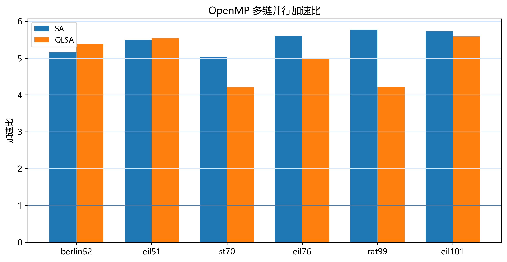

从并行效率看，SA 的平均并行效率为 68.28%，rat99 和 eil101 分别达到 72.20% 和 71.52%；QLSA 的平均并行效率为 62.29%，其中 st70 和 rat99 约为 52.6%。这一结果与算法结构一致：SA 的链间任务更均匀，而 QLSA 每条链还要维护动作选择和学习更新，导致同样 8 个线程下有效负载更不均衡。

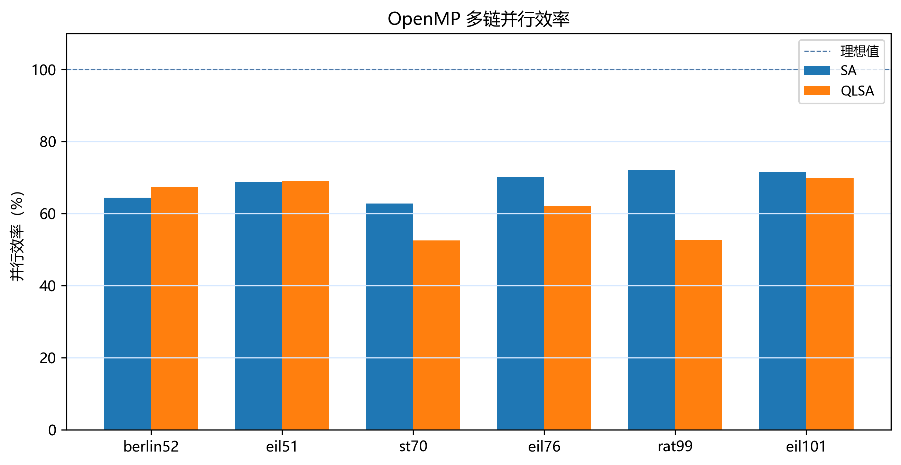

从任务划分角度看，OpenMP 获得较高加速比的原因并不只是“使用了 8 个线程”。程序把 32 条链拆成 32 个独立任务，线程只在本链内读写路径和统计量；距离矩阵是只读共享数据，多个线程同时访问不会产生写冲突；全局最优路径只在所有链完成后顺序归约。因此，百万次迭代中的绝大部分时间都用于实际搜索，而不是锁、条件变量或线程间通信。

QLSA 的效率略低，也能从同一任务模型解释。QLSA 的每条链仍然独立，但链内多了状态判断、动作选择和 Q 表更新，不同链的动作序列更容易分化。静态调度下，如果某些链耗时更长，线程结束时间会更分散，并行区域末尾就会出现等待。这不是 OpenMP 后端失效，而是学习辅助搜索本身增加了链间运行时间差异。

默认实验的平均结果可以概括如下，逐实例结果保存在汇总结果表中，正文只保留平均加速和效率这两个关键指标。

| 算法 | 平均加速比 | 平均并行效率 | 运行时间特征 |
|---|---:|---:|---|
| SA | 5.46 | 68.28% | 链间任务更均匀，调度开销较低 |
| QLSA | 4.98 | 62.29% | 学习更新增加单链开销和负载差异 |

进一步观察线程扩展曲线，线程数从 1 增加到 16 时，加速比继续上升，但相对理想线逐渐拉开。berlin52 和 eil101 的 SA/QLSA 曲线都呈现这种趋势：低线程数阶段主要受益于并行搜索链增加；高线程数阶段开始受线程调度、内存访问和链间运行时间差异影响。

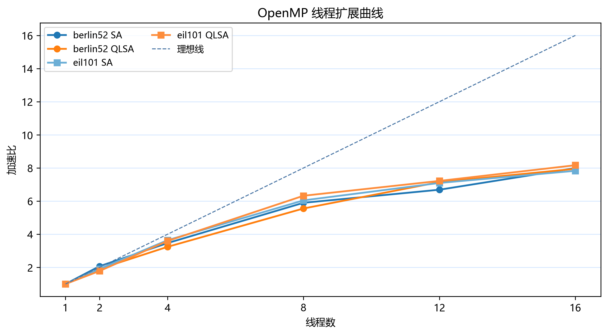

因此，OpenMP 结果可以给出两个层次的结论。第一，8 线程默认实验已经足以支撑“多搜索链并行有效”的课程主结论；第二，高线程数仍有继续加速，但效率下降说明该方案不是无限线性扩展，后续若要进一步提升，需要更细致的线程绑定、任务调度和链数配置。

### 7.2 默认参数下的解质量

默认参数实验同时记录最短路径长度和相对最优偏差。结果显示，berlin52、eil51、st70 在 SA 和 QLSA 下均达到 BKS；eil76、rat99、eil101 仍有非零偏差。SA 在 eil76、rat99、eil101 上的偏差分别为 0.186%、0.330%、0.954%；QLSA 在这三个实例上的偏差分别为 0.743%、1.156%、1.272%。这说明默认 QLSA 参数并没有自然带来更好的解质量。

如下图，前三个实例的偏差为 0，后三个实例开始拉开差距。rat99 和 eil101 是后续调优和增强实验的重点，因为它们既不太小，也没有大到实验成本失控，适合观察搜索预算和 QLSA 参数对解质量的影响。

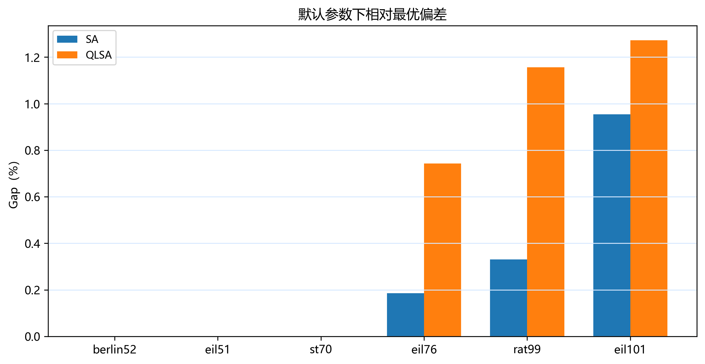

这组结果说明，并行性能和解质量需要分开讨论。OpenMP 改善的是同一搜索预算下的运行时间，它不会自动改变每条链的搜索能力。默认参数下 QLSA 在部分困难实例上的偏差较大，说明 Q 表更新需要与状态、动作、温度范围和迭代预算配合使用；学习机制本身不是无需调参的自动改进器。

### 7.3 调优与定向增强结果

定向增强实验显示，增加搜索预算后，困难实例的解质量可以继续改善。最新复核中，eil101 的 SA 在 2,000,000 次迭代、128 条链配置下达到 BKS=629，平均偏差为 0.477%；QLSA 在 1,000,000 次迭代、64 条链配置下达到 BKS=629，2,000,000 次迭代、128 条链配置下平均偏差降至 0.223%。这些结果表明，eil101 在更充分的搜索覆盖下可以稳定接近 BKS。

rat99 的结果更能体现 QLSA 的质量价值。高预算下，SA 最好路径长度为 1212，距离 BKS=1211 仍差 1；QLSA 在 3,000,000 次迭代配置下达到 BKS=1211，其中 128 条链配置的平均偏差为 0.099%。在当前实验口径下，rat99 是 QLSA 相对 SA 展现质量优势的最清晰实例。

如下图，定向增强后的最小偏差和平均偏差共同说明了搜索预算的作用。最小偏差反映是否找到过 BKS，平均偏差反映多次运行的稳定性；两者一起看，比只看一次最好结果更可靠。

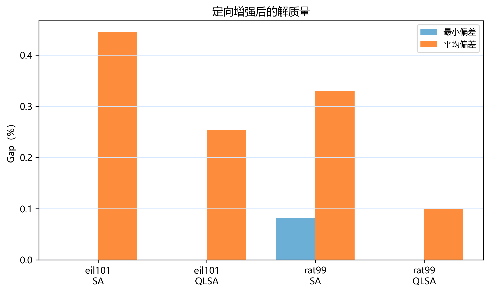

关键配置可概括为以下几行。

| 实例 | 算法 | 代表配置 | 最短路径长度 | 最小偏差 | 平均偏差 |
|---|---|---|---:|---:|---:|
| eil101 | SA | 2,000,000 次迭代，128 条链 | 629 | 0.000% | 0.477% |
| eil101 | QLSA | 2,000,000 次迭代，128 条链 | 629 | 0.000% | 0.223% |
| rat99 | SA | 2,000,000 次迭代，128 条链 | 1212 | 0.083% | 0.248% |
| rat99 | QLSA | 3,000,000 次迭代，128 条链 | 1211 | 0.000% | 0.099% |

把默认参数实验和定向增强实验分开后，结论边界更清楚：默认参数主要用于比较并行运行时间，高预算配置用于观察困难实例的搜索质量上限。rat99 的结果来自搜索预算、链数和 QLSA 参数共同作用，而不是默认设置下的必然优势；因此正文只把它写成“代表性质量收益案例”，不把 QLSA 描述为所有实例上都优于 SA。

### 7.4 QLSA 策略对比

QLSA 的动作选择策略对结果有直接影响。epsilon-greedy 与 softmax 在 eil76 和 eil101 上差距不大：eil76 的平均偏差分别为 0.892% 和 0.855%，eil101 的平均偏差分别为 1.335% 和 1.176%。但在 rat99 上，epsilon-greedy 的平均偏差为 0.512%，softmax 上升到 3.815%。这一差异说明，动作选择策略对实例结构敏感，不能只根据单个实例判断策略优劣。

如下图，rat99 的 softmax 柱明显高于 epsilon-greedy，而 eil76 和 eil101 的差距较小。该现象也解释了为什么后续 rat99 的质量增强主要采用 epsilon-greedy：在本项目实现中，它对该实例更稳。

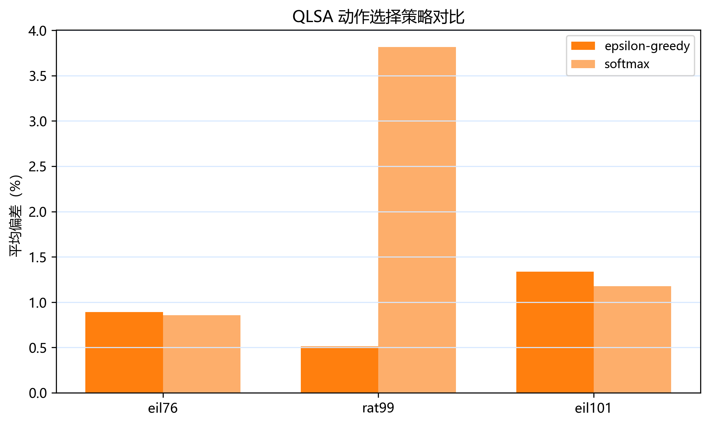

这组结果把 QLSA 的策略敏感性单独呈现出来。参考论文中也比较了 softmax 和 epsilon-greedy，但论文的 candidate-leader 机制、状态设计和实验环境与本项目不同。因此，本节结论只对应当前 C++ 版本：QLSA 的质量收益与状态、动作、奖励和参数设置共同相关，策略选择本身也是需要实验验证的设计变量。

### 7.5 CUDA 后端实验与边界

CUDA 后端围绕同一个问题展开：GPU 上如果只把“搜索链”并行化，每条链内部仍然由少数线程完成路径操作，GPU 计算密度不足；如果在块内同时评价多个候选 2-opt 移动，GPU 线程可以参与更多实际计算，但每次迭代的候选选择方式也会改变。为区分这两类作用，实验保留多链模式，并增加候选批量评价、候选选择策略和并行路径反转三组对照。

当前 CUDA 实现包含以下执行路径：

- **多链模式**：一个线程块负责一条链，主要对齐原多链搜索结构，运行时间较短。
- **候选批量评价 best 策略**：块内线程同时评价多个候选，选择增量最小者进入接受判定，偏向解质量。
- **候选批量评价 random 策略**：块内线程仍批量生成候选，但随机选取一个候选，减少批量择优对提案分布的影响。
- **候选批量评价 hybrid 策略**：在 best 与 random 之间交替，用于观察质量收益和随机提案之间的折中。
- **并行路径反转与最优路径复制**：候选被接受后，块内线程协作完成路径反转；更新最优路径时也由块内线程协作复制，减少 thread 0 长循环。

如下图左侧显示运行时间，候选批量评价模式在 ch130、a280、lin318、rat575 上均慢于多链模式；右侧显示最小偏差，候选批量评价模式的路径质量更好。ch130 和 a280 的候选批量评价达到 BKS，lin318 的偏差从 5.720% 降至 0.447%，rat575 从 19.091% 降至 2.229%。

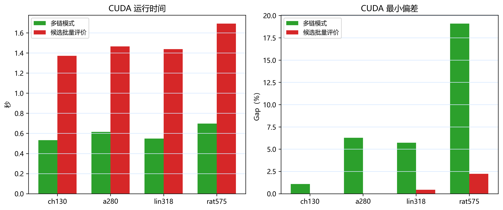

关键结果如下。这个对比展示的是候选批量评价带来的质量变化，以及对应的运行时间成本。

| 实例 | 多链模式最小偏差 | 候选批量评价最小偏差 | 候选批量评价平均时间 |
|---|---:|---:|---:|
| ch130 | 1.080% | 0.000% | 1.371 s |
| a280 | 6.282% | 0.000% | 1.466 s |
| lin318 | 5.720% | 0.447% | 1.438 s |
| rat575 | 19.091% | 2.229% | 1.691 s |

并行路径反转实验进一步定位了瓶颈：

- **SA candidate**：并行反转相对串行反转只有约 1.03 到 1.04 倍改善。
- **QLSA candidate**：并行反转可达到约 1.14 到 1.49 倍改善。
- **瓶颈来源**：路径反转确实是瓶颈之一，但候选生成、全局内存访问和线程同步仍然影响整体时间。

候选选择策略实验给出了更细的解释。300,000 次迭代、64 条链的 formal 对照中，`best` 策略在中等规模实例上降低偏差；`random` 策略运行时间更接近多链模式，但路径质量通常也更接近多链模式。新增的 `hybrid` 策略用于补充 best/random 之间的折中观察。下面几行展示 SA 和 QLSA 在代表实例上的最小偏差变化。

| 实例 | 算法 | 多链模式偏差 | best 候选偏差 | random 候选偏差 |
|---|---|---:|---:|---:|
| a280 | SA | 7.251% | 0.000% | 6.592% |
| a280 | QLSA | 7.833% | 0.155% | 7.484% |
| lin318 | SA | 6.745% | 0.419% | 7.333% |
| lin318 | QLSA | 6.636% | 0.426% | 6.831% |
| rat575 | SA | 26.620% | 3.012% | 27.049% |
| rat575 | QLSA | 19.637% | 2.628% | 21.025% |

这组数据说明，CUDA 候选批量评价的主要收益来自“在同一次迭代中比较多个候选”。`best` 策略把搜索推向更强的局部改进，因此质量提升更大；`random` 策略保留批量生成但不做批量择优，运行时间下降，质量收益也随之减弱；`hybrid` 策略在 quick 对照中表现为二者之间的折中。

下图进一步只取 SA 的运行时间作对照。它把同一实例下的多链模式、best 候选和 random 候选放在一起，便于观察候选选择策略的时间代价。hybrid quick 对照保存在 `results/summary/cuda_candidate_hybrid_quick_summary.csv`，用于后续正式参数扫描。

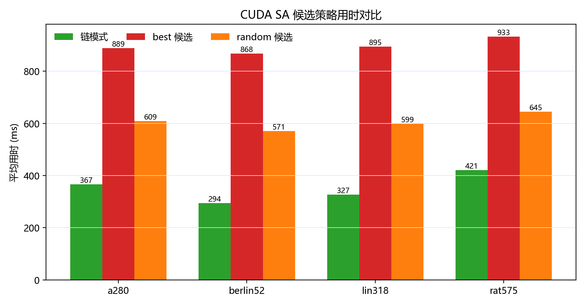

运行时间方面，多链模式仍然最快。以 SA 为例，a280 上多链、best 候选、random 候选的平均时间约为 367 ms、889 ms、609 ms；lin318 上约为 327 ms、895 ms、599 ms；rat575 上约为 421 ms、933 ms、645 ms。候选批量评价增加了共享内存写入、块内同步、路径反转和最优路径复制，质量收益由这些额外代价换来。

因此，CUDA 结果在报告中的位置是：它展示了 GPU 端候选批量评价、块内协作路径操作和候选策略组合已经实现，并且在若干中等规模实例上能换取更短路径；它没有改变 OpenMP 作为主性能后端的结论。若只比较运行时间，当前 CUDA 多链和候选模式都不是最优选择；若比较相同迭代预算下的路径质量，candidate-best 是有价值的 GPU 搜索变体。

### 7.6 MPI + OpenMP 双虚拟机实验

MPI + OpenMP 实验验证了多搜索链在分布式内存环境下的自然划分方式。每个 MPI 进程负责一组搜索链，进程内部使用 OpenMP；进程间只在结果汇集阶段交换局部最优信息。由于通信频率很低，这类任务比需要频繁同步的细粒度并行更适合 MPI。

如下图，berlin52 formal scaling 中，SA 的 np=2 结果接近理想 2 倍：每进程 2 线程时加速比为 1.98，每进程 4 线程时为 2.00。QLSA 的 np=2 加速比为 1.70 到 1.82，低于 SA，但仍体现了跨虚拟机分配搜索链的可行性。通信时间保持在约 5 到 6 毫秒量级，相对总运行时间很小。

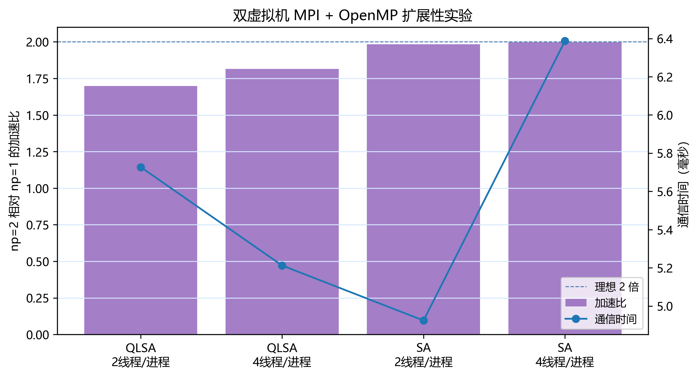

关键结果如下。

| 算法 | 每进程线程数 | np=2 加速比 | 并行效率 | 通信时间 |
|---|---:|---:|---:|---:|
| SA | 2 | 1.98 | 99.21% | 4.92 ms |
| SA | 4 | 2.00 | 100.04% | 6.39 ms |
| QLSA | 2 | 1.70 | 84.87% | 5.73 ms |
| QLSA | 4 | 1.82 | 90.77% | 5.21 ms |

结果中的 SA 效率接近 100%，主要原因是两台虚拟机承担的搜索链相互独立，最终汇集数据量很小。QLSA 加速比低一些，原因与 OpenMP 实验中的观察一致：学习更新和随机链行为使各进程负载更不均衡。该实验展示的是双虚拟机分布式内存执行路径；其价值在于验证 MPI 进程级分工、OpenMP 进程内并行和低通信量归约能够协同工作。

从通信模型看，MPI 进程之间不交换每一步搜索状态，也不共享 Q 表。每个进程只需要在结束时提交本地最短路径长度和对应路径。以 berlin52 为例，最优路径只包含 52 个城市编号，通信数据量远小于搜索过程中完成的 64 条链和百万级迭代。因此，通信时间维持在毫秒级是符合任务结构的。若将该方法迁移到更多节点，主要风险不在通信量本身，而在不同进程搜索链耗时不均衡以及虚拟化或网络环境带来的波动。

### 7.7 大实例压力测试

大实例实验的价值在于验证完整工程能处理更大的 TSPLIB95 实例，并观察问题规模增大后质量和时间的变化。本组数据覆盖 `data/` 目录下 38 个可用实例，正文选取 10 个代表实例进行分析：小规模基准 berlin52，默认困难实例 eil76、rat99、eil101，中等规模 a280、rat575、rat783，以及千点级 dsj1000、u1060、vm1084。所有代表实例均使用 1,000,000 次迭代、64 条搜索链、8 线程和 3 次重复运行。

这些实例的难度并不只由城市数决定。eil76、rat99、eil101 的规模不算大，但默认参数下会出现非零偏差，说明其局部结构对当前扰动和温度参数更敏感；a280、rat575、rat783 的城市数增加后，路径排列空间快速扩大，同样迭代预算下覆盖比例下降；dsj1000、u1060、vm1084 接近一千个城市，主要用于检查距离矩阵、路径操作、OpenMP 多链和结果流水线能否承受更大的输入规模。

从内存角度看，距离矩阵需要 $O(n^2)$ 空间。千点级实例的矩阵约为一百万个距离值，使用 32 位整数时约为数 MB，仍在本机内存和 GPU 设备内存可承受范围内；但城市数继续上升时，矩阵空间和初始化时间会快速增加。因此，本报告只把千点级结果写成压力测试，不把它扩展为更大规模实例的结论。

如下图展示代表实例的最小偏差和平均运行时间。随着城市数量增加，默认百万迭代预算下的偏差整体上升；同时，QLSA 的运行时间大约是 SA 的 1.7 至 2.2 倍。这个时间差来自动作选择和 Q 表更新，但在 rat575、rat783、dsj1000、u1060、vm1084 等较大实例上，QLSA 的最小偏差均低于 SA。

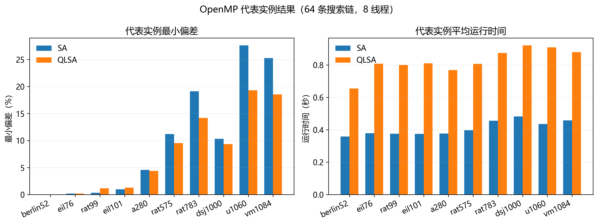

代表实例中，berlin52 的 SA 和 QLSA 均达到 BKS；eil76、rat99、eil101 在默认预算下仍有小偏差，这与第 7.2 节默认参数结论一致。规模继续增大后，a280 的 QLSA 最小偏差为 4.381%，SA 为 4.575%；rat575 中 QLSA 为 9.523%，SA 为 11.192%；rat783 中 QLSA 为 14.195%，SA 为 19.123%。这些结果说明，在更大规模的默认预算压力测试中，QLSA 经常能换取更好的路径质量，但代价是更长运行时间。

千点级代表实例也完成了百万迭代运行。dsj1000 中，SA 最小偏差为 10.333%，QLSA 为 9.349%；u1060 中，SA 为 27.627%，QLSA 为 19.301%；vm1084 中，SA 为 25.285%，QLSA 为 18.539%。这些结果不追求直接达到 BKS，而是说明当前工程能够把 TSPLIB95 千点级实例纳入同一运行、汇总和可视化流程。

## 8 与参考论文结果对比

与参考论文对比时，本报告采用“质量指标为主、时间指标为辅”的口径。同一 TSPLIB95 实例上的最短路径长度和 Gap 可以围绕 BKS 讨论；运行时间则受到语言、硬件和实现方式影响，只作为背景参考。

如下图，参考论文中的 QLSA 系列方法相对于论文 SA 明显降低了困难实例的平均偏差；本项目在调优和定向增强后，也能把 rat99 和 eil101 推近或达到 BKS。

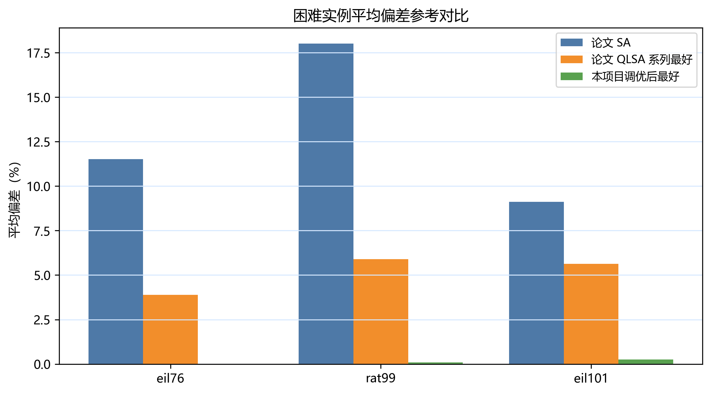

从上图可以看出，论文验证了学习辅助搜索在困难实例上的价值，本项目则进一步展示了 C++ 工程化和多链并行下的质量表现。运行时间方面，论文使用 Python 生态和不同硬件环境，本项目使用 C++20 和多后端并行实现。因此，时间对比的意义在于说明工程实现路径差异，而不是把不同平台的绝对时间直接排名。

## 9 实施过程中遇到的问题

**第一，链级任务划分需要和算法粒度匹配。**

SA/QLSA 的一次 2-opt 候选评价只涉及四条边，计算量很小；一条搜索链却包含大量迭代、随机数状态和历史最优路径。如果在 CPU 上把每次候选移动拆成线程协作任务，线程调度和同步成本会反复进入内层循环。项目最终采用链级并行，把同步集中到搜索结束后的归约阶段。这个选择同时影响 OpenMP、CUDA 和 MPI 三个后端，是整个并行设计的基础。

**第二，CUDA 的并行度和路径操作成本需要同时处理。**

CUDA 候选批量评价让块内线程参与 2-opt 候选计算，`best` 策略在 a280、lin318、rat575 上明显降低偏差；但路径反转、块内同步和全局内存访问仍然占用时间。项目为此实现了并行路径反转、候选策略对照和最优路径协作复制。实验结果显示，GPU 端可以通过批量候选改善质量，但当前运行时间仍受路径操作和同步影响。

**第三，MPI 结果必须区分真实分布式运行和本地回退。**

MPI 实验涉及两台 Ubuntu 虚拟机、SSH、Open MPI 前缀、hostfile 和项目同步。只有通过 `mpirun` 在两个不同虚拟机上启动进程，并记录 np=1 与 np=2 的结果，才能作为分布式内存实验证据。报告中只使用已经完成的双虚拟机 formal scaling 数据，未把本地 OpenMP 或 fallback 结果写成 MPI 结果。

**第四，QLSA 质量收益依赖参数和实例。**

默认参数下，QLSA 在 eil76、rat99、eil101 上并不优于 SA。后续实验把默认参数、独立验证和定向增强分开，避免把调参阶段的偶然最好值直接写成稳定结论。最终报告只在 rat99 high-budget 等有数据支撑的场景中写 QLSA 的质量收益，同时保留默认参数下的对照结果。

## 10 总结与后续工作

从性能角度看，OpenMP 多链并行是本项目最可靠的结果。它利用搜索链之间的独立性，在六个 TSPLIB95 默认实例上获得约 5 倍平均加速，同时保持了解质量的可比性。

从算法角度看，QLSA 在选定困难实例上体现出质量收益，尤其 rat99 的 high-budget 实验中达到 BKS=1211，而 SA high-budget 最好为 1212。与此同时，QLSA 对参数和实例结构敏感，报告只把它描述为在部分实例和预算下有效的质量增强方法。

从工程角度看，项目完成了 C++20 搜索内核、OpenMP、CUDA 和 MPI + OpenMP 多后端实现，并建立了从 TSPLIB95 数据、程序运行、结果汇总到图表报告的可复现实验流程。CUDA 和 MPI 扩展提高了工程复杂度，也暴露出实际并行系统中的代价。

后续工作可以沿以下方向继续：

- **论文机制对齐实验**：C++ 已提供 `paper` / `paper-sb` 入口，后续可以围绕这两个变体做系统参数搜索，并与 `current` 变体比较。
- **CUDA profiling 深化**：Nsight Compute 已能捕获 candidate kernel，后续可在更长预算下分析 occupancy、内存吞吐和同步开销。
- **分布式搜索增强**：在真实多节点环境中实现周期性最优路径交换，比较普通多链搜索与 island migration 的差异。
- **统计检验补充**：在更多实例和重复次数上加入显著性检验，区分随机波动和算法差异。

## 参考文献

[1] Adil, N., Eddaoudi, F., Lakhbab, H., & Naimi, M. (2026). Q-Learning-Assisted Simulated Annealing for Traveling Salesman Problem Optimization. *Statistics, Optimization & Information Computing*, 15(5), 3706-3730. https://doi.org/10.19139/soic-2310-5070-3028

[2] Reinelt, G. TSPLIB: A Traveling Salesman Problem Library. *ORSA Journal on Computing*, 3(4), 376-384, 1991.

[3] Kirkpatrick, S., Gelatt, C. D., & Vecchi, M. P. Optimization by Simulated Annealing. *Science*, 220(4598), 671-680, 1983.

[4] OpenMP Architecture Review Board. *OpenMP Application Programming Interface Specification*.

[5] NVIDIA. *CUDA C++ Programming Guide*.

[6] Sutton, R. S., & Barto, A. G. *Reinforcement Learning: An Introduction*. MIT Press.
