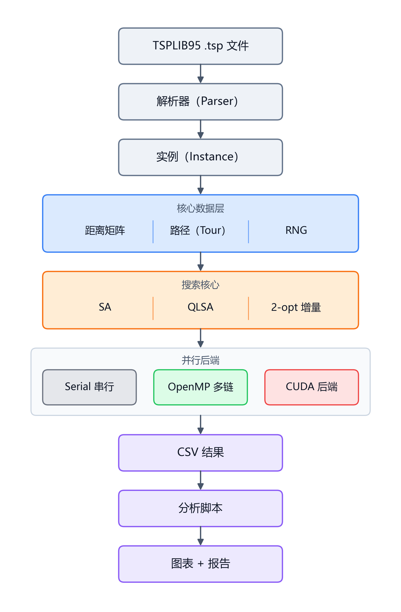
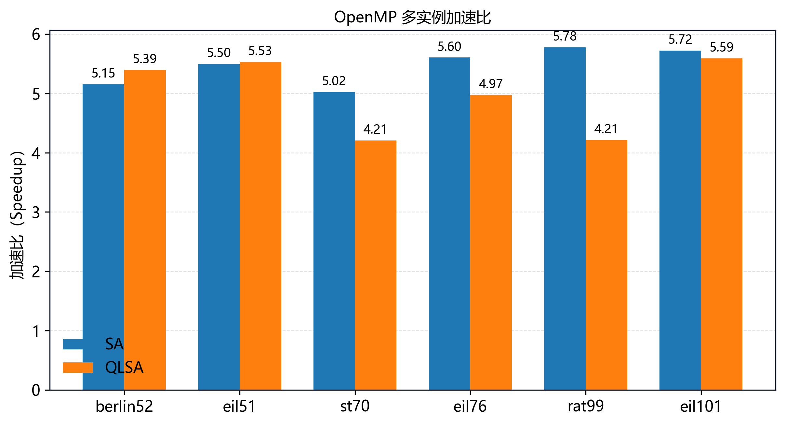
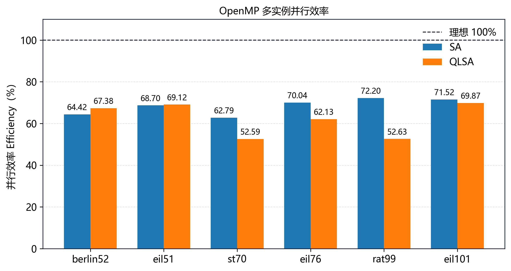
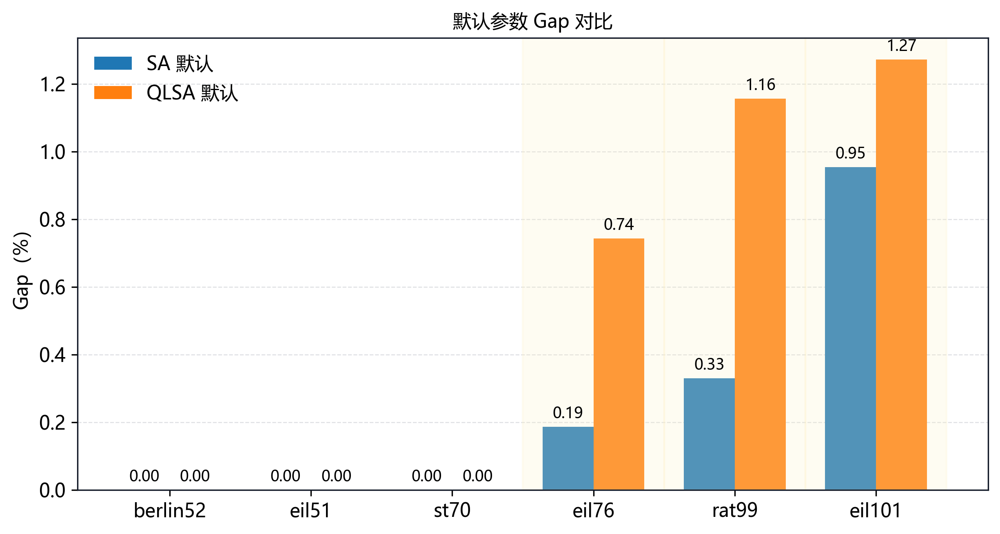
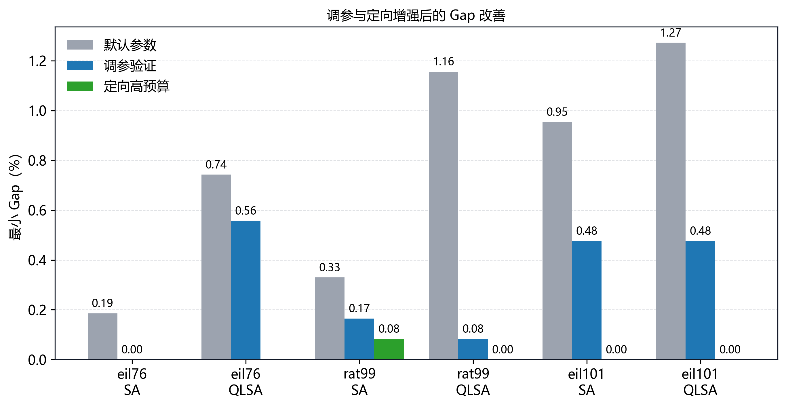
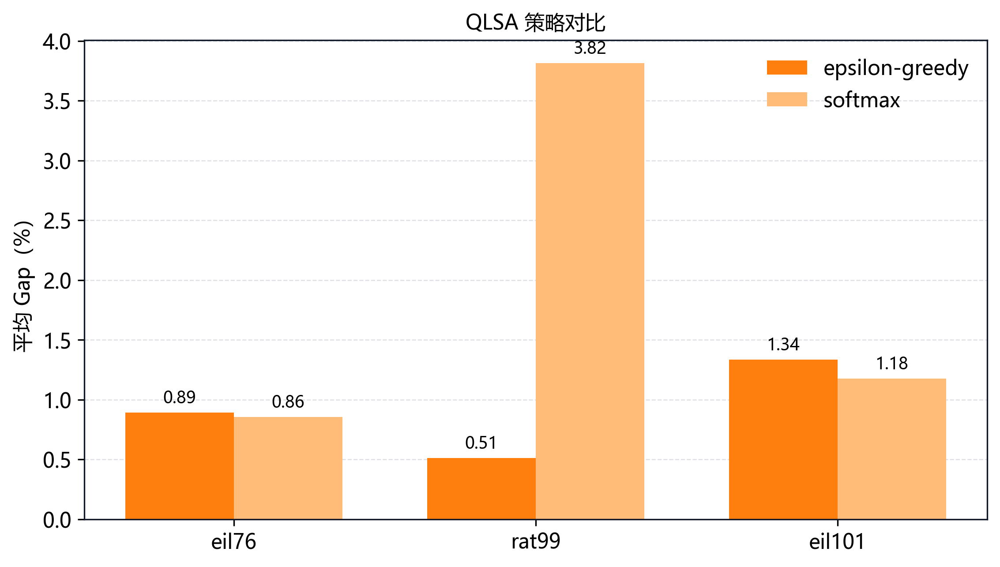
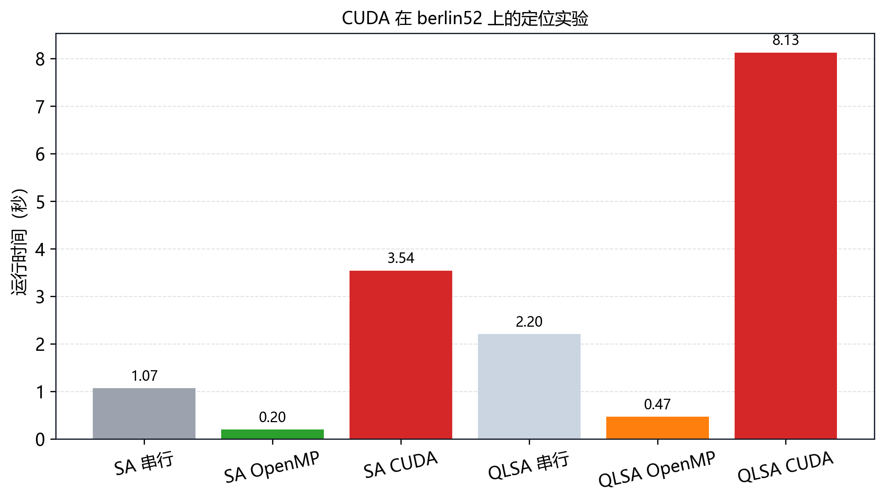
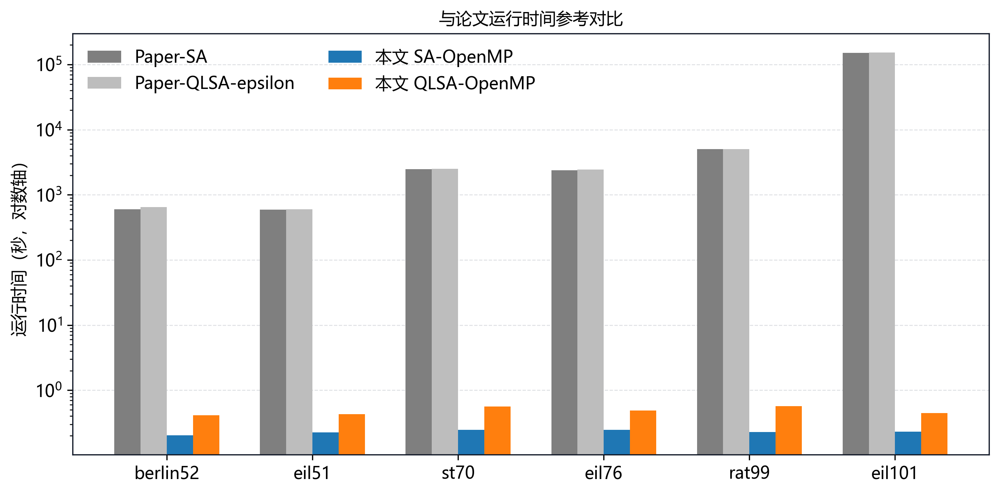
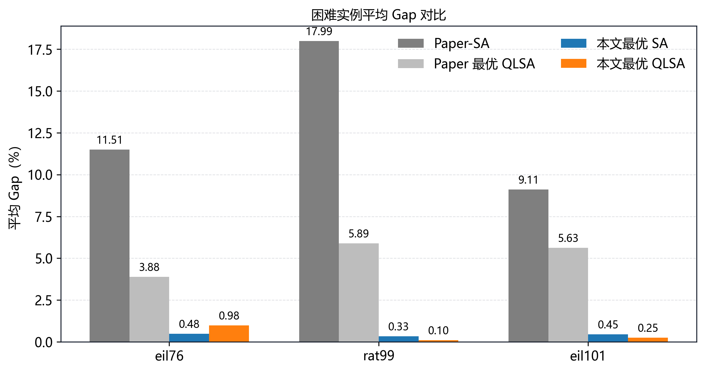

# 面向旅行推销员问题的 Q-Learning 辅助模拟退火算法并行化实现与性能优化

## 摘要

本工作以旅行推销员问题（Traveling Salesman Problem, TSP）为对象，把一篇 2026 年提出的 Q-Learning 辅助模拟退火（QLSA）方法从单机 Python 原型，重写为 C++20 工程实现，并在其上构建 OpenMP 多链并行与 CUDA 后端，目标是回答一个并行算法问题：QLSA 这类随机局部搜索能否在不改变解质量评价口径的前提下被有效并行加速。

实现层面交付了完整链路：TSPLIB95 解析器、一维连续 DistanceMatrix、Tour 表示与 O(1) 的 2-opt 增量、串行 SA、QLSA、OpenMP chain-level 多链后端、CUDA 多链后端，以及命令行参数系统和 CSV 实验流水线。

主要性能结果来自 OpenMP。在六个 TSPLIB95 实例、百万级迭代、32 链、8 线程的默认配置下，SA 多链并行相对串行多链平均加速 5.46x（平均并行效率 68.28%），QLSA 平均加速 4.98x（平均并行效率 62.29%），且并行版与串行版共享同一接受准则与 Gap 定义。主要解质量结果来自 QLSA：在高预算定向实验中，rat99 上 QLSA 取得 BKS=1211，同配置 SA 最优为 1212，代价是约 1.9 倍的运行时间。CUDA 后端已完成真实编译、运行与结果归约，但在 berlin52 等小规模实例上不优于 OpenMP，因此定位为工程扩展与后续优化方向，而非主要加速证据。

与参考论文的对比限定为参考对比。论文运行于 Python 与 Xeon 平台，本实现运行于 Windows、C++20、OpenMP/CUDA 与 i5-12600KF 平台，二者在语言、硬件与实现上均不同，绝对时间不可直接比较，也不能视作同一平台下的严格性能基准；可成立的、范围更窄但更有力的结论是：同一篇论文的搜索族在 C++ 多链实现下成为一个具有稳定 OpenMP 加速的可并行负载。

## 1. 基本信息

| 项目 | 内容 |
|---|---|
| 课程名称 | 并行算法 |
| 项目题目 | 面向旅行推销员问题的 Q-Learning 辅助模拟退火算法并行化实现与性能优化 |
| 团队人数 | 1 人 |
| 团队成员 | Redacted |
| 学号 | Redacted |
| 学院/专业 | 中山大学计算机学院 / 信息与计算科学 |

本文件为报告母版，基本信息按脱敏占位填写。课程提交版 `final_report_course.md` 填入真实姓名与学号，公开版 `final_report_public.md` 保持脱敏。

## 2. 预期目标与实际完成情况

选题报告的预期目标是复现近期论文的 QLSA 思想，并在 TSP 场景下完成并行化优化。实际完成内容超出算法本身，形成了“输入—算法—并行—实验—报告”的完整闭环。下表逐项对照预期目标与实际完成度，并显式标注未完全落地的部分。

表 1：预期目标与实际完成情况。

| 模块 | 预期目标 | 实际完成 | 说明 |
|---|---|---|---|
| TSPLIB95 parser | 读取标准实例 | 完成 | 支持坐标型与显式矩阵型，覆盖 EUC_2D/CEIL_2D/GEO/ATT/EXPLICIT。 |
| SA baseline | 串行模拟退火 | 完成 | 2-opt 邻域、Metropolis 准则、指数退火、O(1) delta。 |
| QLSA | Q-Learning 辅助 SA | 完成 | 状态/动作离散化、Q 表更新、epsilon-greedy 与 Softmax。 |
| State-Based QLSA | 论文 SB-QLSA | 部分完成 | 吸收状态影响策略的思想，未实现完整 candidate-leader 与 diversity-state 机制。 |
| 策略 | softmax / epsilon-greedy | 完成 | 两种策略均可运行并对比。 |
| OpenMP | 多链并行优化 | 完成 | chain-level 并行，是主要性能来源。 |
| CUDA | GPU 并行扩展 | 完成工程验证 | 可编译可运行，小实例不作主要加速结论。 |
| 实验自动化 | 批量实验与分析 | 完成 | 覆盖 baseline/scaling/tuning/targeted/policy/对比，全部产出 CSV。 |
| 论文对比 | 近期论文对比 | 完成 | 整理论文 Table 8 时间与 hard-instance 质量数据。 |
| 个人报告 | 成员报告 | 完成 | 单人团队，见附录 A。 |

需要前置说明的是 State-Based QLSA 一项为“部分完成”。当前实现把搜索状态离散为 5 档并据此影响动作选择，吸收了论文“状态决定策略”的核心动机，但没有实现论文中的 candidate-leader 集合（current/global-best/random/double-bridge）与基于 Hamming 距离的 diversity-state，因此全文所有 QLSA 结论均按“基于论文思想的工程变体”表述。

表 2：课程评分点与支撑证据索引。

| 课程评分点 | 支撑证据 | 所在章节 |
|---|---|---|
| 完成情况 | SA、QLSA、OpenMP、CUDA、parser、实验系统全部交付 | 第 2、4、5 节 |
| 技术难度 | C++20 内核、O(1) delta、CUDA 编译链、自动化分析流水线 | 第 4、6、10 节 |
| 并行算法性能 | SA 5.46x、QLSA 4.98x、效率与线程扩展分析 | 第 8 节 |
| 近期论文对比 | 论文 Table 8 时间与 hard-instance 质量对比 | 第 3、9 节 |
| 报告质量 | 图表、结果索引、course/public 分离、复现命令 | `docs/final/`、`results/final/` |

## 3. 参考论文方法与实现差异

本节先拆解论文方法，再界定本实现保留了什么、没有完全复刻什么，最后说明为何对比仍然成立。结论是：论文验证了算法思想的有效性，本实现验证了同一思想在工程化与并行化下的可扩展性，二者互补而非替代。

### 3.1 论文算法

参考论文在 SA 框架上引入 Q-Learning，给出三层方法。Classical SA 使用 2-opt 邻域与 Metropolis 接受准则：更短的候选解直接接受，更长的候选解以温度控制的概率接受。Stateless QLSA 在每次迭代维护候选 leader 集合（current solution、global best、random solution、double-bridge perturbation），用 Q-Learning 选择由哪个候选引导下一步 2-opt 搜索。State-Based QLSA（SB-QLSA）进一步用当前解与历史最优解的 Hamming 距离定义 diversity state，把 Q 表从动作价值扩展为状态—动作价值，使策略随探索/强化状态切换。论文用 epsilon-greedy 与 Softmax/Boltzmann 两种策略，并以 Best/Mean/Std/Gap 与 computational time 报告结果。

### 3.2 本实现保留了什么

本实现保留 SA 主干、Q-Learning 辅助策略、两种策略形态和状态离散化思想。SA 沿用 2-opt 与 Metropolis；QLSA 维护 Q 表，按 epsilon-greedy 或 Softmax 选择动作，并按路径长度变化给出奖励：动作空间为不同跨度（span ratio）的 2-opt 邻域，状态空间为滑动窗口内平均 delta 离散出的 5 档。这一设计落实了“用强化学习在线调节搜索行为”的论文动机。

### 3.3 本实现没有完全复刻什么

三处没有逐项复刻：其一，论文的 candidate-leader 集合（尤其 double-bridge 扰动解与 random 解）未实现，本实现以邻域跨度动作替代候选解选择；其二，基于 Hamming 距离的 diversity-state 未实现，本实现用平均 delta 的离散状态近似；其三，Softmax 与论文在温度耦合细节上不一致。因此本实现是 QLSA 思想的工程变体，不声称等价于论文 SB-QLSA。

### 3.4 为什么仍然有对比价值

对比价值来自共同基准与互补贡献。双方都使用 TSPLIB95 标准实例和同一 BKS/Gap 指标，质量趋势可在统一坐标下比较；论文未把并行实现作为主线，而论文未来工作明确把 parallel implementations 列为方向，本实现正是在该方向上补足了 OpenMP/CUDA 后端与可复现实验流水线。

表 3：论文机制与本实现的对应关系。

| 论文机制 | 本实现对应 | 对应程度 | 含义 |
|---|---|---|---|
| SA + 2-opt Metropolis | SA baseline + O(1) delta | 一致 | 搜索原理可比，底层更高效。 |
| QLSA candidate leader | 邻域跨度动作选择 | 部分 | 学习思想保留，动作语义不同。 |
| SB-QLSA diversity state | 平均 delta 状态离散 | 部分 | 状态影响策略保留，机制未等价。 |
| epsilon-greedy / Softmax | CLI 策略参数 | 一致/部分 | 两策略可跑，Softmax 细节不同。 |
| Python 串行实现 | C++20 + OpenMP/CUDA | 扩展 | 时间对比仅参考级。 |

## 4. 实施方案设计

本节按工程方案而非算法原理组织，重点说明每个设计选择服务于哪个性能目标或可复现目标。

**数据输入方案。** 选择 TSPLIB95 作为输入数据源，主要基于三点考虑：

- **论文对齐。** 参考论文同样使用 TSPLIB95，因此可以复用 BKS 与 Gap 评价口径。
- **格式覆盖。** 解析器（Parser）同时支持坐标型与显式矩阵型实例：坐标型按 EUC_2D/CEIL_2D/GEO/ATT 规则计算整数距离，显式型按 FULL/UPPER 等格式读入，避免退化为只针对 `berlin52` 一类简单坐标实例的特例实现。
- **实验复现。** 所有 `.tsp` 文件统一进入 `Instance → DistanceMatrix → Tour` 流水线，算法核心不依赖具体实例格式。

因此，该设计把输入兼容性问题隔离在解析器层，算法核心可以复用统一数据结构。

**距离矩阵方案。** 距离矩阵（DistanceMatrix）使用一维连续数组保存 $n \times n$ 距离，而非 `vector<vector<int>>`。这一选择同时服务于两个后端：

- **CPU / OpenMP 后端。** 连续布局减少间接寻址，提高缓存局部性。
- **CUDA 后端。** `raw()` 暴露连续缓冲区，可直接拷贝到 GPU 全局内存。

因此，一维布局不是局部微优化，而是串行、OpenMP、CUDA 三个后端共享的数据契约。

**路径表示方案。** 路径（Tour）仅保存城市排列，合法性由排列检查保证。初始化提供恒等（identity）、随机排列（random permutation）与最近邻（nearest-neighbor）三种方式；默认实验采用最近邻初始化，以降低低质量随机初始解带来的方差。

**2-opt 增量方案。** 这是内层循环的决定性设计。反转区间 $[i,k]$ 时只改变两条边，旧边为 $a$–$b$、$c$–$d$，新边为 $a$–$c$、$b$–$d$，长度增量为：

$$
\Delta=D_{a,c}+D_{b,d}-D_{a,b}-D_{c,d}
$$

因此每步无需重算整条路径长度。该增量是 baseline 与并行版的共同底座；若改为完整重算，内层成本会主导运行时间，使任何加速比都被稀释而失去意义。

**CLI 与 CSV 实验流水线。** 可执行程序统一输出 CSV 行，字段覆盖 `algorithm/instance/iterations/seed/init/chains/threads/parallel/best_length/elapsed_ms` 等。Python 脚本负责收集、统计、绘图与生成分析，把随机实验转化为可审计证据，避免手工抄录终端结果造成的不可追溯。

**seed / repeat 可复现方案。** 每条链的随机种子由 `base_seed` 与 `chain_id` 确定性派生，`repeat` 控制独立重复次数。串行与并行在相同 seed 规则下产生可比统计；调优阶段另用独立 seed（从 101 起）验证，避免只报告参数搜索中的最好个例。

因此，整个实施方案围绕“可复现”与“多后端共享数据结构”两条主线展开：输入兼容性收敛在解析器层，三个后端复用同一份连续距离矩阵，每条结论都能回溯到 CSV。

图 1：系统总体架构与数据流。

## 5. 并行算法设计

并行设计刻意选在链层（chain-level），因为这是 SA 真正具备独立性的层级。本节论证粒度选择、OpenMP 实现、归约方式与同步开销，并交代 CUDA 与 move-level 的定位。

**为什么选择多链（multi-chain）。** 单条 SA 链是顺序的 Markov 过程：当前路径、长度与温度共同决定下一步 move 与接受判断，链内不存在天然并行点。多条链则是同一只读距离矩阵上的独立随机搜索，只在最后归约全局最优。该粒度与算法的随机本质对齐——并行加速的是多条独立轨迹的探索，而不是在单条依赖轨迹内部强行制造并行。

**OpenMP 如何并行。** 后端对链执行 `#pragma omp parallel for schedule(static)`，每个线程运行一条或多条完整搜索链，结果写入私有槽位 `chain_results[chain_id]`，与源文件 `src/parallel.cpp` 一致。

**每条链的数据划分。** 数据按“私有为主、共享只读”划分：

- **私有数据。** RNG、当前路径、当前长度、最优路径、accepted/improved 计数；QLSA 链额外私有一张 Q 表。
- **共享数据。** 仅搜索期间不可变的距离矩阵（只读）。

**归约如何进行。** 并行区只负责把各链结果填入独立下标，不写任何共享最优；并行区结束后在主机端串行遍历 `chain_results`，取最短者为全局最优，并以 `tour_length` 重算校验 `best_length`，把正确性做成可验证的不变量。

**为什么同步开销低。** 链间无共享写、无锁、无临界区，唯一的串行段是规模等于链数的归约（32 链时仅 32 次比较），相对百万级迭代可忽略。加速因此来自同步的缺席，而非改变优化问题本身；seed 派生与逐链输出保持显式，可复现性不受并行影响。

**CUDA 做了什么。** CUDA 后端打通了完整 GPU 路径：距离矩阵拷贝至设备、kernel 执行多链搜索、主机端归约，并通过 smoke test，能在 berlin52 上真实编译、运行并找到 BKS。

**为什么 CUDA 当前不作为主性能证据。** 在 berlin52 这类小实例上，单链工作量不足以摊薄 kernel 启动、调度与访存开销，整体不优于 OpenMP。这是小实例的预期结果，也指明了 CUDA 要产生意义需要更大实例或更细粒度的候选评价。

**为什么 move-level 没有作为主方案。** move-level 看似能并行评价多个候选 2-opt move，但候选 move 依赖当前路径，一旦接受某 move，路径变更会使其它候选失效，且 Metropolis 随机性与可复现性都更难维护。其代价是明确的：chain-level 放弃了单链内部并行度，换来稳定加速、低同步与低工程风险，更契合以正确性、加速比与可复现为评分口径的课程实验。

因此，OpenMP 多链并行的性能收益来自粗粒度独立任务，而不是对单次 2-opt 操作的细粒度拆分。

表 4：并行粒度取舍结论。

| 粒度 | 结论性定位 | 控制的风险 |
|---|---|---|
| chain-level OpenMP | 主加速机制 | 同步极小、可复现 |
| move-level | 未作为主方案 | 规避候选失效与随机不可复现 |
| CUDA multi-chain | 工程扩展 | 不夸大小实例性能 |

## 6. 实施过程中解决的问题

下表汇总实施过程中的真实工程问题，按问题类型、表现、技术原因、解决方案与对结果影响展开。这些问题集中在编译链、内层性能、随机独立性、并行正确性、参数稳定性与对比口径，均为技术性问题。

表 5：实施过程中解决的关键工程问题。

| 问题类型 | 表现 | 技术原因 | 解决方案 | 对结果影响 |
|---|---|---|---|---|
| 输入兼容 | 部分 `.tsp` 解析失败或距离取整不一致 | 不同 edge weight type 与显式矩阵格式规则不同 | parser 分支处理坐标型与显式型，按 TSPLIB 取整规则计算 | 实验可用标准实例，Gap 口径与 BKS 对齐 |
| 内层性能 | 百万级迭代下整段重算路径长度极慢 | 每步 2-opt 后 O(n) 重算主导运行时间 | 改为 O(1) delta，仅更新两去两加边 | 内层提速，speedup 才有意义 |
| 随机独立性 | 多链结果相关、复现困难 | 多链共享或简单复用同一 RNG 状态 | 由 base_seed 与 chain_id 确定性派生独立种子 | 链间独立、结果可复现 |
| 并行正确性 | 并行写全局 best 存在竞争隐患 | 多线程同时更新共享最优会产生 data race | 链写私有槽位，并行区后串行归约并重算校验 | 无锁、无竞争，归约结果可验证 |
| 参数稳定性 | QLSA 默认参数在 harder 实例 Gap 偏高 | 状态/动作与退火参数对实例敏感 | 经 tuning、独立 seed 验证与定向增强逐步定参 | eil76/rat99/eil101 质量改善 |
| GPU 粒度 | berlin52 上 CUDA 慢于 OpenMP | 单链工作量不足以摊薄 kernel 启动与访存 | 定位为工程扩展，留 block 内候选并行方向 | 避免夸大 CUDA 性能 |
| 构建工具链 | Visual Studio CUDA toolset 识别失败 | MSVC generator 下 CUDA toolset 解析问题 | 改用 Ninja + nvcc 构建 CUDA kernel | kernel 真实编译，CUDA 可运行验证 |
| 实验可维护 | 手工记录终端结果不可追溯 | 结果分散、无统一字段与统计口径 | 统一 CSV 输出 + Python 分析流水线 | 每条结论可追溯到 CSV |
| 对比口径 | 论文机制与本实现存在差异 | candidate-leader/diversity-state 未等价实现 | 在论文对比节显式约束有效范围 | 降低对比误导，结论边界清晰 |

## 7. 实验设计

实验体系按“每组回答一个问题”组织，而非堆叠无关运行。下表给出每组实验的存在理由。

表 6：实验体系与科学问题。

| 实验组 | 回答的问题 | 为何存在 |
|---|---|---|
| baseline | 串行多链基准是多少 | 为 speedup 提供分母 |
| OpenMP scaling | 加速是否随线程数保持 | 验证并行效率与扩展性 |
| default multi-instance | 默认参数是否稳定 | 跨实例验证一致性 |
| tuning | harder 实例 Gap 能否降低 | 解决质量、分离速度与质量 |
| targeted | 高预算下质量收益是否稳定 | 用独立 seed 与大预算避免择优偏差 |
| policy | softmax 与 epsilon-greedy 行为差异 | 观察 QLSA 策略敏感性 |
| CUDA positioning | GPU 后端的状态与边界 | 验证 GPU 路径并界定适用范围 |
| paper comparison | 与论文如何对照 | 回应“近期论文对比”评分点 |

默认参数实验使用 iterations=1,000,000、chains=32、repeat=3、threads=8、init=nn。调优验证使用 repeat=10、独立 seed（从 101 起）。定向增强在较优参数附近放大 chains/iterations，repeat=5。指标定义如下：

$$
Gap=\frac{best\_length-BKS}{BKS}\times 100\%
$$

$$
Speedup=\frac{T_{serial}}{T_{parallel}}
$$

$$
Efficiency=\frac{Speedup}{thread\_count}\times 100\%
$$

硬件与软件环境为 Windows 11、i5-12600KF、RTX 4070 SUPER、MSVC 19.44、nvcc 12.9.41、CMake + Ninja、Release、OpenMP 与 CUDA 均启用。

## 8. 实验结果与分析

### 8.1 OpenMP 性能

OpenMP 多链是本项目最强、最稳定的结果：SA 平均加速 5.46x，QLSA 平均加速 4.98x。

图 2：默认参数下 SA 与 QLSA 的 OpenMP 加速比。

图 3：默认参数下 SA 与 QLSA 的并行效率。

表 7：默认参数 OpenMP 加速（串行多链 vs 8 线程）。

| Instance | SA speedup | SA eff. | QLSA speedup | QLSA eff. |
|---|---:|---:|---:|---:|
| berlin52 | 5.153x | 64.42% | 5.391x | 67.38% |
| eil51 | 5.496x | 68.70% | 5.529x | 69.12% |
| st70 | 5.023x | 62.79% | 4.207x | 52.59% |
| eil76 | 5.603x | 70.04% | 4.971x | 62.13% |
| rat99 | 5.776x | 72.20% | 4.211x | 52.63% |
| eil101 | 5.722x | 71.52% | 5.589x | 69.87% |
| 平均 | 5.46x | 68.28% | 4.98x | 62.29% |

这一结果可以从三个层面解释。

- **5x 量级为何可信。** 8 线程的理论上限为 8x，实测 5–6x 对应 60%–72% 效率，落在粗粒度多链并行的合理区间。差距来自线程创建、静态调度的负载不均与共享只读矩阵的访存竞争，而非同步开销——归约段仅 32 次比较。
- **QLSA 效率为何更低。** QLSA 平均效率系统性低于 SA（62.29% 对 68.28%），根因是链内串行段更长：每步多出动作选择、状态更新与 Q 表读写，按 Amdahl 定律抬高了串行占比，st70 与 rat99 的 QLSA 效率跌至约 52% 即此机制的体现。
- **扩展性为何回落。** berlin52 上 SA 的并行效率从 8 线程的约 73.7% 降到 16 线程的约 50.0%。i5-12600KF 的物理性能核有限，超过物理核后线程相互争用，效率随之回落，8 线程因此是该机型的合理工作点。

因此，OpenMP 之所以是主性能贡献，是因为它在不改变接受准则与 Gap 定义的前提下取得稳定加速，把论文的搜索族确立为可并行负载。

### 8.2 解质量

默认参数解决了较易实例，但在 harder 实例上留有可测 Gap。

图 4：默认参数下 SA 与 QLSA 的 Gap。

表 8：默认参数解质量分层（最优 Gap）。

| 实例组 | 结果 | 解释 |
|---|---|---|
| berlin52, eil51, st70 | 达到 BKS（Gap=0） | 默认预算足够 |
| eil76, rat99, eil101 | 仍有 Gap | 需调参或更高预算 |

berlin52、eil51、st70 在默认预算下即达 BKS；困难实例 eil76（SA 0.19%、QLSA 0.74%）、rat99（SA 0.33%、QLSA 1.16%）、eil101（SA 0.95%、QLSA 1.27%）仍有 Gap。其原因是这些实例解空间更大、局部极小更密，固定预算的多链覆盖不足。一个必须明确的边界是：**并行加速只压缩运行时间，不改变搜索逻辑**，因此质量提升只能来自参数、策略或预算，不能由并行本身获得。这也是把性能实验与质量实验分开解释的理由。

### 8.3 调优与增强

定向增强给出本项目最明确的 QLSA 质量证据：rat99 上 QLSA 达到 BKS=1211，同配置 SA 最优为 1212。

图 5：调参与定向增强后的 Gap 改善。

表 9：定向增强关键结果（高预算 best-quality）。

| Instance | Family | Best | Min Gap | Mean Gap | Mean ms |
|---|---|---:|---:|---:|---:|
| eil101 | SA | 629 | 0.000% | 0.445% | 1867.987 |
| eil101 | QLSA | 629 | 0.000% | 0.254% | 3348.545 |
| rat99 | SA | 1212 | 0.083% | 0.330% | 1804.426 |
| rat99 | QLSA | 1211 | 0.000% | 0.099% | 3424.631 |

调优解决的是“质量”而非“速度”，分三步推进：通过 tuning 找到参数方向、用独立 seed 验证排除择优偏差、再以定向增强在较优参数附近放大 chains 与 iterations。结果呈现两种形态：

- **eil101：两者均达 BKS。** SA 与 QLSA 都达到 BKS=629，且 QLSA 平均 Gap 更低（0.254% 对 0.445%）。
- **rat99：QLSA 独到 BKS。** QLSA 达到 BKS=1211 而 SA 停在 1212，平均 Gap 0.099% 远优于 SA 的 0.330%。这是 QLSA 学习辅助真正改变了可达最优解的证据，表明 QLSA 不只是开销层。

但该收益有明确的时间代价：rat99 上 QLSA 达 BKS 耗时 3424.6 ms，约为 SA（1804.4 ms，未达 BKS）的 1.9 倍。因此，QLSA 的优势应表述为“部分困难实例、特定预算下、以更高运行时间换取的质量收益”，不能外推为普遍优于 SA。

### 8.4 policy comparison

softmax 在本实现中不稳定：在某些实例略优，在 rat99 上明显劣化。

图 6：QLSA epsilon-greedy 与 softmax 策略对比。

表 10：policy comparison（平均 Gap）。

| Instance | epsilon-greedy | softmax | 观察 |
|---|---:|---:|---|
| eil76 | 0.892% | 0.855% | softmax 略优 |
| eil101 | 1.335% | 1.176% | softmax 略优 |
| rat99 | 0.512% | 3.815% | softmax 显著劣化 |

Softmax 在 eil76、eil101 上平均 Gap 略低于 epsilon-greedy，却在 rat99 上劣化到 3.815%（epsilon-greedy 仅 0.512%），整体表现为高方差、不稳定。原因在于本实现的 Softmax 作用于邻域跨度动作的 Q 值，与论文作用于 candidate-leader 的 Softmax 并不相同，温度与动作语义的差异在 rat99 这类结构上被放大。因此，该实验只反映本实现内部的策略敏感性，不能用来否定或复现论文的 Softmax 结论；**它真正的价值在于揭示 QLSA 的 action/state 设计是质量的关键变量**，默认实验采用更稳健的 epsilon-greedy 正是基于此。

### 8.5 CUDA positioning

CUDA 后端完整可用，但小实例上不作为主要加速证据。

图 7：berlin52 上 Serial、OpenMP 与 CUDA 的 elapsed time。

表 11：CUDA 定位。

| 维度 | 结论 |
|---|---|
| 正确性 | 可编译、可运行、可输出 CSV、能找到 BKS |
| 性能 | 小实例 elapsed time 高于 OpenMP |
| 价值 | 打通 GPU 编译链、数据拷贝与归约，留扩展空间 |

CUDA 完成了从 nvcc 编译、设备内存布局到主机端归约的完整路径。小实例慢的主因是计算粒度：berlin52 单链工作量太小，无法摊薄 kernel 启动、线程调度与全局访存的固定开销，GPU 的吞吐优势无从发挥。要让 CUDA 产生意义，后续方向是把 block 内线程用于批量候选 move 评价，或转向更大规模实例，使每次 kernel 的有效计算量显著上升。因此，在当前实例规模下，**把 CUDA 表述为工程扩展而非主性能证据，是与数据一致的定位**。

## 9. 与论文结果对比

### 9.1 方法层面对比

论文验证算法质量，本实现补充工程化与并行化。论文在 Python 单机环境下证明 Q-Learning 变体能改善 TSP 搜索质量；本实现在 C++20 下重建同一搜索族，并补上论文未来工作所指向的并行后端与可复现流水线。二者目标不同：前者回答“算法是否更好”，后者回答“该算法族是否可被工程化并行加速”。

表 12：论文与本实现的方法差异。

| 对比项 | 参考论文 | 本实现 |
|---|---|---|
| 实现语言 | Python 3.11.5 | C++20 |
| 硬件 | Xeon 平台 | i5-12600KF + RTX 4070 SUPER |
| 主要算法 | SA、QLSA、SB-QLSA | SA、QLSA、多链并行后端 |
| QLSA 动作 | candidate leader | 2-opt 邻域跨度动作 |
| 状态机制 | Hamming diversity state | 平均 delta 状态离散 |
| 并行化 | 未作为主线 | OpenMP + CUDA |

### 9.2 时间对比

图 8：论文 Table 8 与本实现 OpenMP elapsed time 的参考对比（对数轴）。

论文为 Python/Xeon，本实现为 C++/OpenMP/i5 平台。由于不同语言、不同硬件与不同实现，绝对时间不可直接比较，该图不是同平台公平基准。以共同实例为锚点，论文 SA 在 berlin52 报告约 600 秒、eil101 约 151065 秒，本实现 OpenMP 对应约 0.20 秒与 0.23 秒；该数量级差距同时包含语言、硬件、实现与并行四重来源，不能归因于单一因素。因此，该图能成立的解读是：在共同 TSPLIB95 实例上，C++ 工程化与 OpenMP 多链并行带来了显著的实际运行效率优势，但**这是工程运行效率的对比，而非算法时间复杂度的对比**。

### 9.3 质量对比

图 9：论文 hard-instance 平均 Gap 与本实现调优/增强结果的对比。

质量对比使用共同 BKS 与 Gap 指标。论文中 Q-Learning 变体相对 Paper-SA 明显降低平均 Gap（如 rat99 从约 18.0% 降至最好约 5.9%）。本实现经调优与定向增强后，在 harder 实例上更接近 BKS：eil76 平均 Gap 约 0.48%（SA tuned）、rat99 约 0.10%（QLSA）、eil101 约 0.25%（QLSA）。更接近 BKS 来自多链搜索、参数调优与预算增强的共同作用，而非声称完整复刻论文 SB-QLSA 或全面超越论文；机制不完全相同，故对比限定为“本实现具备竞争力且具并行扩展收益”。

### 9.4 与论文相比的实际贡献

1. 论文未把并行实现作为主线，本项目实现并验证了 OpenMP 与 CUDA 双后端；
2. 论文侧重算法质量，本项目补充了 speedup 与 parallel efficiency 的系统度量；
3. 论文为 Python 实验，本项目以 C++20 工程化重建，控制了内层运行成本；
4. 本项目提供从可执行程序到 CSV、图表与报告的可复现实验流水线。

表 13：论文对比的有效范围与风险控制。

| 风险 | 原因 | 控制方式 |
|---|---|---|
| 时间被读作公平基准 | 语言/硬件/实现不同 | 标注为参考对比，绝对时间不可直接比较 |
| QLSA 机制被读作等价 | 未实现完整 candidate-leader | 显式列出动作/状态差异 |
| SB-QLSA 被读作复刻 | 无 diversity-state 机制 | 表述为基于思想的工程变体 |
| CUDA 被读作主加速 | 小实例 GPU 开销占比高 | 仅作工程定位 |

## 10. 工程难度与完成质量

本项目的工程内容是一个系统，而非一个 `parallel for`。其难度与完成质量可从四个层面说明。

**底层内核难度。** C++20 实现需要自管 TSPLIB95 解析器、距离类型与显式矩阵、路径合法性、可复现 RNG、O(1) 增量与断言校验，任一环节出错都会污染全链路结果。

**双后端一致性难度。** OpenMP 与 CUDA 必须共享同一 seed 规则、同一 CSV 字段与同一归约语义，并行结果才能与串行 baseline 在同一口径下比较；归约后以 `tour_length` 重算校验最优长度，把正确性做成可验证的不变量。

**闭环与可审计。** 输入、算法、并行、实验、报告全部打通，default/tuning/targeted/scaling/policy/对比六类实验的每条结论都能追溯到 `results/` 下的 CSV 或 `results/reference/` 的论文数据；`results/final/RESULTS_INDEX.md` 登记来源，`docs/final/REPORT_MANIFEST.md` 固定报告入口。

**提交与隐私分离。** course 版保留课程要求的姓名学号，public 版与公开包脱敏，`submission/course/` 经 `.gitignore` 隔离，在满足课程要求的同时保护隐私。

因此，本项目的工程价值不在单点优化，而在一个从输入到报告、可复现且可审计的完整系统。

表 14：工程亮点与评分价值。

| 工程模块 | 技术价值 |
|---|---|
| C++20 内核 | 降低内层成本，建立高性能 baseline |
| TSPLIB95 parser | 支撑标准实例与 BKS/Gap 体系 |
| O(1) 2-opt delta | 保证百万级迭代内层效率 |
| OpenMP 后端 | 产生主要 speedup 结果 |
| CUDA 后端 | 完成 GPU 路径与扩展基础 |
| CSV 分析流水线 | 结果可追溯、可审计 |

## 11. 局限性

1. CUDA 后端尚未充分优化，未把 block 内线程用于批量候选 move 评价，小规模实例上不优于 OpenMP。
2. QLSA 是基于论文思想的工程变体，未实现完整 candidate-leader 与 diversity-state，默认参数对实例敏感。
3. policy comparison 只比较本实现内部的 epsilon-greedy 与 softmax，不是论文 Softmax 机制的严格复现。
4. 与论文运行时间的对比为参考对比，不同硬件、不同语言与不同实现使绝对时间不可直接比较。
5. 定向增强的预算扫描不是逐迭代 trace，不能表述为真实收敛曲线。
6. 实例规模集中在中小规模 TSPLIB95，CUDA 与更大规模实例的潜力仍需进一步验证。

## 12. 总结

性能贡献：OpenMP chain-level 多链是主要并行成果，默认参数下 SA 平均加速 5.46x、QLSA 平均加速 4.98x，且不改变搜索逻辑与 Gap 口径，证明 SA/QLSA 这类随机局部搜索适合粗粒度多链并行；线程扩展与效率分析进一步界定了该机型 8 线程的合理工作点与效率回落原因。

解质量贡献：SA baseline 与 QLSA 工程变体均已实现，调优与定向增强使 harder 实例更接近 BKS；rat99 上 QLSA 取得 BKS=1211 而同配置 SA 为 1212，构成 QLSA 学习辅助改变可达最优解的明确证据，同时如实呈现了约 1.9 倍的时间代价。

工程贡献：项目把一篇近期 QLSA-for-TSP 论文的思想，转化为以 C++20 内核、OpenMP/CUDA 双后端、自动化实验与可追溯 CSV 为支撑、并区分课程版与公开版的完整可复现系统，覆盖课程对完成情况、技术难度、并行性能、近期论文对比与报告质量的评分要求。

## 参考文献

1. Adil, N., Eddaoudi, F., Lakhbab, H., & Naimi, M. (2026). Q-Learning-Assisted Simulated Annealing for Traveling Salesman Problem Optimization. *Statistics, Optimization & Information Computing*, 15(5), 3706-3730. https://doi.org/10.19139/soic-2310-5070-3028
2. Reinelt, G. TSPLIB: A Traveling Salesman Problem Library. *ORSA Journal on Computing*, 3(4), 376-384, 1991.
3. OpenMP Architecture Review Board. OpenMP Application Programming Interface Specification.
4. NVIDIA. CUDA C++ Programming Guide.
5. Kirkpatrick, S., Gelatt, C. D., & Vecchi, M. P. Optimization by Simulated Annealing. *Science*, 220(4598), 671-680, 1983.
6. Sutton, R. S., & Barto, A. G. *Reinforcement Learning: An Introduction*. MIT Press.

## 附录 A：个人工作说明

本课程大作业为单人团队完成，从选题、论文阅读、工程实现、并行化设计、实验执行、结果分析到报告撰写均由本人独立承担。本附录为脱敏版本，课程提交版包含成员姓名与学号。

选题阶段，本人阅读并整理 2026 年 Q-Learning-Assisted Simulated Annealing for Traveling Salesman Problem Optimization 论文，分析其 classical SA、stateless QLSA、State-Based QLSA、candidate leader、epsilon-greedy、Softmax 与 diversity state 机制，确定题目为面向 TSP 的 Q-Learning 辅助模拟退火并行优化，并明确目标是 C++20 工程化与多后端并行扩展，而非脚本式复刻。

工程框架阶段，本人完成 CMake 工程结构、模块化头/源组织、CLI 参数系统与可复现 seed 设计。底层数据结构上，实现 TSPLIB95 parser（坐标型与显式矩阵型，覆盖 EUC_2D/CEIL_2D/GEO/ATT/EXPLICIT）、一维连续 DistanceMatrix，以及 Tour 的合法性检查、nearest-neighbor/random 初始化、路径长度与 O(1) 2-opt delta。

算法阶段，本人完成串行 SA 基线，并在其上实现 QLSA 变体：状态/动作离散化、Q 表更新、epsilon-greedy 与 Softmax 策略。实现中保持对论文机制的谨慎对应，未声称等价于论文 SB-QLSA 的 candidate-leader 与 diversity-state。

并行阶段，本人实现 OpenMP 多链并行，链内私有 RNG/tour/best/Q 表、线程间只读共享距离矩阵、并行区后串行归约并重算校验；同时实现 CUDA 后端，完成 Ninja + nvcc 构建、kernel 编译与 smoke test，并据实把小实例 CUDA 定位为工程扩展。

实验与报告阶段，本人完成默认多实例实验、调参搜索、独立 seed 验证、定向增强、policy comparison、OpenMP scaling 与 CUDA positioning，建立 raw/summary/日志/图表/报告流水线，区分 course 与 public 版本保护隐私，并编写复现命令、结果索引、项目结构与已知限制说明。
