# 面向旅行推销员问题的 Q-Learning 辅助模拟退火算法并行化实现与性能优化

## 摘要

- 本项目围绕旅行推销员问题（Traveling Salesman Problem, TSP），参考 2026 年论文 *Q-Learning-Assisted Simulated Annealing for Traveling Salesman Problem Optimization*，实现了模拟退火算法（Simulated Annealing, SA）与 Q-Learning 辅助模拟退火算法（Q-Learning-Assisted Simulated Annealing, QLSA），并进一步完成 C++20、OpenMP 与 CUDA 后端的工程扩展。项目覆盖 TSPLIB95 解析器、一维连续距离矩阵、2-opt 常数时间增量、命令行接口、测试、自动实验、调参分析和报告图表生成。


- 性能方面，本项目采用多链并行（multi-chain parallelism）作为主要并行策略。默认参数多实例实验显示，OpenMP 多链并行在六个 TSPLIB95 实例上稳定有效：SA 平均加速比（speedup）约 5.46x，QLSA 平均加速比约 4.98x。进一步的线程扩展性实验表明，在 `berlin52` 和 `eil101` 上，32 chains 配置随线程数增加仍能继续获得加速，但超过 8 线程后并行效率下降，符合多核调度和任务粒度开销的预期。


- 解质量方面，默认参数下 `eil76`、`rat99`、`eil101` 仍存在 Gap。通过参数调优、独立 seed 验证和定向增强实验，较难实例的解质量得到改善：`eil101` 上 SA 与 QLSA 均达到 BKS=629；`rat99` 上 QLSA high-budget 达到 BKS=1211，而 SA high-budget 最好为 1212。因此，`rat99` 是本项目中 QLSA 相对 SA 体现明确质量优势的案例，但该结论不能外推为 QLSA 在所有实例上总是优于 SA。


- CUDA 后端已经通过 Ninja + CUDA 构建真实编译并运行，`berlin52` 上能够达到 BKS=7542。但当前 CUDA 实现在小规模实例上不优于 OpenMP，因此本报告将 OpenMP 作为主要性能结论，将 CUDA 定位为完成度较高但仍需进一步优化的工程扩展。


## 1. 基本信息

| 项目 | 内容 |
|---|---|
| 课程名称 | 并行算法 |
| 项目题目 | 面向旅行推销员问题的 Q-Learning 辅助模拟退火算法并行化实现与性能优化 |
| 团队人数 | 1 人 |
| 团队成员 | 陈乐浚 |
| 学号 | 22361054 |
| 学院/专业 | 中山大学计算机学院 / 信息与计算科学 |

## 2. 课程要求与完成度

本项目对课程评分重点的回应主要体现在三个方面：

- 第一，完成了从论文算法思想到 C++ 工程实现的完整闭环；
- 第二，完成了 OpenMP 与 CUDA 两类并行后端；
- 第三，提供了可复现实验、图表、论文参考对比和提交包。

| 自我分析 | 对应完成内容 |
|---|---|
| 完成情况 | SA、QLSA、OpenMP、CUDA、测试、脚本、实验与报告均已完成 |
| 技术难度 | C++20、TSPLIB95 parser、2-opt delta、OpenMP、CUDA、调参、自动分析 |
| 近期论文复现 | 基于 2026 年 QLSA for TSP 论文进行工程复现与扩展 |
| 论文对比 | 引入论文 Table 8 和 hard-instance 质量数据 |
| 性能分析 | 统计运行时间、加速比、并行效率、Gap 和策略差异 |
| 报告质量 | 提供正式报告、个人附录、图表、关键 CSV 和提交说明 |

## 3. 参考论文精读与本项目定位

### 3.1 论文机制

参考论文提出将 Q-learning 引入 SA 框架。论文中的 stateless QLSA 不再固定从当前解出发，而是在每次迭代中从候选集合中选择 leader，再对所选 leader 执行 2-opt Metropolis 搜索。候选集合包括 current solution、global best solution、random solution 和 double-bridge solution。论文还提出 SB-QLSA，用当前解与最优解之间的 Hamming distance 定义 diversity state，使 Q table 变为 state-action value function。

### 3.2 本项目定位

| 论文机制 | 本项目实现 | 差异说明 |
|---|---|---|
| SA + 2-opt Metropolis | 已实现 | 本项目使用 O(1) delta 优化 |
| QLSA candidate leader | 部分对应 | 当前 QLSA 选择邻域动作，不完整使用 candidate leader |
| epsilon-greedy | 已实现 | CLI 支持 |
| Softmax | 已实现 | 与论文温度耦合细节不完全一致 |
| SB-QLSA diversity state | 部分对应 | 当前状态不是 Hamming-distance diversity state |
| 并行实现 | 已扩展 | OpenMP 与 CUDA 是本项目主要扩展点 |

## 4. 算法设计

### 4.1 TSP 与 Gap

给定城市集合和距离矩阵 \(D\)，TSP 要求寻找访问每个城市一次并返回起点的最短回路。路径排列为 $\pi$时，路径长度为：

$$
L(\pi)=\sum_{i=0}^{n-1}D_{\pi_i,\pi_{(i+1)\bmod n}}
$$

实验中使用 Best Known Solution（BKS）计算 Gap。令 $L_{\mathrm{best}}$ 表示实验得到的最优路径长度，$L_{\mathrm{BKS}}$ 表示 TSPLIB95 给出的 BKS，则：

$$
\mathrm{Gap}=\frac{L_{\mathrm{best}}-L_{\mathrm{BKS}}}{L_{\mathrm{BKS}}}\times 100\%
$$

### 4.2 SA

SA 通过接受部分较差解跳出局部最优。若 move 造成路径长度变化 $\Delta$，接受概率为：

$$
P(\Delta,T)=
\begin{cases}
1, & \Delta \le 0,\\
\exp(-\Delta/T), & \Delta > 0.
\end{cases}
$$

温度采用指数退火：

$$
T_k=T_0\left(\frac{T_f}{T_0}\right)^{k/N}
$$

### 4.3 QLSA

QLSA 在 SA 搜索过程中维护 Q table，并根据当前离散状态选择动作。Q-learning 更新公式为：

$$
Q(s,a)\leftarrow Q(s,a)+\alpha\left[r+\gamma\max_{a'}Q(s',a')-Q(s,a)\right]
$$

当前实现中的状态来自近期 delta 的平均变化，动作对应不同跨度的 2-opt 邻域策略。该设计保持实现轻量，便于多链并行，但与论文 candidate-leader 机制存在差异。

### 4.4 2-opt O(1) delta

2-opt move 通过反转 tour 中的区间 \([i,k]\) 生成邻域解。设旧边为 \((a,b)\) 和 \((c,d)\)，新边为 \((a,c)\) 和 \((b,d)\)，其中：

$$
a=\pi_{(i-1+n)\bmod n},\quad
b=\pi_i,\quad
c=\pi_k,\quad
d=\pi_{(k+1)\bmod n}.
$$

则该 move 带来的路径长度变化可以用常数时间计算：

$$
\Delta=D_{a,c}+D_{b,d}-D_{a,b}-D_{c,d}.
$$

该公式避免每次 move 后完整重算路径长度，是百万级迭代能够高效运行的关键。

## 5. 工程实现

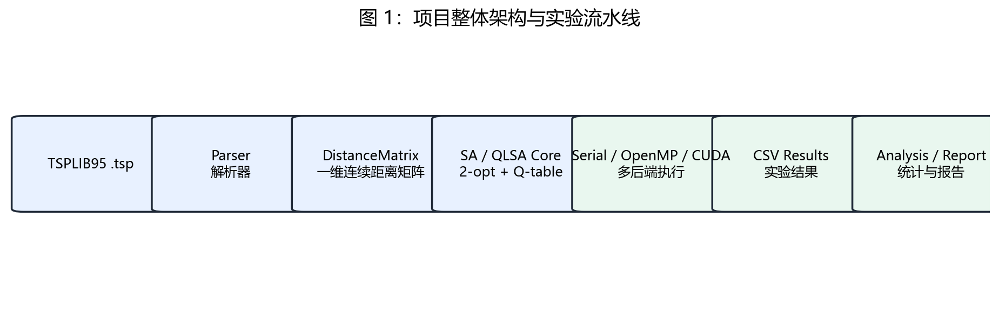

系统从 TSPLIB95 输入开始，经 parser、DistanceMatrix、SA/QLSA core 和 Serial/OpenMP/CUDA 后端，最终生成 CSV、图表和报告。

| 模块 | 文件 | 功能 |
|---|---|---|
| TSPLIB95 解析 | `tsplib_parser.*` | 读取 `.tsp` 文件 |
| 距离矩阵 | `distance_matrix.*` | 一维连续数组存储距离 |
| 路径操作 | `tour.*` | 初始化、合法性检查、2-opt delta |
| SA/QLSA | `sa.*`, `qlsa.*` | 核心搜索 |
| OpenMP | `parallel.*` | 多链并行 |
| CUDA | `cuda.*`, `cuda_kernels.cu` | GPU 后端 |
| 实验脚本 | `scripts/*.py` | 运行、分析、绘图和打包 |

## 6. 并行化设计

### 6.1 OpenMP 多链并行

单条 SA/QLSA 搜索链存在前后依赖，不适合直接对迭代步骤并行。多条搜索链之间则天然独立：每条链有独立 seed、tour、best tour 和 Q table，只共享只读距离矩阵。因此，本项目采用 chain-level OpenMP 并行。

每条 chain 写入独立 `chain_results[chain_id]`，并行区内不竞争全局最优。所有 chain 结束后，主线程串行归约出全局最优解。该方案同步开销低，是本项目获得稳定加速的主要原因。

### 6.2 CUDA 后端

CUDA 后端将距离矩阵复制到 GPU 全局内存，并让 GPU 端并行执行多条搜索链。当前实现已能编译运行，但小实例中每条链计算量不足，kernel 启动和访存开销占比较高。因此 CUDA 被定位为工程扩展，而不是当前主性能证据。

## 7. 实验设置

| 项目 | 配置 |
|---|---|
| 操作系统 | Windows |
| CPU | 12th Gen Intel(R) Core(TM) i5-12600KF |
| GPU | NVIDIA GeForce RTX 4070 SUPER |
| 编译器 | MSVC 19.44 / nvcc 12.9.41 |
| 构建工具 | CMake + Ninja |
| 构建模式 | Release |
| 并行支持 | OpenMP 与 CUDA |

| 实验 | 目的 | 结果文件 |
|---|---|---|
| 默认参数实验 | 评估 OpenMP 加速 | `step5_multi_cpu_summary.csv` |
| 调优验证 | 独立 seed 验证质量 | `tuned_validation_summary.csv` |
| 定向增强 | 增加预算提升质量 | `targeted_quality_summary.csv` |
| 策略对比 | 比较 epsilon-greedy 与 softmax | `policy_comparison_summary.csv` |
| 线程扩展性 | 观察 threads 对 speedup 的影响 | `openmp_scaling_final_summary.csv` |
| 预算扫描 | 近似观察搜索质量变化 | `results/traces/*.csv` |

构建与测试命令：

```powershell
cmake -S . -B build-cuda-ninja -G Ninja -DCMAKE_BUILD_TYPE=Release -DTSP_ENABLE_CUDA=ON
cmake --build build-cuda-ninja -j
ctest --test-dir build-cuda-ninja --output-on-failure
```

## 8. 与参考论文的对比

### 8.1 运行时间参考对比

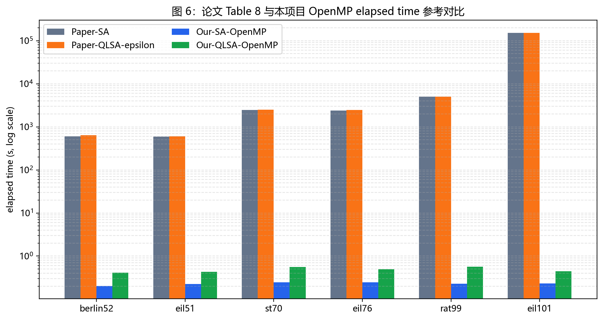

论文 Table 8 与本项目 OpenMP 运行时间参考对比如图，该图用于展示工程化和并行化后的效率，不是同环境严格性能基准。

论文与本项目运行时间对比如下：

| Instance | Paper SA(s) | Paper QLSAε(s) | Our SA(s) | Our QLSA(s) |
|---|---:|---:|---:|---:|
| berlin52 | 600.56 | 644.12 | 0.202 | 0.411 |
| eil51 | 589.41 | 602.53 | 0.224 | 0.429 |
| st70 | 2460.60 | 2498.47 | 0.247 | 0.560 |
| eil76 | 2379.99 | 2450.12 | 0.246 | 0.491 |
| rat99 | 5027.88 | 5003.58 | 0.227 | 0.570 |
| eil101 | 151064.69 | 152305.01 | 0.232 | 0.446 |

### 8.2 解质量参考对比

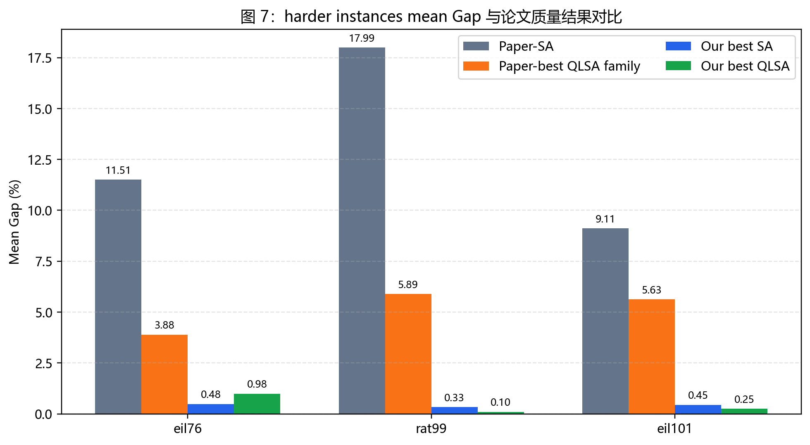

论文 hard-instance mean Gap 与本项目调优/增强结果对比。本项目在 `eil76`、`rat99`、`eil101` 上均显著接近 BKS。

hard-instance 质量参考对比如下：

| Instance | Paper best QLSA mean Gap | Our best mean Gap | Our best min Gap |
|---|---:|---:|---:|
| eil76 | 3.8848% | 0.483% | 0.000% |
| rat99 | 5.8880% | 0.099% | 0.000% |
| eil101 | 5.6279% | 0.254% | 0.000% |

## 9. OpenMP 性能分析

### 9.1 默认参数多实例加速

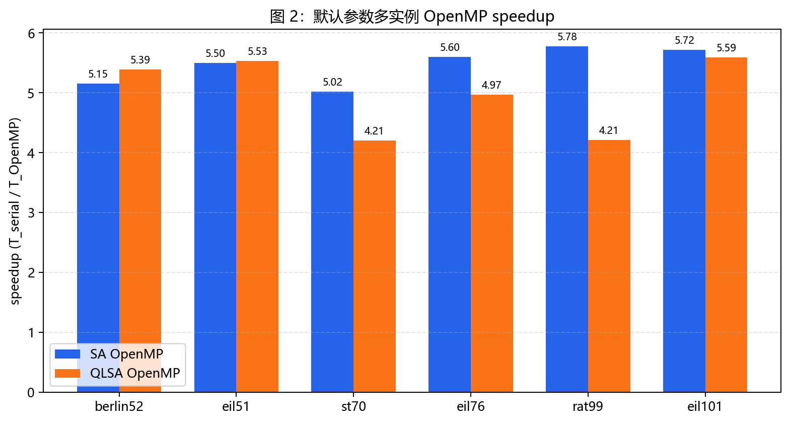

默认参数下 SA 与 QLSA 的 OpenMP 加速比如图。六个实例上 SA 平均约 5.46x，QLSA 平均约 4.98x。

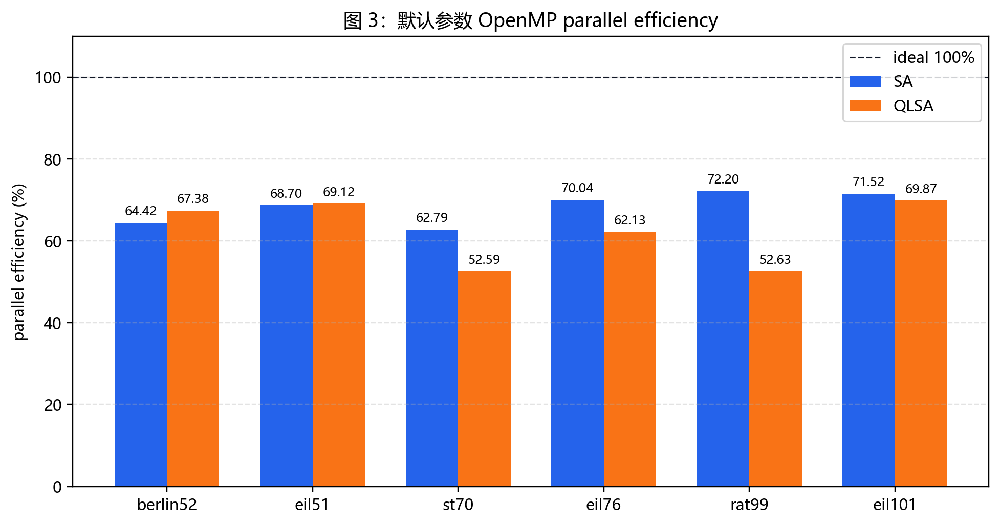

默认参数下 8 线程 OpenMP 并行效率如图。SA 平均约 68.28%，QLSA 平均约 62.29%。

### 9.2 线程扩展性

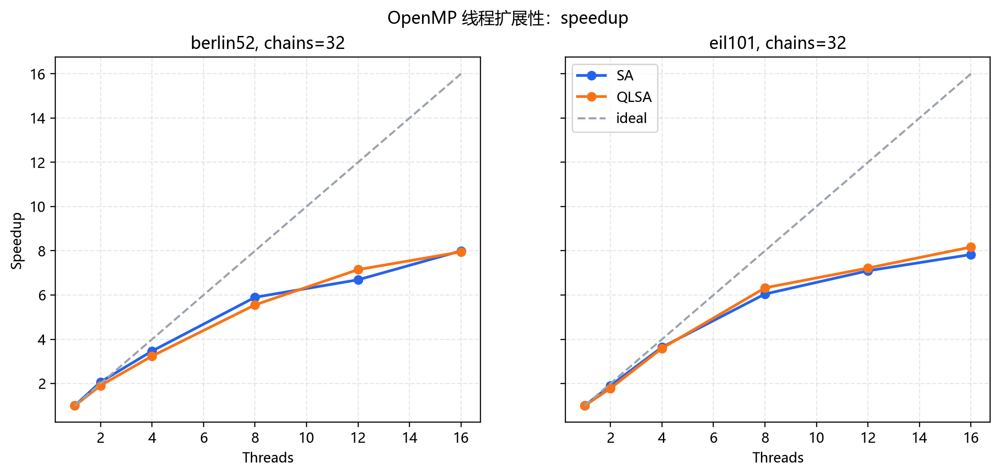

`berlin52` 和 `eil101` 上 chains=32 时的 OpenMP 线程扩展性如图。16 线程下 speedup 仍继续增加，但明显低于理想线性加速。

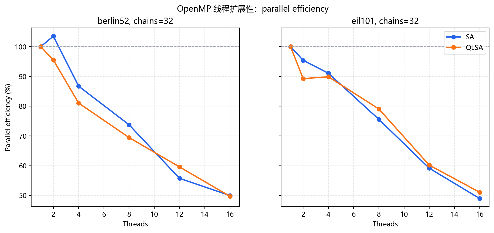

OpenMP 并行效率随线程数变化如图。线程数增加后效率下降，说明调度、内存访问和负载粒度开销逐渐显现。

chains=32 时 16 线程扩展性摘要：

| Instance | Algorithm | Threads | Speedup | Efficiency |
|---|---|---:|---:|---:|
| berlin52 | SA | 16 | 7.995 | 49.970% |
| berlin52 | QLSA | 16 | 7.952 | 49.697% |
| eil101 | SA | 16 | 7.831 | 48.943% |
| eil101 | QLSA | 16 | 8.168 | 51.048% |

## 10. 解质量、调参与策略分析

### 10.1 默认参数 Gap

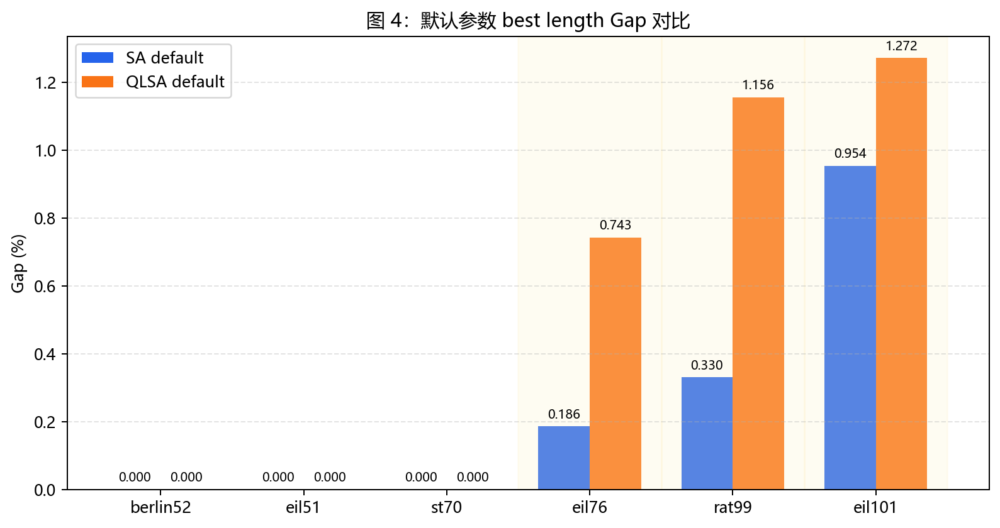

默认参数下 SA 与 QLSA 的 Gap如图。较难实例 `eil76`、`rat99`、`eil101` 仍需要调参或增加预算。

### 10.2 调优与定向增强

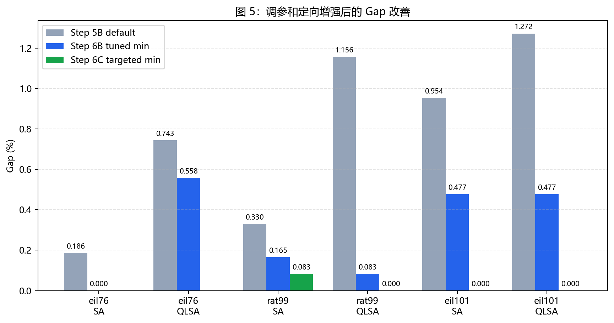

default、tuned validation 和 targeted high-budget 三个阶段的 Gap 改善如图。

定向增强关键结果：

| Instance | Family | Config | Best | Min Gap | Mean Gap |
|---|---|---|---:|---:|---:|
| eil101 | QLSA | it=2e6, chains=128 | 629 | 0.000% | 0.254% |
| eil101 | SA | it=2e6, chains=128 | 629 | 0.000% | 0.445% |
| rat99 | QLSA | it=2e6, chains=128 | 1211 | 0.000% | 0.099% |
| rat99 | SA | it=2e6, chains=128 | 1212 | 0.083% | 0.330% |

### 10.3 policy comparison

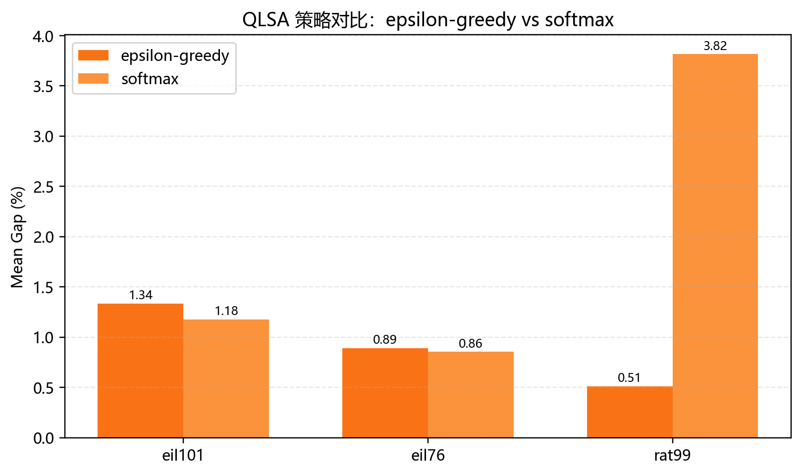

当前 QLSA 实现中 epsilon-greedy 与 softmax 的 mean Gap 对比如图。该实验是策略敏感性补充，不等同论文 candidate-leader softmax。

policy comparison 摘要：

| Instance | Policy | Best | Min Gap | Mean Gap |
|---|---|---:|---:|---:|
| eil76 | epsilon-greedy | 540 | 0.372% | 0.892% |
| eil76 | softmax | 539 | 0.186% | 0.855% |
| rat99 | epsilon-greedy | 1213 | 0.165% | 0.512% |
| rat99 | softmax | 1248 | 3.055% | 3.815% |
| eil101 | epsilon-greedy | 631 | 0.318% | 1.335% |
| eil101 | softmax | 631 | 0.318% | 1.176% |

结果显示，softmax 在 `eil76` 和 `eil101` 上略好，但在 `rat99` 上明显较差。因此，本项目不能声称 softmax 或 epsilon-greedy 在所有实例上稳定占优。

### 10.4 预算扫描收敛近似

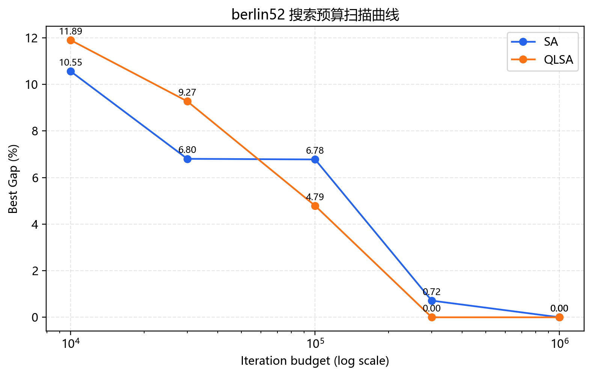

`berlin52` 上不同 iteration budget 下的 best Gap如图。该图是独立预算扫描，不是同一次运行内部 trace。

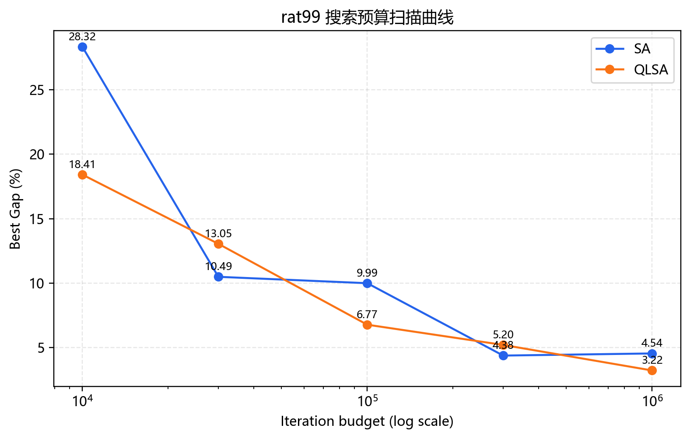

`rat99` 上不同 iteration budget 下的 best Gap如图。随着预算增加，Gap 整体下降，但单 seed 下曲线仍可能波动。

## 11. CUDA 后端实验与局限

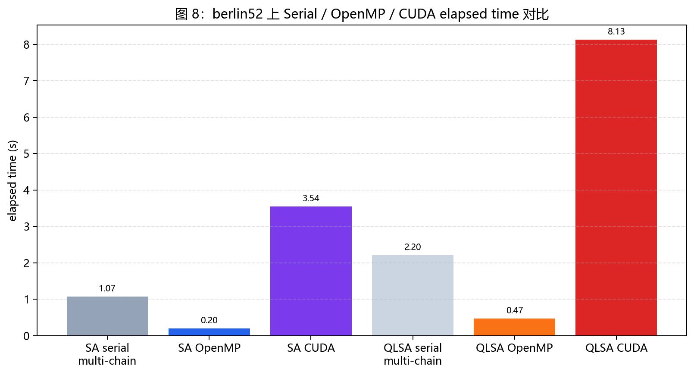

`berlin52` 上 Serial、OpenMP 和 CUDA 的时间定位如图。CUDA 能达到 BKS，但当前小实例上不作为主加速证据。

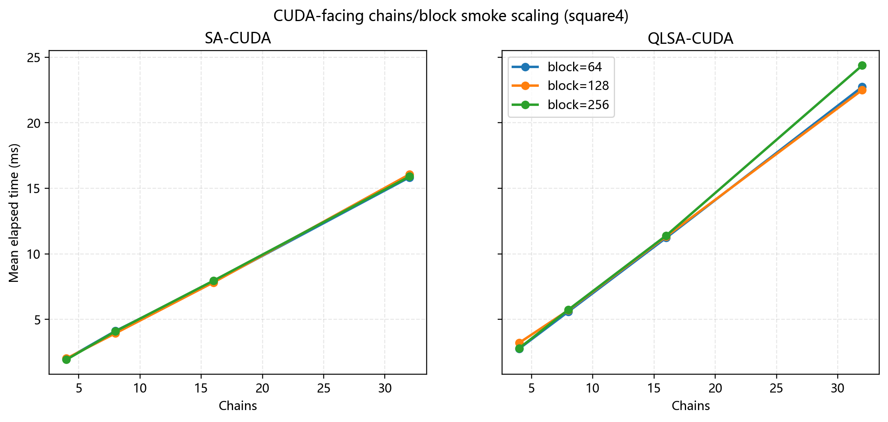

基于 `square4` 的 CUDA-facing chains/block smoke scaling如图。该图用于展示 CUDA 参数通路和工程验证，不作为真实大规模 GPU 性能结论。

CUDA 当前局限主要包括：实例过小、每条 chain 计算粒度不足、kernel 启动和访存开销占比高。后续应将 block 内线程用于候选 move 批量评估，并在更大规模实例上重新评估。

## 12. 问题与解决方案

| 问题 | 解决方案 | 影响 |
|---|---|---|
| TSPLIB 下载不稳定 | 支持手动放置 `.tsp` 文件 | 避免数据下载阻塞项目 |
| CUDA toolset 问题 | 改用 Ninja + CUDA 构建 | 成功编译 CUDA kernel |
| Python alias 问题 | 使用 `py` launcher | 实验脚本稳定运行 |
| QLSA 默认参数不稳定 | 调参、独立验证、定向增强 | 提升 harder instances 解质量 |
| CUDA 小实例不占优 | 谨慎定位为工程扩展 | 避免夸大 GPU 结果 |
| 论文机制差异 | 单独写对齐说明 | 保证对比严谨 |

## 13. 总结与贡献

本项目的主要贡献包括：

- 算法实现：完成 SA 与 QLSA，并实现 2-opt O(1) delta。
- 并行实现：完成 OpenMP 多链并行，稳定取得约 5x 平均加速。
- 工程实现：完成 TSPLIB95 parser、CLI、测试、自动实验和 CUDA 后端。
- 实验分析：完成默认参数、调优验证、定向增强、策略对比、线程扩展性和预算扫描。
- 论文扩展：在论文 QLSA 思想基础上补充 C++ 工程化和并行性能分析。

最强结论是：OpenMP 多链并行是当前稳定的性能提升来源；调优和增强后，`rat99` 上 QLSA 达到 BKS 而 SA 未达到，构成 QLSA 质量优势案例；CUDA 后端已完成，但在当前小实例上仍需优化。

## 14. 后续工作

后续可以继续：

- 实现更贴近论文的 candidate-leader QLSA；
- 增加 Hamming-distance diversity state；
- 添加真正的逐迭代 trace；
- 在 CUDA block 内并行评估候选 2-opt move；
- 使用更大 TSPLIB95 实例；
- 增加 Wilcoxon/Friedman 等统计检验。

## 参考文献

1. Adil, N., Eddaoudi, F., Lakhbab, H., & Naimi, M. (2026). *Q-Learning-Assisted Simulated Annealing for Traveling Salesman Problem Optimization*. *Statistics, Optimization & Information Computing*, 15(5), 3706-3730. https://doi.org/10.19139/soic-2310-5070-3028
2. Reinelt, G. (1991). TSPLIB—A Traveling Salesman Problem Library. *ORSA Journal on Computing*, 3(4), 376-384.
3. OpenMP Architecture Review Board. *OpenMP Application Programming Interface Specification*.
4. NVIDIA. *CUDA C++ Programming Guide*.
5. Kirkpatrick, S., Gelatt, C. D., & Vecchi, M. P. (1983). Optimization by Simulated Annealing. *Science*, 220(4598), 671-680.
6. Sutton, R. S., & Barto, A. G. *Reinforcement Learning: An Introduction*. MIT Press.
